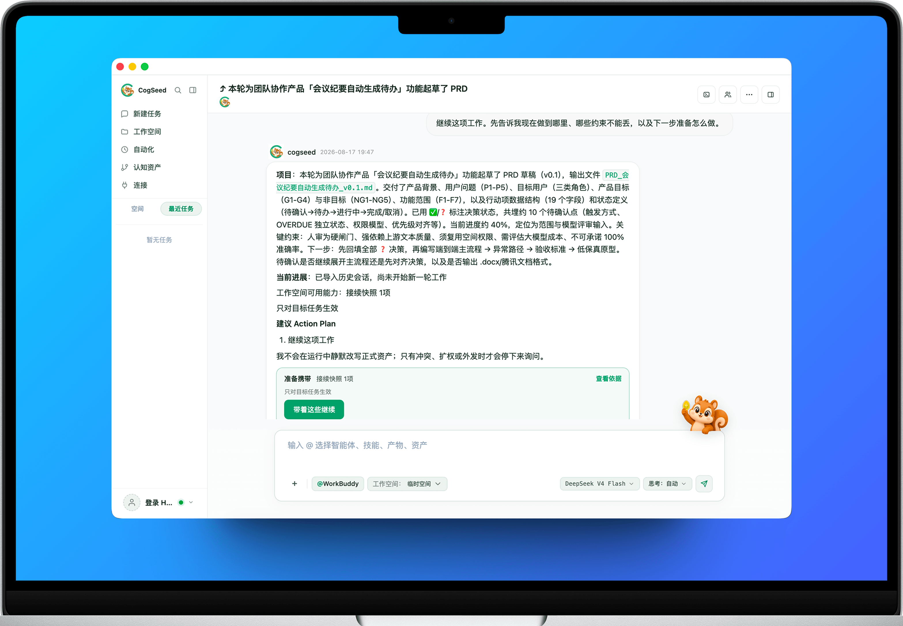

<p align="center">
  
</p>

<h1 align="center">CogSeed</h1>

<p align="center">A local-first desktop workspace for coordinating AI agents and turning task experience into reusable personal capability assets.</p>

<p align="center">
  <a href="./README.md">English</a> | <a href="./README.zh-CN.md">简体中文</a>
</p>

<p align="center">
  
</p>

## Overview

CogSeed brings tasks, workspaces, AI teams, skills, connectors, personal knowledge, and reusable cognition assets into one Electron desktop application. It is designed for work that needs more than a single chat turn: planning, delegation, tool use, local project access, continuity across sessions, reviewable evidence, and long-term reuse.

A Commander maintains the shared plan and delegates work through structured dispatch. Built-in agents and supported local CLI agents operate through controlled execution paths, while each worker receives only the context needed for its role. Results can remain as conversation output, become workspace files or artifacts, or enter the Cognition and Recall workflow as user-reviewed capability assets.

CogSeed is local-first. The renderer cannot access Node.js directly, local tools run behind explicit gateways, and user-scoped data is separated into sync-eligible private state and machine-local state.

## Highlights

| Capability | What it enables |
|---|---|
| Structured multi-agent coordination | Plan, delegate, observe, retry, skip, and stop work through one group-chat execution path. |
| Local CLI agent integration | Use Claude Code, Codex, OpenClaw, OpenCode, Hermes, or WorkBuddy from the same workspace. |
| Continuity across tasks | Import supported sessions and continue work with workspace context, progress, constraints, and execution evidence. |
| Governed cognition assets | Review candidate experience, promote confirmed assets, version them, and track reuse and effectiveness evidence. |
| Connected tools and knowledge | Give supported agents controlled access to skills, MCP connectors, messaging touchpoints, and indexed Library content. |
| Local-first security boundaries | Keep credentials, indexes, caches, tool results, and local installations behind explicit storage and execution boundaries. |

## Core Workflows

### Tasks and Spaces

- Start a focused task or organize related work inside a Space.
- Select agents, skills, connectors, and Library files from the task composer with `@`.
- Associate conversations with a workspace directory without encoding project identity into file paths or session IDs.
- Review plans, member status, process events, produced files, artifacts, and conversation history in one place.

### Commander and AI Team

- The Commander translates the user goal into a shared plan.
- Structured `dispatch_to` actions assign work to specific members.
- `plan_set` owns plan state, including retries, skips, and reconciliation.
- Every worker reads its visibility slice instead of the full conversation record.
- Group abort is the single stop path for all active actors.

### Continue Existing Work

- Import supported histories from local coding-agent environments.
- Carry forward the working directory, current progress, known constraints, and available evidence.
- Keep imported source sessions separate from CogSeed conversation and execution state.
- Resume through normal task dispatch rather than bypassing the collaboration pipeline.

### Skills, Connections, and Library

- Install or create agents and skills, then control which skills an agent may use.
- Connect supported external services through OAuth or MCP transports.
- Expose connector actions through list-and-call meta-tools instead of injecting every remote action into the model context.
- Store user-managed source material in the Library while keeping derived indexes and vector data machine-local.

### Cognition and Recall

- Capture candidate experience from sessions, review signals, and teaching interactions.
- Require user confirmation before a candidate becomes a formal capability asset.
- Preserve stable IDs, versions, scope policy, provenance, and audit history.
- Record transfer and effectiveness evidence when an asset is reused in later work.

### Automation, Touchpoints, and Artifacts

- Run saved automation tasks through the same guarded execution surface.
- Connect supported messaging touchpoints, including Feishu and WeChat integrations where configured.
- Produce chat artifacts inside conversation-scoped storage and display them through the validated artifact resolver.
- Save reusable apps separately; editing a saved app creates a forked conversation rather than mutating it in place.

## Task Lifecycle

```text
┌───────────┐   goal    ┌────────────┐   plan    ┌──────────────┐
│   User    │──────────▶│ Commander  │──────────▶│ Shared Plan  │
└───────────┘           └─────┬──────┘           └──────┬───────┘
                              │ dispatch_to              │ plan state
                              ▼                          │
                       ┌────────────┐                    │
                       │ Agent / CLI│◀───────────────────┘
                       └─────┬──────┘
                             │ tools, files, connectors, Library
                             ▼
                       ┌────────────┐
                       │ Result and │
                       │ Evidence   │
                       └─────┬──────┘
                             │ optional review and confirmation
                             ▼
                       ┌────────────┐
                       │ Cognition  │
                       │ Asset      │
                       └────────────┘
```

## Architecture

```text
┌─────────────────────────────────────────────────────────┐
│ Renderer: classic HTML / CSS / JavaScript               │
│ Tasks · Spaces · Automation · Assets · Connections      │
└───────────────────────────┬─────────────────────────────┘
                            │ window.cogseed.invoke / stream
┌───────────────────────────▼─────────────────────────────┐
│ Preload: contextBridge allow-list                       │
└───────────────────────────┬─────────────────────────────┘
                            │ Electron IPC
┌───────────────────────────▼─────────────────────────────┐
│ Main process: IPC validation → feature workflows        │
│ Group Chat · Recall · Knowledge Base · Connectors       │
└──────────────┬────────────────┬────────────────┬────────┘
               │                │                │
               ▼                ▼                ▼
┌──────────────────┐  ┌──────────────────┐  ┌──────────────────┐
│ Core Agent       │  │ Runtime worker   │  │ Child processes  │
│ In-process       │  │ JSONL protocol   │  │ Local CLI / MCP  │
└──────────────────┘  └──────────────────┘  └──────────────────┘
```

### Execution Boundaries

| Boundary | Responsibility |
|---|---|
| Renderer | Classic scripts render the desktop UI and call only the exposed `window.cogseed` API. |
| Preload | Maintains the explicit contextBridge allow-list and maps invoke or stream requests to Electron IPC. |
| IPC handlers | Validate request arguments and delegate to feature modules; business logic stays out of handlers. |
| Feature layer | Owns conversations, workspaces, agents, skills, Recall, connectors, messaging, and other workflows. |
| Core Agent | Runs model sessions and tool orchestration in-process through the dynamically loaded `#core-agent`. |
| CogSeed Runtime | Runs isolated backend work through a dedicated worker process and JSONL protocol. |
| Local Agent runner | Owns the approved child-process path for supported CLI agents. |
| MCP client | Owns stdio connector processes and exposes connected actions through connector meta-tools. |
| Storage and paths | Centralize user data paths, path sandboxing, JSON/JSONL storage, and the KB vector database. |

## Quick Install

### Requirements

- Git
- Node.js and npm available in the development shell
- Network access during first setup for npm packages and pinned runtime resources
- macOS or Windows for the primary desktop targets

Clone the repository and install its dependencies:

```bash
git clone https://github.com/cogseed/cogseed.git
cd cogseed
npm install
```

The repository pins `npm@11.11.0`. Installation prepares Electron native dependencies and the embedding model. Development startup also verifies or downloads the platform runtime, OfficeCLI, FFmpeg, and Whisper resources required by enabled features.

## Quick Start

Start CogSeed on macOS or a Linux development environment:

```bash
./run.sh
```

On Windows:

```bat
run.cmd
```

The source launcher verifies dependencies, prepares the `cogseed` runtime variant, and starts Electron with an isolated data root and application identity.

### First-Run Setup

1. Open **Connections → Models & Quota**.
2. Add an API key, configure a supported OAuth authorization, or import a compatible authorization from CC Switch.
3. Test the connection and select one or more returned models.
4. Create a task and type `@` to select agents, skills, connectors, or Library files.
5. Choose a workspace when the task needs controlled access to local project files.

## Local Agent Support

The corresponding CLI must be installed or configured on the machine before CogSeed can use it.

| CLI | Primary role | CogSeed integration |
|---|---|---|
| Claude Code | End-to-end coding tasks | Managed process, workspace context, session resume, event mapping, and supported bridge injection |
| Codex | Coding, patches, debugging, and refactoring | Managed process, app-server support, workspace evidence, and supported bridge injection |
| OpenClaw | General orchestration and lightweight automation | Managed process with backend-specific progress and idle handling |
| OpenCode | Coding with selectable providers, including local models | Managed process, terminal activity, and supported session import |
| Hermes | Multi-step tasks and tool-driven workflows | Managed process, session-scoped resume, and supported bridge injection |
| WorkBuddy | End-to-end coding through CodeBuddy CLI | Managed process, workspace context, session resume, and file-change evidence |

Local CLI execution is centralized in `src/main/features/local_agents/runner.ts`. The runner manages backend selection, working directory, environment overlays, cancellation, event mapping, idle detection, and result evidence.

## Skills, Connectors, and Library

### Skills and Agents

- Custom agents and skills live in user-scoped cloud state.
- Platform agents and skills are installed marketplace content stored in the machine-local tier.
- Custom skills may override a same-name platform skill; platform duplicates remain addressable by internal ID.
- Skill execution goes through `bin/run-skill.cjs` and the installed skill tier.
- Quality, trust, and path checks run before sensitive skill operations are admitted.

### Connectors

- Hosted connector authorization starts through the configured account service and returns through the application protocol callback.
- Token-bearing grant and transport state is encrypted before local persistence.
- The model receives only currently connected, enabled, and session-eligible connectors.
- Connector actions are discovered with `list_connector_tools` and invoked with `call_connector_tool`.

### Library and Knowledge Base

- Source files are user-managed and may be sync-eligible.
- Derived chunks, embeddings, model configuration, and the vector database remain machine-local.
- Agents search and read Library content through dedicated KB tools.
- PDF and DOCX access follows file-stat and bounded read paths rather than eager attachment extraction.

## Cognition and Recall

CogSeed treats reusable experience as governed state rather than automatically promoting every conversation summary.

| Stage | Meaning |
|---|---|
| Candidate | A captured lesson or reusable pattern waiting for review. |
| Confirmed asset | A user-approved capability asset with stable identity, version, scope, and provenance. |
| Projection | A prepared asset reference made available to a later task. |
| Transfer evidence | Evidence that the projected asset entered the target execution. |
| Effectiveness evidence | Feedback or outcome information used to assess whether the reuse helped. |

Assets can be paused, resumed, revised, or rolled back through the established Cognition workflows. Personal Ontology organizes confirmed concepts and relationships without granting agents unrestricted access to private data directories.

## Data and Security

### User Data Domains

```text
<container>/data/<uid>/
├── cloud/
│   ├── conversations, sessions, attachments, and artifacts
│   ├── projects, automations, contexts, memory, agents, and skills
│   └── saved apps, marketplace manifests, and user configuration
└── local/
    ├── account and session cache
    ├── marketplace installations and local-agent archives
    ├── indexes, vector database, model caches, and tool-result spills
    └── workspace selection and other machine-private state
```

The `cloud` and `local` names describe synchronization eligibility, not public visibility. Cloud state remains user-private and is synchronized only when the configured hosted account and entitlement support it. Model credentials remain behind the local secret-storage facade.

### Security Controls

| Control | Enforcement |
|---|---|
| Renderer isolation | Context isolation and the preload allow-list prevent direct Node.js access. |
| No local web backend | The main process does not expose an HTTP server or local authentication surface. |
| Path sandbox | File-class tools validate workspace and attachment paths at entry. |
| Process choke points | Runtime workers, local CLI agents, and MCP stdio connectors spawn only through approved modules. |
| Artifact isolation | `chat-app://` serves validated artifact files to sandboxed iframes without exposing IPC. |
| Secret handling | Hosted secrets and token-bearing connector state stay behind encrypted local storage facades. |
| Tool result limits | Large results pass through centralized caps and spill handling. |
| User confirmation | Sensitive operations use explicit permission and confirmation flows instead of silent escalation. |

## Runtime and Dependencies

| Component | Repository baseline | Purpose |
|---|---|---|
| Electron | `^41.7.1` | Desktop shell and main/renderer process boundary |
| TypeScript | `^6.0.3` | Main-process, feature, model, and test code |
| Node.js runtime bundle | `24.17.0` | Node-based skills and packaged command execution |
| Python runtime bundle | `3.12.13` | Python skills, package tooling, and resource tests |
| uv | `0.11.21` | Python environment and package management |
| SQLite and sqlite-vec | Repository dependencies | Local structured storage and KB vector search |
| FFmpeg and Whisper | Prepared platform resources | Media inspection and enabled transcription workflows |
| OfficeCLI | Prepared platform resource | Enabled document and office workflows |

Pinned runtime downloads are described and checksummed in `resources/runtime/manifest.json`.

## Repository Layout

| Path | Purpose |
|---|---|
| `bootstrap.cjs` | Electron entry shim, runtime identity selection, and TypeScript loader registration |
| `src/main/` | Main process, IPC, storage, model adapters, utilities, and feature workflows |
| `src/renderer/` | Classic HTML, CSS, JavaScript, localization, and desktop UI |
| `src/core-agent/` | Core Agent sessions, providers, tool orchestration, and execution loop |
| `src/main/features/group_chat/` | Conversation bus, plan execution, worker scheduling, and abort handling |
| `src/main/features/local_agents/` | Supported CLI detection, adapters, sessions, and centralized runner |
| `src/main/features/recall/` | Candidate capture, formal assets, projections, proofs, and effectiveness feedback |
| `src/main/features/connectors/` | Connector metadata, authorization state, MCP clients, and tool exposure |
| `resources/builtin/` | Platform agents, skills, and marketplace seed content |
| `resources/runtime/` | Pinned runtime manifests and platform assets |
| `p3394-gateway/` | Local Bridge gateway, protocol integration, and publication guidance |
| `test/` | Main-process, renderer, resource, native, and cross-layer tests |
| `scripts/` | Dependency preparation, diagnostics, packaging, audits, and verification tools |

## Development

### Common Commands

| Command | Purpose |
|---|---|
| `npm run typecheck` | Run TypeScript checking without emitting files |
| `npm test` | Run JavaScript and resource test suites with native ABI management |
| `npm run test:coverage` | Run the JavaScript suite with coverage |
| `npm run test:platform-native` | Run platform-native verification |
| `npm run runtime:ensure` | Verify or prepare the pinned runtime bundle |
| `npm run builtin:manifest:check` | Verify the built-in marketplace manifest |
| `npm run audit:workspace` | Audit the local workspace layout and invariants |
| `npm run diagnose:agents` | Diagnose supported local Agent installations |
| `npm run rebuild:sqlite:electron` | Repair the Electron SQLite native ABI |
| `npm run rebuild:pty:electron` | Repair the Electron node-pty native ABI |
| `scripts/restart-cogseed.sh` | Restart only this worktree's CogSeed runtime |

Use `npm test` rather than invoking Vitest directly. The repository test runner manages Electron and Node native SQLite ABI switching and recovery.

### Development Rules

- Keep IPC handlers focused on validation and feature delegation.
- Keep renderer code as classic scripts and register new files in `src/renderer/index.html`.
- Dynamically import `#core-agent`; static imports can break startup ordering and ESM resolution.
- Route user-private data through the active user ID and the canonical storage helpers.
- Register boot-time asynchronous work through `util/boot_init.ts`.
- Add new Core Agent tools to the central catalog and runner wiring.
- Run `npm run typecheck` after merges that touch renderer-to-main IPC contracts.

## Troubleshooting

### Native SQLite errors

```bash
npm run rebuild:sqlite:electron
```

### Terminal or node-pty ABI errors

```bash
npm run rebuild:pty:electron
```

### Missing bundled runtime resources

```bash
npm run runtime:ensure
```

### Local Agent is not detected

```bash
npm run diagnose:agents
```

Confirm that the corresponding CLI is installed and available to the shell used to launch CogSeed.

### Windows and WSL

Use `run.cmd` for the Windows-native runtime. The shell launcher delegates to it when WSL and the required Windows bridge commands are available.

### Model connection problems

Open **Connections → Models & Quota**, test the authorization again, and select a model returned by the configured provider. Do not place API keys in repository files or README examples.

## Documentation

| Topic | Link |
|---|---|
| Engineering boundaries and repository rules | [AGENTS.md](./AGENTS.md) |
| Source package contents and startup commands | [Source package notes](./README-源码包说明.txt) |
| Bundled runtime layout and version policy | [Runtime documentation](./resources/runtime/README.md) |
| P3394 gateway overview | [Gateway README](./p3394-gateway/README.md) |
| Gateway bootstrap | [Gateway bootstrap guide](./p3394-gateway/BOOTSTRAP.md) |
| Gateway publication | [Gateway publication guide](./p3394-gateway/PUBLISH.md) |
| Cognition asset specification | [Cognition assets](./specs/cognition-assets/spec.md) |

## License

CogSeed is available under the [MIT License](./LICENSE).
