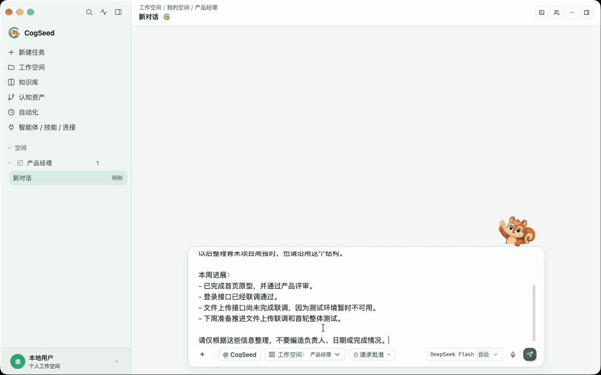
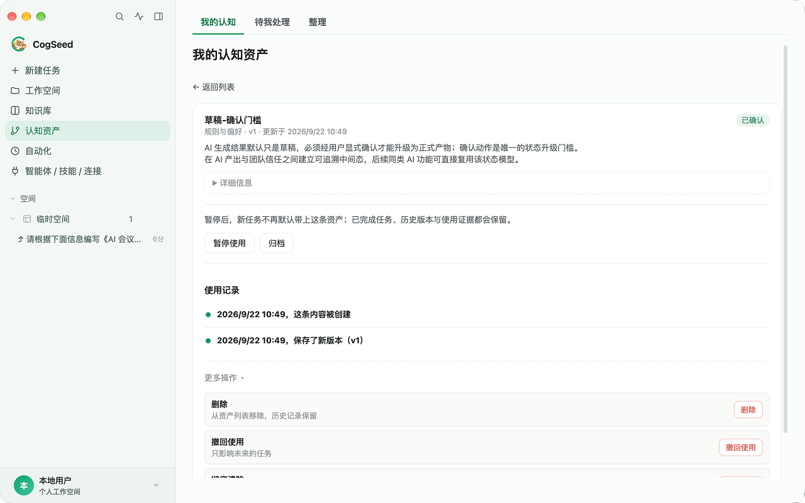
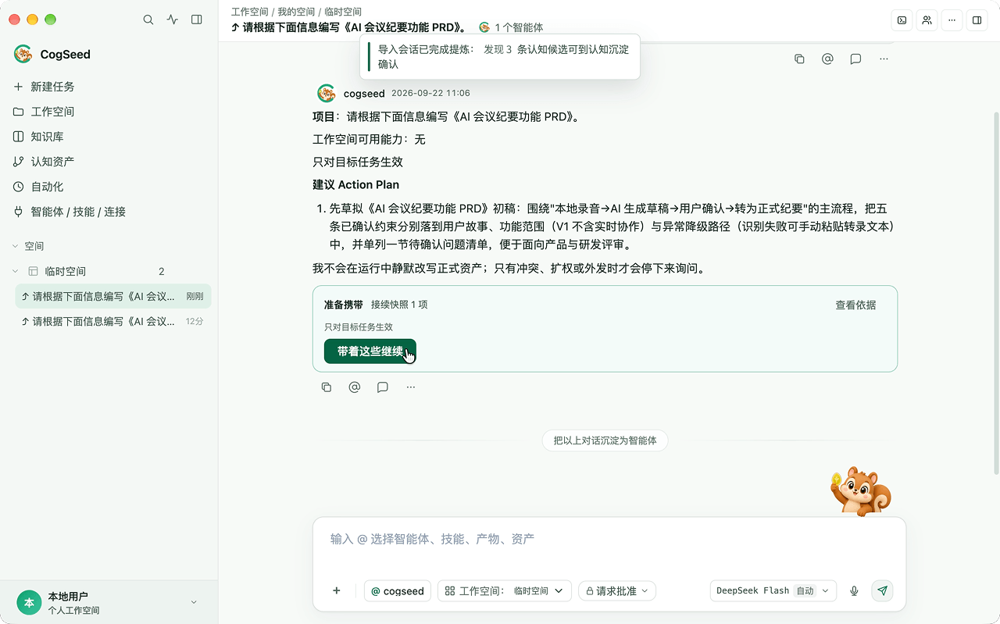
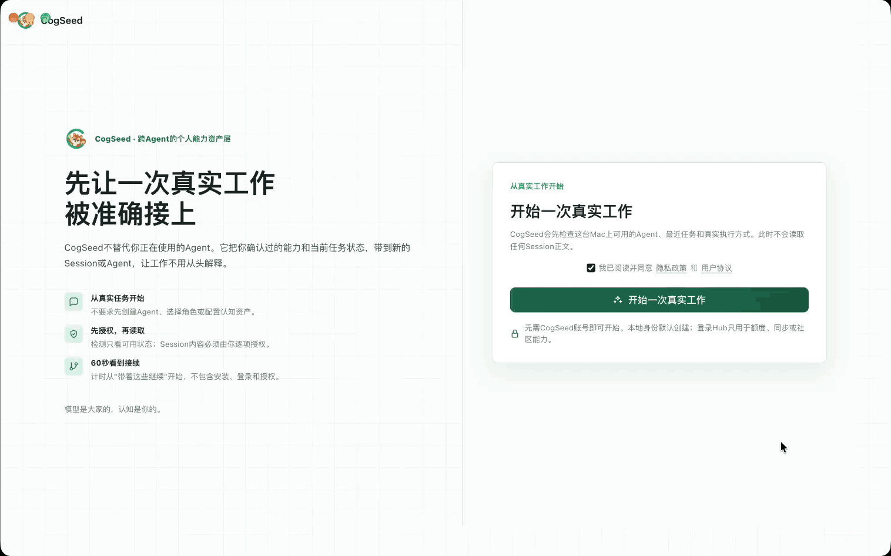

<p align="center">
  
</p>

<h1 align="center">CogSeed</h1>

<p align="center">
  <strong>AI that understands you better with every task</strong>
</p>

<p align="center">
  <a href="./README.md">English</a> ·
  <a href="./README.zh-CN.md">简体中文</a>
</p>

<p align="center">
  <a href="https://github.com/bonc-ai/cogseed/releases"></a>
  <a href="https://github.com/bonc-ai/cogseed/releases"></a>
  <a href="https://github.com/bonc-ai/cogseed/stargazers"></a>
  <a href="./LICENSE"></a>
  
  
</p>

**CogSeed is your personal companion agent.**
It turns preferences, project constraints, and effective approaches validated through your work into **cognitive assets** that you confirm, trace, and revoke—and reuse when relevant in your next task.

When you switch from Codex to Claude Code or another supported agent, CogSeed can carry task progress and applicable cognitive assets forward so you can continue the work.

<p align="center">
  <a href="https://github.com/bonc-ai/cogseed/releases"><strong>⬇️ Download CogSeed</strong></a>
  ·
  <a href="#-quick-start"><strong>Quick start</strong></a>
  ·
  <a href="#-build-on-cogseed"><strong>Build extensions</strong></a>
  ·
  <a href="#-faq"><strong>FAQ</strong></a>
</p>

<p align="center">
  
</p>

Cognitive asset reuse in action: see how confirmed experience is brought into a later related task and used.

---

## Confirm once, start the next task with less repetition

You should not have to explain how to write code for this project, which rules must be respected, or how you prefer to collaborate every time you work with an agent.

After a task finishes or a past session is imported, CogSeed extracts preferences, constraints, and effective approaches worth keeping and presents them as candidate experience for your review. Once you confirm them, they become cognitive assets for reuse in later related tasks.

**CogSeed does not silently turn conversations into long-term memory.** Candidates need your confirmation. Each asset retains its source, version, and scope, and you can edit, pause, or revoke it at any time.

```text
Complete a task
  → Generate candidate experience: preferences, constraints, effective approaches
  → Confirm, revise, or reject it
  → Create cognitive assets with sources and scope
  → Reuse them when relevant in the next task or with another supported agent
  → Review results, edit, pause, or revoke at any time
```

---

## What you gain

| Outcome | What it means |
|---|---|
| **Less repetition about you and your projects** | Confirmed preferences, rules, and constraints appear in relevant tasks with their sources |
| **Continue working when you switch agents** | Carry task goals, progress, workspace, and available assets between supported agents |
| **Keep control of your experience** | Review candidates before confirmation; inspect sources, edit, pause, or revoke each asset |

<p align="center">
  
</p>

Open an asset's details to review its source, versions, and usage records, and manage its scope and usage status.

<p align="center">
  
</p>

---

## 🚀 Quick start

Already have a local agent? Check that it is installed, logged in, and has available quota.

No local agent? Configure and test a model in **Models & Quota** first.

For model selection and key requirements when extracting candidate experience, see [Built-in capabilities and keys](#built-in-capabilities-and-keys).

<p align="center">
  
</p>

### Already using Claude Code, Codex, or another agent?

Prerequisites: install and log in to your agent on this machine (see [Support and data boundaries](#-support-and-data-boundaries)), and have a past session you can continue.

1. Download and launch CogSeed from the [Releases page](https://github.com/bonc-ai/cogseed/releases), then follow the guide to detect local agents.
2. Under "Where should we continue?", select a recommended recent task, or choose another session to find the one you want to continue. You authorize access before CogSeed reads its content.
3. Review the task goal, progress, and workspace information to be imported. CogSeed reads the original agent's session without writing back to it.
4. Click "Continue with this" to have the agent pick up from the existing progress. You can add new requirements in the conversation.
5. When the task finishes, give your assessment in the "Task result check" card. If candidates are generated, open **Cognition Assets → To Review**, check their content, sources, and scope, then confirm what to keep.
6. Create a new related task in the same project or applicable scope. Open **Carried context** in the task information to inspect the included context and its sources. Then open the asset's details under **Cognition Assets**, check whether **Usage** links to this task, and compare the output against the constraint.

Assess reuse using both the target task's carried context and its actual output. Creation and version-change records only show that an asset was saved or modified.

### No past tasks yet?

Configure a model key, then create a task for the Commander and built-in Task Agent to execute. Try this example across two tasks:

1. **First task:** provide this week's progress and say, "Prepare a project weekly report. For this project, always organize weekly reports under Accomplishments, Risks, and Next steps." After the task, review and confirm the corresponding candidate in **To Review**, if one is generated. Check that its scope covers the project or report tasks.
2. **Second task:** create a new task in the same project, provide fresh progress, and ask only, "Prepare this week's report," without repeating the formatting preference. Follow step 6 to inspect the carried context, then check whether the output uses the structure above.

If no candidate appears, first check that the model or agent used for extraction is available. If the second task does not include the asset, check that it is confirmed, enabled, and matches the task's scope.

---

## 📋 Support and data boundaries

### Local agents

| Agent | CogSeed version | Import past sessions | Continue execution |
|---|---|---|---|
| Claude Code | v1.2.0 | ✅ | ✅ |
| Codex | v1.2.0 | ✅ | ✅ |
| OpenCode | v1.2.0 | ✅ | ✅ |
| WorkBuddy | v1.2.0 | ✅ | ✅ |

Install and log in to local agents on your machine. Compatibility depends on the combination of CogSeed and CLI versions. When reporting import or execution issues, include both versions and your operating system.

More agent adapters are being added. Suggest an agent you would like to connect in [Issues](https://github.com/bonc-ai/cogseed/issues).

### Built-in capabilities and keys

| Capability | Model key requirement | Where data goes |
|---|---|---|
| Continue a local agent's task | No extra key; uses the agent's existing login | The corresponding agent and its model service |
| Built-in model execution for the Commander and Task Agent | Configure an available model in **Models & Quota**; your own API access requires a key (BYOK) | The configured model provider |
| Import past sessions and extract candidate experience after tasks | Uses the configured model; without one, it can use an available local CLI agent with no extra key. Valid login and available quota are still required | The configured model provider, or the local agent performing extraction and its model service |
| Other model entry points, such as generating a cognitive draft from a message | Configure an available model as required by the entry point | The model service actually called |
| MCP connectors and external services | Depends on the service | The third-party service you connect |

### Data and credentials

- **Local storage.** This repository's open-source build can be used without logging in and does not integrate multi-device data synchronization. Tasks, attachments, and cognitive assets are stored on your machine.
- **Accounts and synchronization.** Hub login authorizes the account and binds the device, exchanging necessary account, installation, and device information with the account service. Login alone does not mean content synchronization is enabled. Builds that support hosted synchronization also depend on service configuration and account entitlements.
- **Sync-eligible data.** The [Development Guide](./docs/DEVELOPMENT.md#data-and-security) describes the sync-eligible domain, including conversations, attachments, artifacts, projects, memory, cognitive assets, and user configuration. Local caches, indexes, and device state remain machine-private. Eligibility does not mean the current build synchronizes the data, or that all code files in your workspace are automatically uploaded.
- **Models and external services.** Task execution and candidate extraction may send necessary conversation content, file excerpts, and asset context to the agent, model API, or connector service actually used. Disabling CogSeed synchronization does not make these calls offline.
- **Credential protection.** Model credentials are accessed through local credential storage and used to authenticate model requests. Local CLIs use their own login credentials. Hosted connector OAuth starts on the server; grants, tokens, and transport information received by the client are stored in encrypted fields.

### Platforms

| Platform | Supported systems |
|---|---|
| macOS 12+ | Apple Silicon and Intel |
| Windows | x64 |

### Capabilities and requirements

This guide applies to **v1.2.0**. Installers and release history are available on the [Releases page](https://github.com/bonc-ai/cogseed/releases).

| Capability | Requirements and scope |
|---|---|
| Capture and reuse cognitive assets | Extraction requires an available model or agent; confirmed assets are reused according to task needs, scope, and enabled status |
| Import and continue local agent sessions | Requires an installed and authenticated supported CLI; import reads the original session and continuation runs in CogSeed |
| Commander multi-agent collaboration | Configure the relevant model or execution agent; work is assigned according to task needs |
| Skills / MCP connectors / knowledge base | Install Skills, configure and authorize connector services, and import knowledge files |
| P3394 Gateway interoperability | Configure both endpoints, network access, and authentication; see the Gateway documentation for connection methods and implementation scope |

---

## 🧠 How CogSeed works

### Cognitive assets

Cognitive assets are experiences extracted from your work and confirmed by you. They include:

- **Personal ontology:** your preferences, working style, rules, and constraints
- **Skills:** reusable, installable methods and workflows

Sources explain where experience came from, scope determines which tasks can retrieve it, and versions preserve its changes. Confirming an asset does not mean it is included in every task.

### KSTAR: from a task to an asset

KSTAR is CogSeed's learning loop for recording "expected outcome → actual execution → result feedback → captured experience":

```text
Before the task: record the expected outcome
      │
      ▼
After the task: compare actual and expected outcomes
      │        (Choose met / partially met / not met, or add a correction)
      ▼
Candidate experience: preferences, constraints, effective approaches
      │
      ▼  After your confirmation
Formal cognitive assets
      │
      ▼
Later tasks: Recall retrieves relevant assets for supported agents;
             usage records, outputs, and feedback help assess their value
```

### Task continuity: switch agents and keep working

CogSeed saves task goals, workspace, completed progress, known constraints, and execution evidence. It also supports importing past sessions from supported agents:

```text
Today       Codex finishes code analysis
              ↓
Tomorrow    Claude Code takes over implementation
              ↓
Later       Other supported agents continue testing and wrap-up
```

When continuing a task, CogSeed includes confirmed cognitive assets according to task needs and scope, reducing the work of explaining project rules again to a new agent.

### Multi-agent collaboration when tasks need it

For complex tasks, the Commander coordinates the smallest necessary set of agents:

```text
Your goal
   │
   ▼
Commander ── Plans, delegates, and tracks status
   │
   ├──► Codex                   Code analysis / changes
   ├──► Claude Code             Architecture analysis / implementation
   └──► Other supported agents  Research / verification / tool calls
                │
                ▼
           Combined results
```

Each agent receives only the context it needs. In one interface, you can see the plan, each member's status, execution progress, file changes, and final deliverables instead of juggling separate opaque terminals.

### Skills, MCP, and connectors: extend capabilities

Install Skills for agents, connect MCP connectors and external services, and add knowledge files. Installing a Skill or connecting MCP does not require changing CogSeed's source code; you can do it in the app.

---

## 🛠 Build on CogSeed

CogSeed is an extensible Agent Workspace. Choose an entry point based on what you want to do:

| Direction | What you can do | Where to start | Maturity |
|---|---|---|---|
| **Skill** | Submit a reusable Skill candidate | [Community Skill pilot](./community/skills/README.md): directory template, evaluation cases, and submission process | Community pilot; repository merge, app import, and distribution are separate stages |
| **Agent Adapter** | Connect a new local agent | Existing implementations in `src/main/features/local_agents/backends/` | Source extension |
| **MCP / connector** | Connect an external service | Configure it in the app; source extensions start in `src/main/features/connectors/` | In-app integration / source extension |
| **Product contribution** | Fix features or improve the experience | [`good first issue`](https://github.com/bonc-ai/cogseed/labels/good%20first%20issue) · [`help wanted`](https://github.com/bonc-ai/cogseed/labels/help%20wanted) · [`documentation`](https://github.com/bonc-ai/cogseed/labels/documentation) | Actively maintained |

Skill and MCP extensions do not require forking the main repository. Fork it for source changes, adapter implementations, or customized internal builds.

### Run from source

These commands run the source code for the v1.2.0 release.

```bash
git clone --branch v1.2.0 https://github.com/bonc-ai/cogseed.git
cd cogseed
npm ci
./run.sh        # macOS / Linux
```

On Windows, use `run.cmd`. See the [Development Guide](./docs/DEVELOPMENT.md) for requirements (Node.js 24.x and npm 11.11.0), development commands, and packaging instructions, and [AGENTS.md](./AGENTS.md) for engineering boundaries.

Developer contract: the renderer reaches main only through the allow-listed
`window.cogseed` bridge, development launchers keep source-build state under an
isolated `.cogseed` root, and validated application deep links use the
`cogseed://` protocol. Run `npm test` before submitting a source change; the
[Development Guide](./docs/DEVELOPMENT.md) documents the full boundaries and
verification commands.

### Contributing

To contribute, follow the [Contribution Guide](./CONTRIBUTING.md) and create a development branch from the latest `develop`.

Submit pull requests to `develop` and sign off your commits under the DCO. See the [Contribution Guide](./CONTRIBUTING.md) for the workflow, Git identity requirements, and review rules. If the Chinese and English contribution guides differ, the English version takes precedence.

---

## ❓ FAQ

**Will my code be uploaded to CogSeed?**
This repository's open-source build does not integrate multi-device content synchronization. Task execution and experience extraction may still send necessary context to the agent, model, or connector service used. Builds that support hosted synchronization also depend on service configuration and account entitlements. See [Data and credentials](#data-and-credentials).

**Could cognitive assets retain incorrect experience?**
Candidates are not promoted automatically. You confirm each one, and can inspect its sources, edit it, pause it, or revoke it.

**Do I need my own API key?**
Not always. Local agents use their CLI login. Session import and candidate extraction after tasks can also use an available local CLI when no model is configured. For built-in model execution or other entry points requiring a model, configure an available model first. If you use your own API access, enter and test its key in **Models & Quota**. See [Built-in capabilities and keys](#built-in-capabilities-and-keys).

**Can I use CogSeed without Claude Code or Codex installed?**
Yes. CogSeed includes a built-in Task Agent. Configure a model key to use multi-agent collaboration without those CLIs.

**How is this different from using Claude Code or Codex directly?**
CogSeed is a personal companion agent that works with you over time. It turns preferences, constraints, and methods you confirm into cognitive assets, reuses them when relevant in later tasks, and coordinates supported agents such as Claude Code and Codex to carry out the work.

**Does it support Skills, MCP, and connectors?**
Yes. Install Skills for agents, connect MCP connectors and external services, and add knowledge files.

---

## 💬 Community and security

- Report bugs in [Issues](https://github.com/bonc-ai/cogseed/issues).
- Share product ideas and experiences in [Discussions](https://github.com/bonc-ai/cogseed/discussions).
- Do not open public Issues for security problems. Report them privately through GitHub Private Vulnerability Reporting; see [SECURITY.md](./SECURITY.md).

CogSeed provides a P3394 Gateway for agent interoperability. See [p3394-gateway/README.md](./p3394-gateway/README.md) for implementation scope, connection methods, and review guidance.

---

## 🙏 Acknowledgments

CogSeed is based on [Orkas](https://github.com/Orkas-AI/Orkas). The desktop `core-agent` component originates from [OpenClaw](https://github.com/openclaw/openclaw), and the planning and runtime adapter patterns draw on [Hermes-Agent](https://github.com/NousResearch/hermes-agent).

For upstream copyright and third-party license information, see [NOTICE](./NOTICE) and [THIRD_PARTY_NOTICES.md](./THIRD_PARTY_NOTICES.md).

---

## 📄 License

CogSeed is open source under the [MIT License](./LICENSE).

---

<p align="center">
  <strong>If you want to keep control of your experience and put it to work in your next task, give CogSeed a ⭐ Star.</strong>
</p>

<p align="center">
  ⭐ <a href="https://github.com/bonc-ai/cogseed">Star</a>
  ·
  🍴 <a href="https://github.com/bonc-ai/cogseed/fork">Fork</a>
  ·
  🐛 <a href="https://github.com/bonc-ai/cogseed/issues">Issues</a>
  ·
  💬 <a href="https://github.com/bonc-ai/cogseed/discussions">Discussions</a>
</p>
