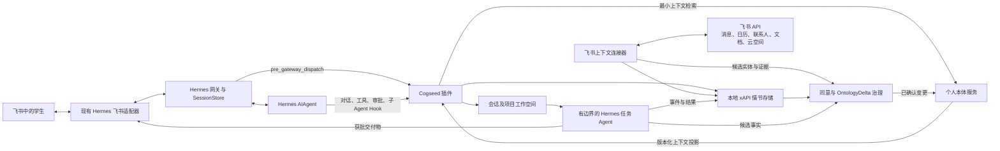

# Cogseed 个人伴侣 Agent MVP

## 基于 Hermes Agent 分支并支持飞书通道的总体实施计划

**规划基线：** Hermes Agent `main` 分支提交 [`36cb5ae`](https://github.com/NousResearch/hermes-agent/commit/36cb5ae5530a75def7df3195e49b7a4aa2add482)，核查日期为 2026 年 8 月 4 日。

## 1. 核心决策

把 Cogseed 构建成 Hermes 之上的轻量产品层，而不是重写 Hermes。

Hermes 已经提供最难替代的执行基础：

- CLI 与消息通道共用的 `AIAgent` 循环；
- 持久化 SQLite 会话及全文会话搜索；
- 插件与生命周期 Hook；
- 技能和自我改进工作流；
- 隔离的子 Agent 与定时任务；
- 命令审批以及飞书交互式审批卡片；
- 成熟的飞书/Lark 适配器，支持 WebSocket、Webhook、私聊、群聊、话题、表情、文件、流式输出、文档评论和会议邀请。

Cogseed MVP 应在此基础上增加五项能力：

1. **持久化伴侣身份：** 在不同飞书会话中持续识别同一名学生。
2. **学生个人本体：** 使用 T-box、R-box、A-box、角色绑定和 `OntologyDelta` 变更模型。
3. **本地 xAPI 情节账本：** 保存经授权的消息、Agent 行为、审批、作品和结果。
4. **飞书日常上下文连接器：** 接入用户选定的消息、日历、联系人、文档、云空间资料和作品集。
5. **有边界的任务 Agent：** 只接收最小本体投影、隔离工作空间、明确权限和带证据的结果回传路径。

首选交付形态是独立的 Hermes `cogseed` 插件及一个小型配套库。除非端到端测试证明现有 Hook 不足，否则不要修改 `run_agent.py` 或 Hermes 核心。

## 2. MVP 用户结果

MVP 完成后，学生应能够：

1. 安装启用 Cogseed 的 Hermes 分支并连接飞书机器人。
2. 通过用户授权 OAuth，开放经过选择的个人飞书资源。
3. 创建“学生角色绑定”，检查并确认系统建议的学期地图。
4. 在飞书私聊或获准群聊中，与同一个 Cogseed 身份持续交流。
5. 根据已授权的课程、截止日期、日程和项目收到每日简报。
6. 提出学习问题，并获得建立在正确课程和项目上下文上的回答。
7. 把一项边界明确的研究任务交给任务 Agent，并在飞书中收到结果、来源和操作记录。
8. 审核、批准或拒绝个人本体和长期记忆的候选变更。
9. 查看本地时间线，了解系统学习所依据的消息、行为、审批和结果。

## 3. Hermes 已提供的能力

当前 [Hermes 消息网关](https://hermes-agent.nousresearch.com/docs/user-guide/messaging) 已把飞书作为一等消息平台。其实现支持语音、图片、文件、话题、表情、输入状态、流式输出、群聊提及控制、私聊配对和交互式命令审批。

| 所需能力 | Hermes 现有组件 | MVP 处理方式 |
|---|---|---|
| Agent 执行 | `run_agent.py`、`agent/` | 原样复用。 |
| 飞书消息与媒体 | `plugins/platforms/feishu/adapter.py` | 复用并配置；只为缺失的 Cogseed 元数据或审核卡片扩展。 |
| 飞书文档读取与评论 | `tools/feishu_doc_tool.py`、`tools/feishu_drive_tool.py` | 用于关联文档和评论工作流。 |
| 网关会话 | `gateway/session.py` | 复用；Cogseed 的会话和项目绑定放在外部。 |
| 对话持久化 | `hermes_state.py` | 作为对话来源复用，不把它复制成语义记忆。 |
| 插件 Hook | `hermes_cli/plugins.py` | 用于 xAPI 记录、本体上下文注入、工具观察、审批和子 Agent 生命周期。 |
| 技能 | `skills/`、`skill_manage` | 增加学生、学习会话、每日简报、每周复盘和任务 Agent 技能。 |
| 子 Agent | `delegate_task` 及子 Agent Hook | 外包一层 Cogseed 任务清单和隔离工作空间。 |
| 定时流程 | `cron/` | 用于飞书同步、晨间简报和每周复盘。 |
| 命令审批 | `tools/approval.py`、飞书卡片 | 复用工具操作审批，并把同一交互模式扩展到本体变更。 |
| 记忆写入审批 | Hermes 记忆审批流程 | 复用交互模式；已确认语义事实写入本体服务。 |
| 安全 | 白名单、配对、群策略、密钥脱敏 | 复用，并针对学生试点采用更严格默认值。 |

## 4. MVP 范围

### 包含

- 每个 Hermes 配置档案对应一个个人伴侣身份。
- 一个学生角色模板，约含 20 个核心概念和 25 个核心关系。
- 飞书私聊和一个或多个明确批准的群聊。
- 复用飞书文本、图片、文件、话题、表情、流式输出和审批支持。
- 通过用户授权 OAuth 访问选定的个人日历、联系人、文档和云空间资源。
- 选择性资源模型：只接入选定文件夹、文档、聊天、日历和联系人，不采集整个租户。
- 带加密载荷的本地、面向 xAPI 2.0 的情节存储。
- 保存候选、已确认、已取代和已拒绝事实的本地本体库。
- 会话与项目工作空间。
- 每日简报、引导式学习、有边界的研究任务和每周复盘。
- 飞书上下文默认只读。
- 对外写入、发送、共享、修改日历、本体晋级和技能修改均需明确确认。

### 不包含

- 同步全部飞书消息、联系人、文档或租户资源。
- 自动提交作业或未经审核的对外沟通。
- 通用任务 Agent 市场。
- 多名用户共同拥有一个伴侣身份。
- 宣称完全符合 IEEE P3394 或取得相关认证。
- 宣称 xAPI LRS 已通过认证。
- 未经审核地修改提示词、技能、本体或连接器。
- Hermes 与飞书之外的原生移动端或独立桌面 UI。

## 5. 目标架构



### 架构原则

- **飞书是其当前消息、日程、联系人、文档和文件的业务事实来源。**
- **xAPI LRS 是情节与证据账本，**不是语义事实库。
- **个人本体保存经过治理的含义，**不保存原始对话转录。
- **Hermes SessionDB 继续作为对话存储，**负责回放和会话搜索。
- **长期记忆只保存经过筛选的摘要和偏好，**不保存每个观察事件。
- **任务 Agent 不得获得完整个人本体。**它只能接收清单所需的只读、版本化最小投影。
- **会话期间系统提示词保持稳定。**通过 Hermes `pre_llm_call` Hook 把本体召回内容注入当前用户消息，保留提示缓存能力。

## 6. 代码仓库与包结构

让分支尽量贴近上游。Cogseed 主要作为插件包实现，也应能够安装到未修改的 Hermes 检出中。

```text
cogseed-hermes/
  plugins/
    cogseed/
      plugin.yaml
      config.py
      commands.py
      hooks.py
      tools.py
      identity/          # 伴侣身份及飞书身份绑定
      episodes/          # xAPI Profile、记录器和存储
      ontology/          # 本体、投影、变更与治理
      feishu/            # OAuth、客户端、同步和资源映射
      tasks/             # 任务清单、启动器与结果接收
      workspaces/        # 工作空间及保留策略
      templates/student/ # 学生角色模板、T-box、R-box、SHACL
      skills/            # 入门、简报、学习、研究和复盘技能
      tests/             # 单元、集成和端到端测试
  tests/
    cogseed_contracts/
```

如果无法避免修改 Hermes 上游代码，应拆成小型、通用的独立提交，例如“在插件 Hook 上下文中加入稳定消息/事件元数据”。不要把上游适配改动与本体或飞书产品逻辑混在同一提交中。

## 7. 本地状态布局

使用 `get_hermes_home()` 从当前 Hermes 配置档案解析数据根目录。普通配置不另设环境变量。

```text
<HERMES_HOME>/cogseed/
  identity/
    companion.json
    channel-bindings.json
  ontology/
    store/
    templates/
    candidates/
    snapshots/
  lrs/
    cogseed-lrs.sqlite
    payloads/
    profiles/
    checkpoints/
  workspaces/
    sessions/<session-id>/
    projects/<project-id>/
    task-runs/<run-id>/
  memory/
    semantic/
    procedural/
    episodic-index/
  connectors/feishu/
    resource-map.sqlite
    sync-cursors.json
    scope-manifest.json
  audit/
  backups/
```

密钥和刷新令牌必须保存在 Hermes 密钥机制、操作系统钥匙串或专用加密凭据库中。连接器目录只保存密钥引用、已授予权限范围、租户标识和同步游标。

## 8. Cogseed 插件设计

### 8.1 使用的 Hook

| Hermes Hook | Cogseed 用途 |
|---|---|
| `pre_gateway_dispatch` | 记录标准化飞书入站事件，执行伴侣/通道策略，附加稳定身份和项目提示。 |
| `on_session_start` | 创建会话工作空间，把 Hermes 会话绑定到伴侣和当前项目。 |
| `pre_llm_call` | 检索当前请求所需的最小本体及情节投影，并注入当前用户消息。 |
| `post_llm_call` | 记录完整人机轮次并提取候选事实。 |
| `pre_tool_call` / `post_tool_call` | 记录工具意图与结果，阻止任务 Agent 执行清单外操作。 |
| `pre_approval_request` / `post_approval_response` | 记录请求的权限以及学生的决定。 |
| `subagent_start` / `subagent_stop` | 为每次委派绑定任务清单、工作空间、预算、证据链和结果。 |
| `on_session_finalize` / `on_session_reset` | 刷新缓冲区、结束会话情节并执行保留策略。 |

### 8.2 命令

- `/cogseed status`：显示身份、当前角色、项目、连接器健康和 LRS 状态。
- `/cogseed project <name>`：绑定或切换当前会话项目。
- `/cogseed context`：显示上一轮使用的上下文投影。
- `/cogseed timeline [days]`：显示近期情节摘要。
- `/cogseed pending`：列出本体和记忆候选变更。
- `/cogseed approve <id>`、`/cogseed reject <id>`：治理候选变更。
- `/cogseed forget <scope>`：预览并执行按范围删除或失效处理。
- `/cogseed permissions`：显示飞书权限、可访问资源集合和待审批事项。

### 8.3 模型可见工具

工具面保持精简，并由服务层管控：

1. `cogseed_context_search`：搜索已授权的本体实体和证据引用。
2. `cogseed_context_get`：获取一个有边界的实体、资源或情节包。
3. `cogseed_propose_delta`：提交候选事实，不可直接改写已确认个人事实。
4. `cogseed_task_launch`：根据已注册模板和任务清单启动任务。

飞书日历、联系人、文档和云空间操作应继续置于连接器服务之后。首个里程碑以命令和技能完成设置及同步，不要给每次模型请求都添加大量飞书工具。

## 9. 飞书实施计划

### 9.1 复用现有通道适配器

[飞书适配器文档](https://hermes-agent.nousresearch.com/docs/user-guide/messaging/feishu) 已确认支持 WebSocket、Webhook、私聊、群聊、媒体、话题、表情、流式输出、命令审批、文档评论和会议邀请。

学生试点采用 WebSocket 模式，因为它不需要公网端点。配置要求：

- 每个测试环境使用一个独立飞书应用；
- 通过 `FEISHU_ALLOWED_USERS` 限定试点学生的 `open_id`；
- 群聊策略默认设为 `allowlist`；
- 群聊启用 `require_mention: true`；
- 启用 `group_sessions_per_user: true`；
- 禁止机器人之间互发消息；
- 指定一个“主页会话”接收定时简报。

### 9.2 双飞书身份

| 身份 | 用途 | 规则 |
|---|---|---|
| 机器人/应用令牌 | 接收和回复消息，在机器人已加入的会话中工作，发送已批准通知 | 不得假定它能访问学生的私人日历或云空间。 |
| 用户授权令牌 | 读取学生选定的日历、联系人、文档、云空间和已授权消息历史 | 按需逐步申请权限，只绑定一个伴侣所有者。 |

实现 OAuth 授权码流程、刷新、租户/域识别、权限清单、撤销和健康检查。令牌不得写入 xAPI Statement、本体事实、日志、任务工作空间或提示词。

### 9.3 从选择性资源同步开始

入门流程让学生选择：

- 一个主日历；
- 独立的课程或项目日历；
- 一个课程资料文件夹；
- 一个作品集文件夹；
- 单独的文档或知识库页面；
- 一个或多个获准聊天或话题；
- 只同步这些资源中出现的联系人。

### 9.4 同步策略

- **事件驱动：** 使用适配器已经接收的机器人消息、表情、文档评论和会议邀请。
- **定时增量同步：** 使用游标和 `updated_at` 水位同步日历、选定文件夹元数据、文档版本和联系人。
- **按需获取：** 只有当前任务需要时才读取全文或大文件。
- **有限回填：** 入门时可回填过去 30 天事件和未来 90 天日历。

每个飞书事件或资源都必须使用租户、资源类型、稳定资源 ID、版本或事件 ID 组成幂等键。

### 9.5 资源标准化

本体抽取前，先将飞书对象标准化为 `ExternalResource`：

```yaml
resource_id: feishu:tenant-1:docx:doxcn123
resource_type: document
source_version: "42"
title: 控制系统项目计划
owner_ref: feishu:union_id:on_abc
container_ref: feishu:folder:fldcn456
source_url: https://example.feishu.cn/docx/doxcn123
observed_at: 2026-08-04T15:00:00-04:00
content_hash: sha256:...
access_label: personal
retention_policy: source-linked
```

知识库节点 token 与底层对象 token 必须分开。先解析知识库节点，再按实际对象类型分派给文档、表格、多维表格或云空间处理器。

## 10. xAPI 情节账本

依据 [IEEE 9274.1.1-2023](https://standards.ieee.org/ieee/9274.1.1/7321/) 实现本地、面向 xAPI 2.0 的存储。完成一致性测试前，产品应称其为“兼容 xAPI 的本地情节存储”，而不是已认证 LRS。

### 10.1 存储模型

使用 SQLite WAL 模式保存 Statement 信封、索引、作废关系和保留状态。大体积或敏感载荷作为按内容哈希寻址的加密文件保存。

核心表包括：

- `statements`：actor、verb、object、result、context、时间及原始 JSON；
- `attachments`：内容哈希、类型、长度、载荷及密钥引用；
- `resource_refs`：Statement 与来源资源版本；
- `session_refs`：会话、项目与任务运行关系；
- `retention`：保留策略、过期时间和状态；
- `outbox`：支持崩溃恢复的待写队列和重试信息。

### 10.2 Cogseed xAPI Profile

定义带版本的动作 IRI，包括：

- `messaged`、`replied`、`viewed`、`created`、`revised`；
- `delegated`、`started`、`completed`、`failed`；
- `requested-approval`、`approved`、`denied`；
- `proposed-ontology-delta`、`confirmed`、`rejected`、`superseded`；
- `associated-with-project`、`demonstrated-skill`、`reflected-on`。

相关 Statement 的上下文扩展应包含伴侣 ID、Hermes 会话 ID、飞书会话/话题、当前项目、角色绑定、任务 Agent 和证据敏感级别。

### 10.3 记录规则

- 记录获准且用户可见的输入输出、工具调用、审批、任务状态变化和作品事件。
- 不记录模型思维链，也不记录含密钥的环境或配置值。
- 即使载荷已加密，也要在持久化前进行密钥脱敏。
- 同时保留原始时间和 LRS 入库时间。
- Statement 不覆盖更新；用作废或取代 Statement 表达变化。
- 被记录的情节不会自动升级为本体事实或长期记忆。

## 11. 学生个人本体与治理

### 11.1 MVP 学生角色模板

从刻意精简的模式开始。

核心类别包括：`Person`、`StudentRole`、`Course`、`Instructor`、`Peer`、`Organization`、`Assignment`、`Assessment`、`Project`、`Task`、`Commitment`、`LearningResource`、`Note`、`Artifact`、`PortfolioItem`、`Evidence`、`Skill`、`LearningGoal`、`LearningOutcome`、`Preference` 和 `Feedback`。

核心关系包括：`enrolledIn`、`taughtBy`、`collaboratesWith`、`belongsToCourse`、`supportsGoal`、`hasDeadline`、`produced`、`derivedFrom`、`demonstratesSkill`、`receivedFeedback`、`dependsOn` 和 `supersedes`。

### 11.2 存储

采用支持 SPARQL 和 SHACL 校验的嵌入式 RDF 存储，并用小型 SQLite 治理库保存变更、审批、来源和快照。通过接口隔离存储适配器，确保更换 RDF 引擎不影响任务 Agent 契约。

每条事实必须包含或引用：角色绑定 ID、来源和 `evidence_ref`、置信度、有效时间和记录时间、候选/已确认/已取代/已拒绝状态、敏感级别以及写入者。

### 11.3 变更流水线

1. 从已完成轮次或飞书资源中抽取候选实体与关系。
2. 标准化标识符并解析已有实体。
3. 使用 SHACL Shape 验证结构。
4. 检查 Agent 写入契约与学生同意范围。
5. 检测重复、时间变化和冲突。
6. 只自动确认明确允许、低风险且来自可信来源的事实。
7. 其余内容进入学生审核队列。
8. 将获准变更提交为新的本体版本，并在 xAPI 中记录决定。

## 12. 上下文检索

`pre_llm_call` Hook 可接收当前消息、会话 ID、平台、发送者和对话历史，用它构建临时上下文包：

```text
[Cogseed 已授权上下文]
伴侣：person-maya
角色：StudentRole@1.0
当前项目：robotics-sensor-project
相关已确认事实：...
相关飞书资源：...
相关历史情节：...
权限：只读；对外写入需要审批
快照：ctx-20260804-001
[/Cogseed 已授权上下文]
```

检索顺序：

1. 根据飞书 `union_id`、租户和已授权通道绑定解析伴侣身份。
2. 解析会话、项目和学生角色绑定。
3. 把请求分类为课程、项目、学习、沟通或规划意图。
4. 检索最小本体子图。
5. 检索少量相关 LRS 情节摘要及来源引用。
6. 执行敏感级别、目的和有效期规则。
7. 把内容注入当前用户消息，绝不修改稳定系统提示词。
8. 记录快照 ID 和证据 ID，支持后续解释。

初期把上下文包硬限制在 3,000 至 5,000 个字符内。优先使用已确认事实和当前来源引用，而不是旧摘要。

## 13. 有边界的任务 Agent

复用 Hermes 子 Agent 委派，但每次启动前必须经过 Cogseed 任务清单。

### MVP 任务模板

1. **学生研究 Agent：** 比较方案、引用来源、列出假设并返回待确认问题。
2. **学习规划 Agent：** 根据截止日期、可用时间和学习偏好制定计划。

### 任务清单字段

- 任务 ID、运行 ID、父伴侣和责任学生；
- 声明的目的、交付物、角色绑定和项目；
- 读写范围、允许工具和网络域名；
- 时间、Token 和费用预算；
- 工作空间路径、审批和停止规则；
- 本体输出契约、证据与结果回传路径。

### 执行规则

- 为每次运行创建独立工作空间。
- 只放入已授权上下文快照和必要来源文件。
- 禁用无关工具集。
- 使用 `pre_tool_call` 拒绝清单外行为。
- 在 LRS 中记录启动、工具使用、停止和结果。
- 把知识输出转换为 `OntologyDelta`；任务 Agent 不得直接写入已确认本体。
- 完成必要审批后，把结果返回原始飞书话题。

## 14. 交付阶段

假设团队由两名后端/Agent 工程师和一名全栈/产品工程师组成，采用两周 Sprint。MVP 预计 10 至 12 周；一名有经验的工程师预计需要 16 至 20 周。

### Sprint 0 - 分支、基线与架构测试（第 1 周）

交付：建立 Cogseed 分支和 `upstream/main` 跟踪流程；固定 Hermes 基线并运行上游测试；配置飞书测试租户及机器人；演示私聊、群提及、话题回复、文件、流式输出和命令审批；记录插件边界、数据根目录、本体引擎、加密与 xAPI Profile 的架构决策。

**退出条件：** 未改动的 Hermes 分支可稳定从飞书完成一项获批的工具任务。

### Sprint 1 - Cogseed 外壳与身份（第 2 至 3 周）

交付：创建独立插件与配置 Schema；增加伴侣身份、飞书通道绑定和学生角色绑定；使用租户加 `union_id` 解析稳定身份，以 `open_id` 作为范围受限的后备；建立会话/项目工作空间；增加状态、项目和权限命令；建立 Hermes Hook 契约测试。

**退出条件：** 同一学生在私聊、获准群聊、重启和新会话后仍解析为同一伴侣。

### Sprint 2 - 情节账本（第 4 至 5 周）

交付：实现 SQLite xAPI Statement 存储、加密载荷和 Cogseed Profile；记录消息、回复、工具、审批、会话边界和子 Agent 事件；增加幂等、Outbox、保留标签、密钥脱敏和时间线查询；增加时间线与导出命令。

**退出条件：** 可以从不可变 Statement 和载荷引用重建完整飞书任务，且不暴露凭据或模型隐藏推理。

### Sprint 3 - 学生本体与可控学习（第 6 至 7 周）

交付：实现学生 T-box、R-box、SHACL、A-box 和版本化角色绑定；实现候选抽取、实体解析、来源追踪、冲突检测和 `OntologyDelta` 治理；增加待审核、批准、拒绝和遗忘命令；通过 `pre_llm_call` 实现最小上下文投影。

**退出条件：** 学生纠正信息后产生可审核变更，只有获准版本会出现在后续会话上下文中。

### Sprint 4 - 飞书日常上下文连接器（第 8 至 9 周）

交付：增加用户 OAuth、刷新、撤销、权限清单和健康检查；同步选定日历、联系人、文档、知识库节点和云空间元数据；建立资源注册表、哈希、游标、有限回填、删除传播和按需内容读取；把资源映射为本体候选和 xAPI 证据；使用 Hermes 调度器运行非 Agent 同步任务。

**退出条件：** 可从选定日历、课程文件夹、作品集文件夹和获准会话生成学期地图，每条建议事实均可追溯到证据。

### Sprint 5 - 学生工作流与任务 Agent（第 10 至 11 周）

交付：实现每日简报、引导式学习、学生研究 Agent、学习规划和每周复盘技能；实现任务清单、工作空间隔离、工具限制、预算和结果接收；把进度与结果回传原飞书话题；为对外写入和本体变更提供审批体验，并尽量复用飞书卡片。

**退出条件：** 完成第 18 节定义的学生端到端演示。

### Sprint 6 - 加固与试点发布（第 12 周）

交付：安全审查和威胁模型测试；性能、恢复、重复事件和令牌刷新测试；备份、恢复、撤权、来源删除和项目归档流程；试点入门、诊断、数据控制及支持文档；针对最新 Hermes 上游提交进行升级演练。

**退出条件：** 试点候选版本通过全部完成标准。

## 15. 测试策略

### 单元测试

- xAPI Statement 校验、不可变性、作废和幂等。
- 本体契约、SHACL、变更冲突处理和版本化。
- 飞书身份映射、权限执行、令牌刷新和知识库 token 解析。
- 工作空间路径、保留策略和密钥排除。
- 任务清单允许和拒绝规则。

### 集成测试

- Cogseed 插件与真实 Hermes Hook 的集成。
- 飞书适配器事件经 `pre_gateway_dispatch` 进入 LRS。
- `pre_llm_call` 注入上下文而不持久修改转录或系统提示词。
- 会话重启与项目延续。
- 机器人身份和用户身份的权限差异。
- OAuth 撤销、资源删除传播和游标续传。

### 端到端测试

使用专用飞书测试租户和合成学生数据，覆盖私聊与获准群聊、审批卡片、选定日历和文件夹同步、文档链接接入、每日简报、带引用的研究任务、纠正与本体审批、下一会话召回，以及交付过程中网关崩溃后的恢复。

安全、令牌、事件和交付行为不能只依赖模拟飞书客户端测试。

## 16. 安全与隐私闸门

- 飞书个人连接器默认只申请只读权限。
- 所有资源访问都必须满足身份、角色、用途、来源范围和有效期约束。
- 试点期间所有对外写入和发送均需审批。
- 密钥不得进入提示词、LRS、本体、工作空间或普通日志。
- 敏感载荷本地加密；密钥与数据分离保存。
- 不记录模型思维链。
- 提供 OAuth 撤销、来源删除传播、项目归档和按范围遗忘。
- 把飞书事件视为至少一次投递；所有处理器必须幂等。
- 任务 Agent 默认禁止访问完整用户目录、完整本体和无关项目。
- 插件启动时检查权限与配置；权限不匹配时关闭相关能力并明确显示故障。

## 17. MVP 衡量指标

| 维度 | 发布目标 |
|---|---|
| 通道可靠性 | 排除外部 API 故障后，至少 99% 的获准飞书测试事件成功处理。 |
| 重复处理 | 重放同一飞书事件 ID 时，任务重复执行次数为零。 |
| 可追溯性 | 100% 的 Agent 行为、审批、任务状态和本体变更具有情节或证据引用。 |
| 身份连续性 | 所有获准飞书表面和重启后，同一学生解析为同一伴侣。 |
| 上下文精度 | 至少 80% 的基准请求检索到正确课程/项目，且不混入无关敏感上下文。 |
| 本体质量 | 自动确认的低风险事实准确率至少 95%；敏感或冲突事实自动晋级为零。 |
| 用户控制 | 试点期间所有对外写入和发送均经过审批。 |
| 恢复能力 | 网关重启不丢失已完成回复、同步游标、待审核变更或 LRS 事件。 |
| 效率假设 | 学生试点中，每周减少 2 至 4 小时的计划与上下文重建时间。 |

## 18. 完成标准演示

无需人工操作数据库即可完成以下场景，方可视为 MVP 完成：

1. 玛雅安装 Cogseed，连接飞书机器人，并授权一个选定日历、课程文件夹、作品集文件夹和项目群聊。
2. Cogseed 建议学期地图；玛雅修正一处课程与项目关系并批准。
3. 次日早晨，Cogseed 在主页会话发送简报，包含当天课程、一个截止日期、一个时间冲突和一个建议学习时段。
4. 玛雅在项目话题中回复：“比较这三种传感器，帮助我们选择机器人项目方案。”
5. Cogseed 解析正确项目，展示任务 Agent 的目的与权限，并等待批准。
6. 研究 Agent 在隔离工作空间中工作，只能访问项目说明、选定来源、获准网络和固定预算。
7. 结果回到原飞书话题，包含比较表、引用、假设和待确认问题。
8. 玛雅指出时间估算过于乐观；Cogseed 提议本体/工作流变更，而不是静默修改她的档案。
9. 玛雅批准变更；新会话使用更新后的估算。
10. `/cogseed timeline` 展示触发消息、上下文快照、委派、工具、审批、输出、反馈和已确认变更，并连接所有证据。

## 19. 首批工程任务

1. 固定 Hermes 基线，建立自动化上游变基测试分支。
2. 建立飞书测试应用和通道冒烟测试清单。
3. 搭建 Cogseed 插件骨架及 Hook 契约测试。
4. 实现基于 Hermes 配置档案的 Cogseed 数据路径和工作空间管理器。
5. 实现伴侣身份及飞书租户/`union_id` 绑定。
6. 定义 Cogseed xAPI Profile v0.1 并实现 SQLite Statement 存储。
7. 把入站、轮次、工具、审批、会话和子 Agent Hook 接入记录器。
8. 实现学生角色模板 v0.1 和 `OntologyDelta` 存储。
9. 通过 `pre_llm_call` 实现最小本体检索。
10. 完成飞书用户 OAuth 技术验证，证明只读日历及选定文档访问可行。

## 20. 主要风险与缓解措施

| 风险 | 缓解措施 |
|---|---|
| 分支快速偏离 Hermes | 保持独立插件、固定 Hook 契约、每月变基，并将通用修复单独反馈上游。 |
| 把机器人令牌误当作用户访问权 | 分离客户端类型和权限清单；身份不匹配时拒绝调用。 |
| 过度采集学生数据 | 选择性资源入门、只读权限、有限回填、保留标签和来源删除传播。 |
| 原始情节污染个人事实 | LRS 内容只能通过带证据的 `OntologyDelta` 治理后进入本体。 |
| 上下文注入过大或不稳定 | 强制字符/Token 预算、排序后的最小子图、快照 ID，并只注入当前用户轮次。 |
| 任务 Agent 获得过多权限 | 任务清单工具集、隔离空间、`pre_tool_call` 执行和短期上下文快照。 |
| 重复或延迟事件触发重复任务 | 稳定幂等键、持久去重、事务 Outbox 和可安全重复执行的处理器。 |
| OAuth 刷新或撤销静默失败 | 连接器健康检查、失败关闭、可见权限状态和重新授权流程。 |
| 学生过早信任自动化 | 默认只读、逐步扩大权限、显示证据，并在试点中强制审批。 |

## 参考资料

- [Hermes Agent 代码仓库](https://github.com/NousResearch/hermes-agent)
- [Hermes 架构](https://hermes-agent.nousresearch.com/docs/developer-guide/architecture)
- [Hermes 消息网关](https://hermes-agent.nousresearch.com/docs/user-guide/messaging)
- [Hermes 飞书/Lark 设置](https://hermes-agent.nousresearch.com/docs/user-guide/messaging/feishu)
- [Hermes 持久记忆](https://hermes-agent.nousresearch.com/docs/user-guide/features/memory)
- [Hermes 技能系统](https://hermes-agent.nousresearch.com/docs/user-guide/features/skills)
- [Hermes 安全模型](https://hermes-agent.nousresearch.com/docs/user-guide/security)
- [IEEE 9274.1.1-2023 xAPI](https://standards.ieee.org/ieee/9274.1.1/7321/)
- [IEEE P3394 概览](https://aistandardshub.org/ai-standards/standard-for-large-language-model-agent-interface/)
