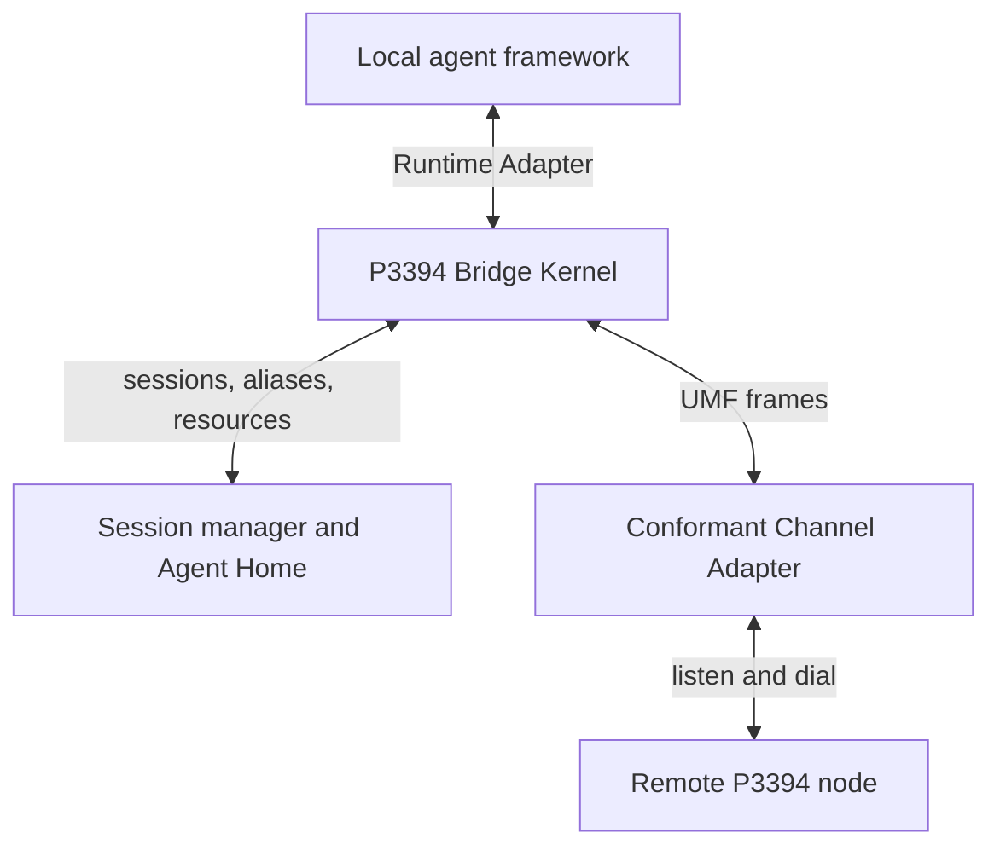
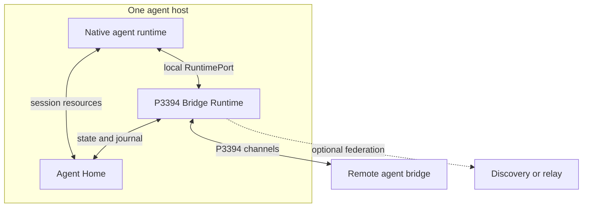
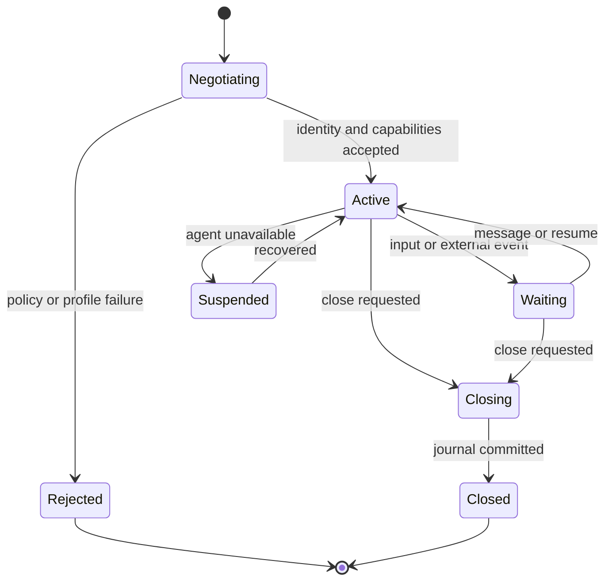

# P3394 Local Bridge ADK and Channel-Adapter SDK

**Developer primer, architecture, interfaces, and local implementation**  
**Status:** Proposed reference design, revision 1.1  
**Date:** 2026-08-12

## 1. Executive decision

P3394 should adopt a **locality-first architecture**:

> Every P3394-compliant agent instance MUST have a P3394 Bridge Runtime on the same physical or virtual host. The bridge is the agent's local protocol endpoint, session authority, resource broker, and interoperability boundary.

The bridge may be linked into the agent process or run as a sidecar process/container, but it may not be replaced by a remote-only proxy. A network gateway may relay, route, discover, or federate agents; it is not the canonical bridge for an agent it does not co-reside with.

This decision makes the P3394 ADK more than a network client. It becomes the local **stub and skeleton** for an agent:

- **Outbound proxy/stub:** presents remote agents as native tools, delegates, or subagents.
- **Inbound listener/skeleton:** accepts remote P3394 work and invokes the local agent runtime.
- **Session authority:** maps external sessions to native agent sessions and owns their durable state.
- **Resource broker:** gives both the bridge and agent a controlled view of session files and artifacts.
- **Policy boundary:** applies identity, authorization, consent, budgets, and audit rules before work reaches the agent.

The desired integration remains one or two lines. A developer supplies an existing local agent and selects an already-conformant channel adapter package; the ADK supplies the listener, server-side session manager, client registry, and outbound client hook:

```python
agent = MyAgent(...)
node = p3394.enable(
    agent,
    alias="@reviewer",
    channels=[p3394_channels.https(listen=":3394")],
)
```

or, if the framework requires explicit tool registration:

```python
bridge = p3394.attach(agent, home="./agent-home")
agent.add_tool(bridge.client_hook())
bridge.serve(":3394")
```

After attachment, the original agent has both directions:

- a P3394 input channel that listens for session and message requests;
- a server session manager that binds those requests to native framework sessions;
- a local peer registry resolving handles such as `@researcher`;
- an outbound client that connects to local or remote P3394 nodes; and
- a framework-native chat/tool hook that sends every semantic turn in a P3394 UMF envelope.

## 2. Fundamental design philosophy

### 2.1 Local sovereignty

The agent and its bridge form one **Agent Execution Boundary**. Session truth, credentials, local resources, and runtime control remain inside that boundary. Remote infrastructure can transport messages but cannot silently become the agent's memory or authority.

### 2.2 Semantic interoperability above transport interoperability

HTTP connectivity alone is insufficient. P3394 standardizes the semantics that must survive across frameworks:

- identity and delegation;
- agent description and capabilities;
- session and task continuity;
- messages, events, and artifacts;
- cancellation, interruption, and resumption;
- policy, consent, and audit information;
- declared degradation when a channel cannot carry a feature.

### 2.3 Framework-native at the edge, canonical in the bridge

LangGraph state, OpenAI run state, AG2 conversations, LlamaIndex workflows, Hermes workspaces, and CLI processes should remain native. A runtime adapter maps each of them into a small canonical P3394 model. P3394 does not require frameworks to adopt a common internal agent implementation.

### 2.4 One bridge core, many façades

Python, TypeScript, MCP, CLI, and framework plugins are façades over the same bridge core. They must not develop independent session or protocol behavior.

### 2.5 Progressive compliance

A minimal implementation can support point-to-point messages and stateless tasks. Higher conformance levels add durable sessions, artifacts, multi-party participation, identity assurance, and transactional workflow semantics. Unsupported features must be discoverable before a session begins.

### 2.6 Gateway precedent

Terminology note: the publicly documented local agent gateway matching the requested Slack/Telegram/Feishu example is **OpenClaw**; this primer uses that project as the reference for the user's “OpenCloud” mention.

P3394 deliberately borrows three proven implementation patterns:

- **Bridge ADK:** auto-detect a native framework adapter, wrap the agent in a protocol executor, expose a listener, connect to a remote agent, and project the remote agent back into OpenAI Agents, Google ADK, or Claude as a native tool. P3394 generalizes this from A2A text-oriented wrapping into UMF, durable sessions, resources, identity, and multiple channel bindings.
- **Hermes Gateway:** run one gateway process that attaches Telegram, Slack, Discord, Feishu/Lark, and many other messaging adapters to the same agent and session subsystem. P3394 adopts the single local gateway plus pluggable adapters, but its peers are agents and its canonical payload is UMF rather than a platform chat event.
- **OpenClaw Gateway:** make a local gateway the source of truth for sessions, routing, events, and channel connections, while UI, CLI, and channel plugins connect to that gateway. P3394 adopts this local control-plane shape and adds a standards-defined server/client boundary between independent agent nodes.

The useful analogy is:

| Messaging gateway | P3394 bridge |
|---|---|
| Telegram/Slack/Feishu adapter | P3394/A2A/MCP/local channel adapter |
| Chat/user ID | authenticated agent identity |
| DM or group thread | P3394 conversational session |
| Platform message event | UMF semantic message |
| Bot send API | P3394 channel dialer/client |
| Mention such as `@bot` | local peer alias such as `@researcher` |



## 3. Normative locality model

A compliant deployment has these properties:

1. The bridge and agent execute on the same host.
2. Their control connection uses an in-process call, loopback, Unix-domain socket, named pipe, shared volume, or supervised stdio—not a public network endpoint.
3. Each agent instance has a dedicated **Agent Home** owned by that agent identity.
4. The bridge is the sole network-facing protocol authority for that local agent unless the framework's embedded listener is itself the bridge.
5. Session state has a local canonical copy. Replication is permitted, but a remote service cannot be the only copy required for normal session operation.

A sidecar container is compliant only when scheduled on the same host and joined to the agent through local IPC and a private shared storage boundary. A Kubernetes service in another pod on an arbitrary node is a remote proxy and is not compliant with this locality profile.



## 4. Logical architecture

The reference implementation contains six planes.

### 4.1 Runtime plane

The Runtime Adapter knows how to start, resume, stream, interrupt, and close work in the native framework. It is the only component that needs framework-specific knowledge.

### 4.2 Protocol plane

The Bridge Kernel validates P3394 Universal Message Format (UMF) envelopes, negotiates capabilities, manages task state, enforces idempotency, and routes events between the runtime and channels.

### 4.3 Channel plane

Channel adapters listen and dial over native P3394 HTTP/WebSocket, A2A, MCP profiles, local IPC, or future transports. Channels carry canonical operations but do not own agent memory.

### 4.4 Session plane

The Session Manager binds a P3394 session to a native runtime session, journals events, tracks participants, maintains epochs and leases, and recovers interrupted work.

### 4.5 Resource plane

The Resource Store manages artifacts and session files. Small metadata lives in SQLite; large objects are content-addressed files. The agent receives stable local paths or resource handles rather than large inline payloads.

### 4.6 Trust plane

The Identity and Policy components authenticate peers, validate delegation, scope local credentials, request consent, enforce budgets, and generate auditable decisions.

## 5. Two mandatory adapter interfaces

The word “channel adapter” should not be used for the entire bridge implementation. The ADK has two distinct adaptation boundaries.

### 5.1 Inward Runtime Adapter

```python
class RuntimeAdapter(Protocol):
    async def describe(self) -> RuntimeDescription: ...

    async def open_session(
        self, session: SessionContext
    ) -> RuntimeSessionBinding: ...

    async def deliver(
        self, binding: RuntimeSessionBinding, message: UMFMessage
    ) -> AsyncIterator[RuntimeEvent]: ...

    async def resume(
        self, binding: RuntimeSessionBinding, checkpoint: CheckpointRef
    ) -> AsyncIterator[RuntimeEvent]: ...

    async def cancel(self, binding: RuntimeSessionBinding, task_id: str) -> None: ...
    async def snapshot(self, binding: RuntimeSessionBinding) -> CheckpointRef | None: ...
    async def close_session(self, binding: RuntimeSessionBinding, reason: str) -> None: ...
```

`deliver()` is deliberately event-oriented. A framework can emit text deltas, tool calls, state changes, requests for user input, artifacts, checkpoints, errors, and final results without pretending every agent call is a synchronous function.

### 5.2 Outward Channel Adapter

```python
class ChannelAdapter(Protocol):
    descriptor: ChannelDescriptor
    schemes: set[str]

    async def start(self, context: ChannelContext) -> None: ...

    async def listen(
        self, endpoint: Endpoint, receiver: InboundReceiver
    ) -> ListenerHandle: ...

    async def connect(
        self, endpoint: Endpoint, credentials: CredentialRef | None
    ) -> ChannelConnection: ...

    async def capabilities(self, endpoint: Endpoint) -> ChannelCapabilities: ...
    async def send(self, connection: ChannelConnection, frame: UMFFrame) -> None: ...
    async def receive(self, connection: ChannelConnection) -> AsyncIterator[UMFFrame]: ...
    async def health(self) -> ChannelHealth: ...
    async def close(self, connection: ChannelConnection) -> None: ...
    async def stop(self) -> None: ...
```

Channel adapters MUST declare which semantics they preserve: streaming, bidirectional initiation, durable tasks, artifacts, cancellation, multi-party sessions, push notifications, and identity proofs. The kernel either negotiates a common profile or fails explicitly; it must not silently discard semantics.

### 5.3 Channel Adapter SDK and package contract

A developer converting an agent should consume a channel adapter, not implement network protocol details. The Channel Adapter SDK therefore provides base classes, schema validation, lifecycle helpers, authentication hooks, retry/backpressure utilities, and a conformance harness.

Every installable adapter package contains a descriptor equivalent to:

```yaml
id: org.p3394.channel.https
sdkVersion: "1.x"
adapterVersion: "1.2.0"
schemes: [p3394+https, p3394+wss]
roles: [listener, dialer]
bindings: [umf-json]
capabilities:
  streaming: bidirectional
  durableTasks: true
  cancellation: true
  artifacts: referenced
  multiPartySessions: true
  identityProofs: [mtls, oauth2, did-proof]
entrypoint: p3394_channel_https:factory
```

A conformant adapter package MUST:

1. implement listener and/or dialer roles and declare the implemented roles;
2. preserve immutable UMF message identifiers and session/task correlation;
3. surface authenticated peer claims without converting them into authorization decisions;
4. implement bounded queues, backpressure, cancellation, health, and graceful shutdown;
5. expose binding limitations through capability negotiation;
6. use Bridge Kernel services for session storage, aliases, policy, and resources rather than creating private competing stores;
7. pass the Channel Adapter Test Kit for every declared transport and capability.

Adapters may translate Slack, Telegram, or Feishu events for human-facing gateways, but such adapters are not automatically agent-to-agent P3394 channels. A P3394 channel must carry UMF semantics and authenticated agent/session addressing. Human-chat adapters can coexist as ingress façades on the same bridge.

### 5.4 Adapter discovery and selection

The bridge discovers adapters through language-native package entry points and an optional explicit configuration. Auto-selection is by URI scheme, never by import order:

```python
node = p3394.enable(
    agent,
    channels=[
        "p3394+https://0.0.0.0:3394",
        "p3394+ipc:///run/reviewer.sock",
    ],
)
```

The SDK resolves each scheme to one installed conformant adapter, validates its descriptor, starts its listener, and registers its dialer with the client. If two packages claim the same scheme, configuration must choose one explicitly. The bridge refuses startup when a required capability is absent.

## 6. Agent Home: the local state and resource contract

Each agent instance has one configurable home, for example:

```text
agent-home/
├── agent.yaml                 # identity, capabilities, endpoints
├── policy.yaml                # local authorization and consent policy
├── state/
│   ├── bridge.db              # sessions, tasks, mappings, deduplication
│   └── journal/               # append-only recovery events
├── sessions/
│   └── <session-id>/
│       ├── context.json       # safe session metadata exposed to the agent
│       ├── workspace/         # mutable files intentionally shared with agent
│       ├── artifacts/         # session artifact links
│       └── checkpoints/       # framework checkpoint references
├── objects/sha256/            # content-addressed immutable blobs
├── peers/                     # cached manifests and trust decisions
├── run/
│   ├── bridge.sock            # local control socket
│   └── bridge.pid
└── secrets/                   # OS-protected references; never sent as UMF
```

The directory is a portability contract, not an invitation for every framework to edit the database. Agents use a `SessionContext` API. Frameworks that are workspace-aware additionally receive:

```text
P3394_AGENT_HOME=/absolute/path/agent-home
P3394_SESSION_ID=...
P3394_SESSION_DIR=/absolute/path/agent-home/sessions/.../workspace
```

Recommended storage rules:

- SQLite in WAL mode is the default metadata store.
- The event journal is append-only and includes monotonic sequence numbers.
- Artifacts are immutable, content-addressed, and referenced by digest.
- Workspace files are mutable and session-scoped.
- Database and journal writes use transactional outbox semantics before network acknowledgement.
- Every inbound message has an idempotency key; delivery is at-least-once with deterministic deduplication.
- File permissions isolate agent homes. Secret material is stored through OS keyrings or secret managers, with only opaque references in the database.

## 7. Canonical session model

A P3394 session is longer-lived than an individual task and may contain many messages, tasks, artifacts, participants, and checkpoints.

```python
@dataclass
class SessionContext:
    session_id: str
    home_agent_id: str
    epoch: int
    participants: list[Participant]
    native_session_id: str | None
    workspace: Path
    policy_context: PolicyContext
    capabilities: NegotiatedCapabilities
    created_at: datetime
    expires_at: datetime | None
```

The bridge maintains three identifiers rather than conflating them:

- `session_id`: collaborative P3394 context;
- `task_id`: one unit of work with a lifecycle;
- `message_id`: one immutable message or event.

The native framework's thread, run, conversation, checkpoint, or workflow identifier is stored in `native_session_id` as a local mapping and is not required to be portable.

### 7.1 Session state machine



Task state is separate: `submitted`, `working`, `input-required`, `completed`, `failed`, or `cancelled`. This separation permits several concurrent or sequential tasks inside one session.

### 7.2 Ownership and conflict rules

- The receiving bridge allocates the authoritative local session record on first contact.
- A session epoch changes when ownership or recovery state changes.
- Events are ordered per sender and task, not globally across all participants.
- Optimistic version fields prevent lost updates to shared session metadata.
- A participant may reconnect with a resume token scoped to its identity and session.
- Multi-party shared files require explicit lock, merge, or append policies; shared POSIX writes alone are not a collaboration protocol.

## 8. Universal Message Format minimum envelope

The bridge should keep the normative envelope small and extensible:

```json
{
  "specVersion": "p3394/1.0",
  "messageId": "msg_...",
  "sessionId": "ses_...",
  "taskId": "tsk_...",
  "sender": {"agentId": "...", "delegation": []},
  "recipients": [{"agentId": "..."}],
  "kind": "message",
  "role": "requester",
  "parts": [
    {"type": "text", "text": "Review the attached design"},
    {"type": "resource", "uri": "p3394-object:sha256:..."}
  ],
  "replyTo": "msg_...",
  "idempotencyKey": "...",
  "trace": {"traceparent": "..."},
  "extensions": {}
}
```

Normative kinds include `message`, `task`, `event`, `artifact`, `control`, and `error`. Large binary content is referenced, not embedded. Extensions use namespaced identifiers and cannot redefine core fields.

## 9. Public ADK interface

### 9.1 Python embedded or supervised mode

```python
import p3394

agent = create_agent()

bridge = p3394.enable(
    agent,
    home="./.p3394/reviewer",
    identity="did:web:example.com:agents:reviewer",
    listen=["p3394+https://0.0.0.0:3394"],
    adapter="auto",
)
```

`enable()` performs the integration work:

1. detects or validates the runtime adapter;
2. opens the Agent Home and acquires an instance lease;
3. generates or loads the agent manifest;
4. starts the local bridge kernel;
5. installs the inbound runtime handler;
6. exposes the outbound peer tool, if the framework supports tools;
7. starts configured channel listeners;
8. registers graceful shutdown hooks.

For production, `mode="sidecar"` makes the library supervise or connect to a local bridge daemon over a Unix socket. The application-facing API remains unchanged.

### 9.2 Outbound peer API

```python
bridge.peers.register(
    "@researcher",
    "p3394+a2a://research.example/agent",
    expected_identity="did:web:research.example:agent",
)

peer = await bridge.connect("@researcher")

result = await peer.run(
    "Compare these standards",
    session=bridge.current_session,
    resources=[report],
)

agent.add_tool(peer.as_tool(name="standards_researcher"))
```

`peer.as_tool()` is a projection, not the P3394 protocol itself. It lets a model call a remote agent through its normal tool system while the bridge retains the session, identity, and transport semantics.

### 9.3 Decorator/manual adapter path

```python
@p3394.runtime_adapter(MyAgent)
class MyAgentAdapter(RuntimeAdapter):
    ...
```

Unknown frameworks can become compliant by implementing the seven-method `RuntimeAdapter`; they do not need to implement channels, authentication, session storage, or network servers.

### 9.4 Agent alias and peer registry

`@certain-node-agent-alias` is a local, human-readable routing handle. It is intentionally not a globally trusted identity. The alias resolves to a `PeerRecord` containing stable identity expectations, candidate endpoints, channel preferences, and cached manifest metadata:

```python
@dataclass
class PeerRecord:
    alias: str                         # @researcher
    expected_identity: str | None     # stable DID/OID/certificate subject
    endpoints: list[Endpoint]
    preferred_channels: list[str]
    manifest_digest: str | None
    trust_policy: str
```

Resolution precedence is deterministic:

1. an alias explicitly bound for the current session;
2. the Agent Home peer registry;
3. configured organizational directory/discovery service;
4. failure requiring explicit registration.

Aliases MUST NOT be used directly for authentication or authorization. After connection, the authenticated peer identity must match the `expected_identity` or satisfy the configured trust policy. An alias can be rebound only through an explicit registry operation and the change is audited.

Suggested syntax:

- `@researcher` — local address-book alias;
- `@researcher/example.org` — directory-scoped alias;
- `p3394://did:web:example.org:agents:researcher` — identity-oriented address;
- an endpoint URI — direct connection without a saved alias.

The portable API is:

```python
bridge.peers.register(alias, address, expected_identity=None)
bridge.peers.resolve(alias)
bridge.peers.remove(alias)
bridge.peers.list()
```

### 9.5 Conversational client hook

The client hook lets the native agent treat a peer like another participant in a conversation:

```python
agent.add_tool(bridge.client_hook())

# Natural agent instruction or application call
await agent.run("@researcher compare P3394 with A2A, then report back")
```

The hook performs six operations:

1. recognizes a registered `@alias` in structured recipient metadata or text;
2. resolves and authenticates the peer;
3. joins or creates a P3394 session;
4. converts the semantic message into a UMF envelope;
5. sends it through the selected channel dialer and streams events back;
6. maps the reply into the native framework's message/tool-result representation.

Text parsing is a convenience, not the normative routing interface. Framework integrations should prefer structured recipient fields when available so quoted text and ordinary human mentions are not accidentally dispatched.

Every semantic turn receives its own immutable UMF `messageId`; follow-up turns retain the same `sessionId`, set `replyTo`, and create or reuse a `taskId` according to the negotiated interaction pattern. Transport chunks are frames of one semantic message and do not become independent conversation turns.

### 9.6 Server-side input listener contract

For every configured listener, the Bridge Kernel provides the same inbound pipeline:

```python
async def on_inbound(frame: UMFFrame, channel: ChannelContext):
    message = umf.reassemble_and_validate(frame)
    peer = await identity.authenticate(channel, message.sender)
    decision = await policy.authorize(peer, message)
    session = await sessions.open_or_restore(message.session_id, peer)
    await journal.commit_inbound(message, session)
    async for event in runtime.deliver(session.binding, message):
        await journal.commit_outbound(event, session)
        await channel.reply(umf.from_runtime_event(event))
```

This server input channel is present regardless of whether the local runtime is Pydantic AI, LangChain, Hermes, AG2, or a proprietary agent. Only the Runtime Adapter changes.

### 9.7 Framework quick starts

The exact runtime-specific object names may vary, but the integration target is deliberately uniform.

**Pydantic AI**

```python
from pydantic_ai import Agent
import p3394

agent = Agent("openai:gpt-5", instructions="You are a reviewer.")
node = p3394.enable(agent, alias="@reviewer", channels=["p3394+https://:3394"])
```

**LangChain or LangGraph**

```python
graph = build_graph()
node = p3394.enable(graph, alias="@planner", session_key="thread_id")
```

**AG2**

```python
assistant = ConversableAgent(name="analyst", ...)
node = p3394.enable(assistant, alias="@analyst", channels=["p3394+https://:3394"])
```

**Hermes or another CLI agent**

```bash
p3394 serve --alias @hermes \
  --runtime-command "hermes --p3394-jsonl" \
  --channel p3394+https://0.0.0.0:3394
```

In each case, the outcome is the same: an inbound P3394 agent server, a local session manager, an alias registry, and an outbound client hook.

## 10. MCP local integration profile (SA-MCP)

MCP is useful as a local adapter, but one directional MCP tool connection is insufficient for full bidirectional agent operation. A P3394 bridge must both invoke the local agent for inbound work and let the local agent invoke remote peers.

The proposed **SA-MCP profile** therefore defines two logical surfaces, which may share one local process but retain clear roles:

### 10.1 Agent Runtime MCP surface

The native agent exposes a local MCP server; the bridge acts as its MCP client. Required tools:

- `p3394.runtime.describe`
- `p3394.runtime.open_session`
- `p3394.runtime.deliver`
- `p3394.runtime.resume`
- `p3394.runtime.cancel`
- `p3394.runtime.close_session`

Events too large or long-running for one result use task handles and resource references. The agent runtime server listens only on stdio, a Unix socket, or loopback with an instance token.

### 10.2 Bridge MCP surface

The bridge exposes an MCP server to the agent host for outbound operations:

- `p3394.peer.discover`
- `p3394.peer.connect`
- `p3394.peer.send`
- `p3394.task.get`
- `p3394.task.cancel`
- `p3394.resource.get`

Remote peers can also be projected as specifically named tools so models see domain intent rather than a single overly generic `send` tool.

An implementation may define a negotiated duplex extension, but basic conformance must not assume an MCP server can arbitrarily invoke its client as an agent. The dual-surface design works with ordinary MCP roles.

## 11. Structured-stream CLI profile (SSCLI)

SSCLI is the lowest-common-denominator Runtime Adapter for Hermes-style agents, coding agents, shell-based workers, and runtimes with no embeddable SDK.

```bash
p3394 serve \
  --home ./.p3394/hermes \
  --runtime-command "hermes-agent --p3394-jsonl" \
  --listen p3394+https://0.0.0.0:3394
```

The bridge supervises the local agent subprocess and exchanges UTF-8 JSON Lines over stdin/stdout:

```json
{"op":"open_session","requestId":"r1","sessionId":"s1","workspace":"/.../sessions/s1/workspace"}
{"ok":true,"requestId":"r1","nativeSessionId":"thread-27"}
{"op":"deliver","requestId":"r2","sessionId":"s1","message":{"messageId":"m1","parts":[{"type":"text","text":"Review this"}]}}
{"event":"delta","requestId":"r2","sequence":1,"text":"I found "}
{"event":"artifact","requestId":"r2","sequence":2,"resource":"p3394-object:sha256:..."}
{"event":"completed","requestId":"r2","sequence":3}
```

SSCLI requires:

- an initial protocol/version handshake;
- correlation IDs and monotonic event sequence numbers;
- separate stdout protocol and stderr diagnostics;
- cancellation through a control frame before process signals;
- heartbeat, timeout, exit-code, and restart semantics;
- environment and working-directory allowlists;
- no secrets in command-line arguments or protocol logs;
- process-group cleanup and resource limits.

For an already-running CLI agent, the same profile can use a local Unix socket instead of subprocess stdio.

## 12. Channel listener and server design

The local bridge daemon contains one server kernel and zero or more listener plugins. “Session server” is therefore a logical responsibility, not necessarily a separate deployable service.

```text
p3394-bridge daemon
  ├── local control listener       Unix socket / named pipe
  ├── native P3394 listener        HTTPS + streaming
  ├── optional A2A listener        A2A binding
  ├── optional MCP channel         negotiated P3394 profile
  ├── session manager              SQLite + journal
  └── resource endpoint            authenticated artifact transfer
```

The daemon MUST bind public endpoints only when explicitly configured. Local development defaults to loopback. Production listeners require TLS, authenticated peer identity, request limits, replay protection, and policy evaluation.

The listener pipeline is:

1. accept and authenticate connection;
2. resolve target local agent identity;
3. negotiate protocol and semantic capability profile;
4. authorize participant, action, resource access, and delegation;
5. deduplicate and journal the inbound operation;
6. open or restore the local session;
7. invoke the Runtime Adapter;
8. journal and stream events/results;
9. commit artifact references and acknowledgement state.

## 13. Mapping to existing protocols

P3394 should treat A2A, MCP, and native HTTP as channel/runtime bindings—not competing definitions of the local agent.

| Concern | P3394 canonical concept | A2A mapping | MCP mapping |
|---|---|---|---|
| Agent description | Agent Manifest | Agent Card | Server/tool metadata |
| Collaborative context | Session | `contextId` | Local profile; not assumed from transport |
| Unit of work | Task | Task | Tool call or Tasks extension |
| Input/output | UMF parts | Message parts | Tool arguments/content |
| Deliverable | Resource/Artifact | Artifact | Resource or tool result |
| Long-running work | Task events | Streaming/task updates | Tasks extension where negotiated |
| Inbound agent invocation | Runtime Adapter | A2A executor | Agent Runtime MCP surface |

Translation must produce a `MappingReport` that identifies preserved, synthesized, and dropped fields. A channel adapter fails negotiation when a required semantic cannot be represented safely.

## 14. Framework integration patterns

| Framework class | Local integration | Native session binding | Remote peer projection |
|---|---|---|---|
| Pydantic AI | Python Runtime Adapter and tool registration | framework message history/run context | typed tool or dependency |
| OpenAI Agents SDK | Python Runtime Adapter | session/thread/run identifier | function tool or agent-as-tool |
| AG2/AutoGen | message/reply hook | conversation/group context | conversable agent proxy |
| LangChain/LangGraph | Runnable and callback adapter | thread/checkpoint ID | StructuredTool/Runnable |
| LlamaIndex | workflow/agent handler | context/store key | FunctionTool/agent workflow |
| Hermes/local agent | SSCLI or local MCP | workspace/conversation ID | CLI command or MCP peer tools |
| Claude Code-like agent | local MCP plus worker hook, or SSCLI | project/session workspace | MCP peer tools |
| Managed cloud agent | provider-hosted co-resident bridge | provider-native session ID | provider-native tool |
| Proprietary service | RuntimeAdapter over local IPC | opaque local ID | SDK proxy |

A managed platform is P3394-locality compliant only if the provider deploys the bridge inside the same worker/VM/host boundary as the agent and supplies local session storage or a locally mounted durable volume. Asking a customer's remote gateway to impersonate a closed managed agent is not compliance.

### 14.1 Lessons from Bridge ADK, Hermes, and OpenClaw

Bridge ADK's strongest developer-experience choices should be retained:

- `serve(agent)`-style wrapping rather than requiring the agent author to implement a protocol server;
- runtime adapter auto-detection with a small custom adapter interface;
- `connect(address)` returning a remote-agent object;
- framework-native projections such as `as_openai_tool()` or MCP server configuration;
- metadata-derived tool names and descriptions so the calling model understands the peer.

P3394 must go beyond Bridge ADK's initial alpha limitations by requiring structured UMF parts, resource/artifact mapping, authentication hooks, explicit capability negotiation, and durable framework-neutral sessions.

Hermes demonstrates that one local gateway can run many channel adapters simultaneously while preserving the same agent, memory, tools, and per-conversation state. Its messaging gateway also demonstrates practical requirements that P3394 should copy: sender authorization, per-chat session keys, interruption, media normalization, scheduled delivery, and channel-specific error handling.

OpenClaw makes its local Gateway the control plane and source of truth for sessions, routing, channel connections, and events. Its channel-plugin architecture and per-agent/workspace/sender routing support the same structural decision made here: channel plugins terminate at a local bridge; they do not become independent agent brains.

The P3394 distinction is that Slack, Telegram, and Feishu are normally **human-to-agent presentation channels**, whereas a P3394 adapter is an **agent-to-agent semantic channel**. Both can share the same gateway mechanics, but only the latter guarantees UMF envelopes, authenticated agent identity, negotiated capabilities, session participation, and peer-to-peer client behavior.

## 15. Security and privacy requirements

Co-residency reduces—but does not eliminate—risk. The bridge is a privileged local component and must be hardened accordingly.

- Use OS user/container isolation between unrelated agent homes.
- Authenticate local IPC with file permissions plus an instance token or peer credentials.
- Never expose the local control socket publicly.
- Bind remote identity to session participation and every delegation hop.
- Treat remote instructions and artifacts as untrusted inputs.
- Apply least-privilege resource mounts and credential scopes per task.
- Record policy decisions and resource disclosures in the audit journal.
- Support human consent events without leaking secret values to the remote peer.
- Encrypt network channels and optionally encrypt sensitive local artifacts.
- Define retention and deletion policy per session; deletion must cover journals, workspaces, cached peer data, and replicated copies where applicable.

## 16. Packaging and reference implementation

Recommended packages:

```text
p3394-spec/                 JSON Schema, protobuf, conformance fixtures
p3394-bridge/               kernel, daemon, sessions, resources, policy
p3394-channel-sdk/          adapter API, lifecycle helpers, conformance kit
p3394-python/               Python API and framework adapters
p3394-js/                   TypeScript API and framework adapters
p3394-mcp/                  SA-MCP dual-surface profile
p3394-cli/                  administration and SSCLI runner
p3394-channel-native/       native HTTPS/streaming binding
p3394-channel-a2a/          A2A adapter
p3394-channel-ipc/          same-host Unix socket/named-pipe binding
p3394-testkit/              fake peers, traces, failure injection
```

For the fastest credible implementation, build the first reference bridge in Python with:

- Pydantic-generated schemas;
- asyncio runtime;
- FastAPI/ASGI native listener;
- Unix socket local control plane;
- SQLite WAL session store;
- content-addressed filesystem resources;
- pluggy- or entry-point-based adapters;
- a persistent peer alias registry and manifest cache;
- OpenTelemetry traces.

Distribute it as both a Python package and a self-contained executable. Keep wire schemas and local IPC language-neutral so a hardened Rust or Go daemon can later replace the kernel without changing framework APIs.

## 17. Ease-of-integration requirements

The SDK succeeds only if integration friction is an explicit conformance target.

### Level 0: client-only

An agent can call a remote P3394 agent through a library, MCP tool, or CLI. It is not advertised as a bidirectional P3394 agent.

### Level 1: reachable agent

One call attaches the runtime, starts a local listener, advertises a manifest, and supports point-to-point task execution.

### Level 2: session-aware agent

The adapter preserves native session identity, workspace, artifacts, streaming, cancellation, and restart recovery.

### Level 3: collaborative agent

The implementation supports multi-party participation, delegation chains, resource policy, checkpoints, and integrated workflows.

The SDK should automatically detect common frameworks, but always expose the selected adapter and negotiated profile in diagnostics. “Magic” must remain inspectable.

## 18. Conformance and test strategy

Every Runtime Adapter is tested once against a framework-independent suite:

- open/deliver/resume/cancel/close behavior;
- event ordering and backpressure;
- session restoration after bridge and agent restart;
- workspace and artifact visibility;
- duplicate delivery and idempotency;
- input-required and consent round trips;
- cancellation races and partial output;
- secret redaction and policy denial.

Every Channel Adapter is tested independently:

- capability negotiation and downgrade rejection;
- authentication and replay protection;
- framing, streaming, reconnect, and cancellation;
- lossless mapping of required UMF fields;
- large artifact transfer and integrity verification;
- malformed messages, slow peers, and resource exhaustion.
- descriptor validity, duplicate scheme claims, health, and graceful shutdown.

The peer registry and client hook are tested for:

- deterministic `@alias` resolution and explicit rebinding;
- authenticated-identity mismatch after alias resolution;
- session-scoped versus Agent Home aliases;
- non-dispatch of quoted or ambiguous human mentions;
- one UMF envelope per semantic turn and stable session continuity;
- reconnect and endpoint failover without changing peer identity.

End-to-end golden tests pair every runtime adapter with every supported channel through the common kernel, preventing an N-by-N implementation matrix.

The SDK should ship two commands:

```bash
p3394 adapter test org.p3394.channel.https
p3394 doctor --agent-home ./.p3394/reviewer
```

The first executes the Channel Adapter Test Kit. The second validates the local runtime binding, Agent Home permissions, listener reachability, peer registry, and a loopback session without contacting an unapproved remote node.

## 19. Minimal implementation sequence

### First usable reference

1. Freeze UMF, task events, Agent Manifest, and adapter interfaces.
2. Implement Agent Home, SQLite session store, journal, and artifact store.
3. Implement the Python callable Runtime Adapter.
4. Implement the native HTTPS listener and Python client.
5. Add `enable()`, `attach()`, `connect()`, `peers.register()`, `client_hook()`, and `peer.as_tool()`.
6. Publish conformance fixtures and a two-agent example.

### Interoperability expansion

1. Add the A2A channel adapter.
2. Add SA-MCP dual-surface integration.
3. Add SSCLI supervision.
4. Add LangGraph, OpenAI Agents, AG2, LlamaIndex, and Hermes adapters.
5. Add discovery federation and managed-platform deployment profiles.

## 20. Final recommendation

The public concept should remain **P3394 Bridge ADK**, because developers should experience one object that makes an agent both callable and able to call peers. Internally, the implementation must preserve three boundaries:

1. **Runtime Adapter** toward the co-resident native agent;
2. **Bridge Kernel** owning local sessions, resources, policy, and UMF;
3. **Channel Adapter** toward remote P3394 nodes and other protocols.

This structure satisfies the locality prerequisite without sacrificing one-line adoption. The Python library, MCP surfaces, and CLI are simply alternative ways to bind a native agent to its mandatory local bridge. The public web server, A2A listener, or relay connection is merely how that local bridge communicates with another agent's local bridge.

The defining rule is therefore:

> **No agent without a local bridge; no bridge without a local agent home; no remote interoperability without two locally sovereign endpoints.**

## References

- IEEE, [“P3394 - Standard for Large Language Model Agent Interface”](https://standards.ieee.org/ieee/3394/11377/), project scope page.
- Model Context Protocol, [current specification](https://modelcontextprotocol.io/specification/2026-07-28) and [transport documentation](https://modelcontextprotocol.io/specification/2026-07-28/basic/transports).
- Agent2Agent Protocol, [current specification](https://a2a-protocol.org/latest/specification/), [task lifecycle](https://a2a-protocol.org/latest/topics/life-of-a-task/), context, and artifact documentation.
- Bridge ADK, [Python package documentation](https://pypi.org/project/bridge-adk/), including `serve()`, `connect()`, framework adapters, and remote-agent tool projections.
- Nous Research, [Hermes Agent](https://github.com/nousresearch/hermes-agent) and [integrations/gateway documentation](https://hermes-agent.nousresearch.com/docs/integrations/).
- OpenClaw, [repository](https://github.com/openclaw/openclaw) and [Gateway/channel architecture documentation](https://docs.openclaw.ai/).
- Feishu Open Platform, [agent integration overview](https://open.feishu.cn/document/mcp_open_tools/integrating-agents-with-feishu/overview).
- *GB/Z 185 智能体互联标准调研报告 v2*, supplied source document, especially the identity, description, discovery, interaction, and tool-calling layers.
