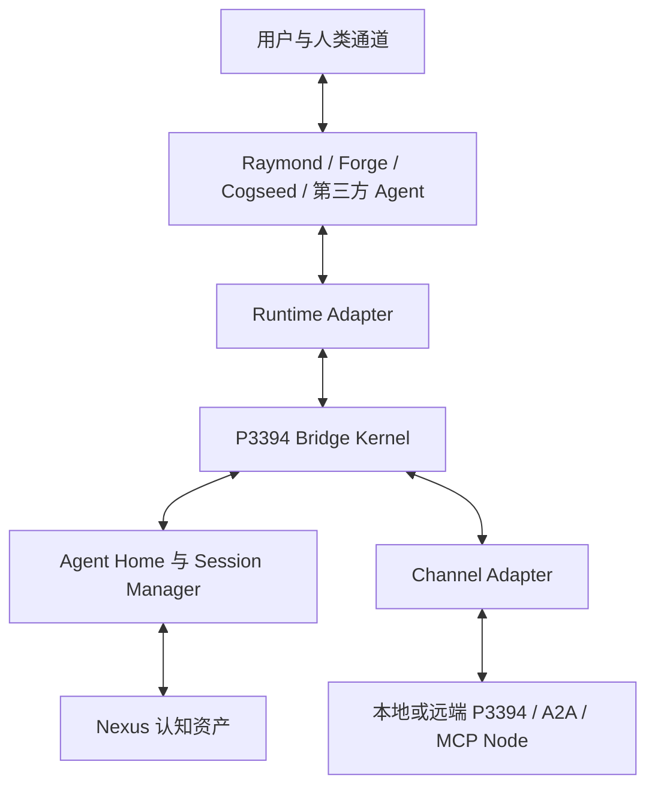
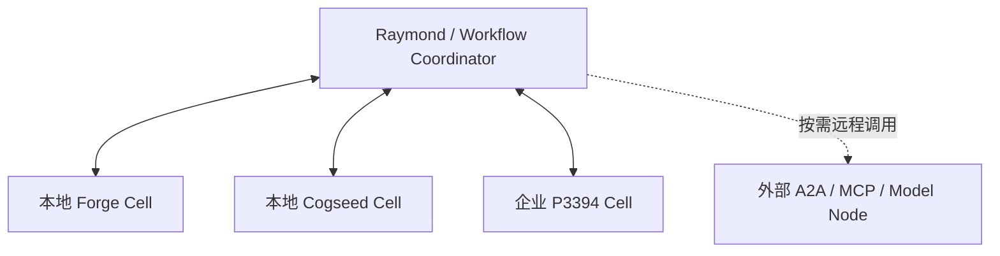
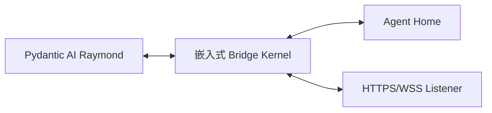
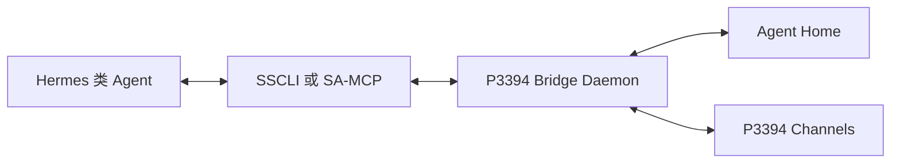
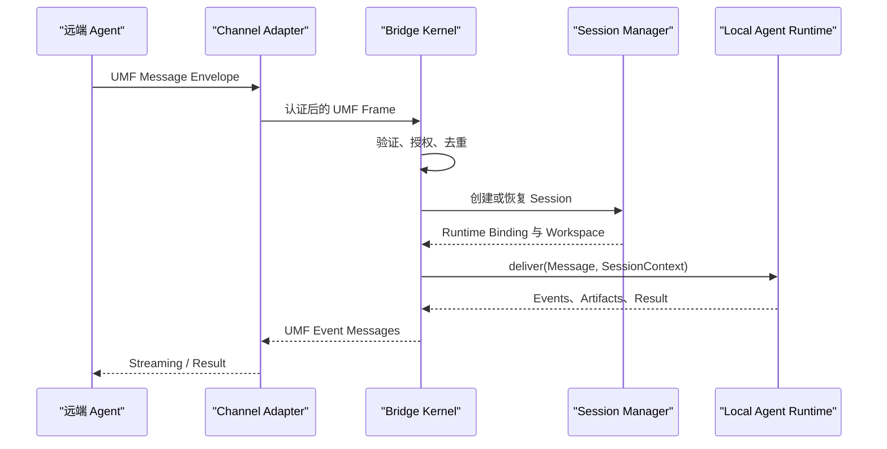

# P3394 LLM Agent Interface Standard 中文实施指南

## 面向 Raymond、Forge、Cogseed、第三方 ADK 与 Hermes 类 Agent Framework 的通用 Bridge ADK 实现

**文档性质：** 开发实施指南与参考架构  
**版本：** 1.1  
**日期：** 2026-08-12  
**默认语言与实现栈：** Python、Pydantic、Pydantic AI、asyncio、FastAPI/ASGI、SQLite

---

## 0. 一句话结论

任何 Agent 都不需要为了支持 P3394 而重写成一个新的 Agent Framework。无论它是 Raymond 伴侣智能体、Forge 任务智能体、Cogseed 开源伴侣智能体、企业自研 Agent，还是基于 Pydantic AI、Hermes、LangChain/LangGraph、AG2 或其他 ADK 实现的第三方 Agent，都可以在原有本地 Agent Runtime 旁边安装一个同机运行的 **P3394 Bridge Runtime**：

> 任意本地 Agent + Runtime Adapter + P3394 Bridge Kernel + Agent Home + Channel Adapter = 可双向通信、可加入 ECS Cognitive Cell Network 的 P3394 兼容 Agent Node。

开发者只需要：

1. 创建或复用本地 Agent；
2. 通过一行 `p3394.enable(...)` 挂接 Bridge；
3. 选择一个符合 Channel Adapter Spec 的现成 Channel Adapter；
4. 为 Agent 配置本地 Alias、Agent Home 和监听地址。

完成后，这个 Agent 同时获得：

- 一个符合 P3394 的 Agent Input Channel Listener；
- 一个本地 Agent Server Session Manager；
- 一个本地 Agent Home 与 Session Workspace；
- 一个 Agent Client、Peer Registry 与 `@agent-alias` 调用入口；
- 一套使用 Universal Message Format（UMF）Message Envelope 发送语义消息的能力；
- 一套将每个 Goal/Task Session 沉淀为 KSTAR Episode 的学习接口。

从 ECS 的角度看，每个完成上述封装的 Agent 都成为一个可独立运行、可被发现、可被调用、也可调用其他节点的 **Cognitive Cell（认知单元）**。这些 Cognitive Cells 可以在同一设备或企业内网中优先进行低延迟、低成本、数据可控的本地协作；只有在本地没有所需能力时，才通过已授权的远程 Channel Adapter 调用外部 Agent、A2A Node、MCP Capability、OpenAI-Compatible Model API 或其他 Agentic Node，组合成更高级的 Workflow。

---

## 1. 实施目标

本指南面向以下开发者：

- 正在实现 Raymond 或 Cogseed 伴侣智能体，希望其成为长期存在的 P3394 Agent Server 和 Agent Client 的团队；
- 正在实现 Forge 任务智能体，希望其可被 Raymond、其他 Forge 或外部 Agent 按任务调用的团队；
- 已经使用 Hermes 类 Agent Framework，希望在不重写 Agent Loop、Tools、Skills、Memory 和 Workspace 的前提下增加 P3394 能力的开发者；
- 使用 Pydantic AI、LangChain/LangGraph、AG2 或其他 ADK 的第三方 Agent 开发者；
- 希望将多个本地与远程 Agent Node 组合成 ECS Cognitive Cells 和高级 Workflow 的平台开发者。

实施目标不是把所有 Agent 改造成同一种内部架构，而是提供一个稳定的标准边界：

```text
Agent Framework 内部实现可以不同
        ↓ Runtime Adapter
P3394 Agent、Message、Session、Channel 与 Node Capability 语义保持一致
        ↓ Channel Adapter
任何本地或远程 P3394 Agent Node 均可互联
```

必须达到的开发体验是：

```python
from pydantic_ai import Agent
import p3394

raymond = Agent(
    "openai:gpt-5",
    name="raymond",
    instructions="You are the user's persistent companion agent.",
)

node = p3394.enable(
    raymond,
    alias="@raymond",
    home="./raymond-home",
    channels=["p3394+https://0.0.0.0:3394"],
)
```

`enable()` 之后，Raymond 既可以接收另一个 Agent 发起的新 Session，也可以在自己的对话中执行：

```text
@contract-reviewer 请在当前 Session 中审核这份合同，并返回风险条款与依据。
```

Client Hook 将其转换为带明确 Sender、Recipient、Session、Task、Message、Payload 和 Metadata 的 P3394 UMF Message Envelope，而不是把它降级成一次没有上下文和身份的普通 Tool Call。对于 Forge 或第三方任务 Agent，同一个接口可以由 Workflow Engine、上游 Agent 或应用代码直接调用，并不要求存在人类聊天界面。

---

## 2. 核心设计原则

### 2.1 每个 Agent 必须拥有同机 Bridge

每个 P3394 兼容 Agent Instance 都必须在同一台物理机、虚拟机、容器宿主机或可信执行单元内拥有自己的 Bridge Runtime。

Bridge 可以：

- 嵌入 Agent Python 进程；
- 作为同机 Sidecar Daemon 运行；
- 作为同一 Pod 内共享本地卷与 Unix Socket 的 Sidecar Container 运行。

Bridge 不可以仅由一个远程代理代替。远程 Gateway 可以提供发现、转发和联邦，但不能替代本地 Agent 的 Session Authority、Runtime Control、Credential Boundary 和 Agent Home。

### 2.2 Raymond 是统一入口，但 Session 必须按任务隔离

Raymond 对用户表现为一个持续存在的伴侣智能体入口，但不应把所有工作放进一个不断增长的上下文。

推荐使用两层结构：

| 层次 | 作用 | 是否直接承载任务上下文 |
|---|---|---|
| Companion Context | Raymond 的身份、关系、偏好、长期记忆和统一入口 | 否，只负责选择或创建工作 Session |
| Work Session | 围绕一个 Goal 管理消息、任务、参与者、资源、权限、状态和结果 | 是 |

用户可以一直和同一个 Raymond 对话，但 Raymond 会：

1. 识别当前消息是否属于已有 Goal；
2. 若属于，则恢复对应 P3394 Session；
3. 若不属于，则创建新的 Work Session；
4. 只向模型装载当前 Session 所需的最小上下文；
5. Session 完成后执行 AAR，并形成 KSTAR Episode。

### 2.3 Channel 不是 Agent，Alias 不是 Identity

- **Agent** 是具有稳定身份、能力和行为边界的逻辑主体；
- **Channel** 是 Agent 之间传递 Message 的通信机制；
- **Channel Instance** 是一个具体可用的监听端点或连接实例；
- **Channel Type** 描述 HTTP、WebSocket、A2A、MCP Profile、本地 IPC 等类型；
- **Channel Adapter** 把某一种 Channel Type 映射到 P3394 Channel Contract；
- `@reviewer` 是本地 Peer Registry 中的人类可读 Alias，不是认证凭据。

建立连接后，Bridge 必须验证远端 Agent Identity 是否符合 Alias 中的 `expected_identity` 或 Trust Policy。

### 2.4 每个语义消息只有一个 UMF Message Envelope

一次自然语言请求、状态通知、审批请求、结果或错误，分别形成一个语义 Message。网络分片、Token Streaming Chunk 和重试帧不应被误认为新的语义 Message。

同一个 Message：

- 只有一个不可变 `message_id`；
- 可以由多个传输 Frame 组成；
- 可以包含一个 Message Payload；
- Message Payload 可以包含多个 Payload Parts；
- Payload Metadata 为可选扩展；
- 所有后续消息通过 `reply_to`、`session_id` 和 `task_id` 建立关系。

### 2.5 本地框架状态保持原生，标准语义由 Bridge 统一

Hermes Workspace、Pydantic AI Message History、LangGraph Checkpoint、AG2 Conversation 和厂商 Runtime Session 都可以保留原有格式。

Bridge 只维护它们与 P3394 Session 的映射，不要求框架将所有内部状态公开给远端 Agent。

### 2.6 Local-First，Remote-on-Demand

ECS Cognitive Cell 的默认调度原则是本地优先：

1. 优先使用当前 Agent 自己的 Model、Skill、Ontology、Tool 和 Memory；
2. 其次调用同机的 Sub-Agent 或本地 P3394 Node；
3. 再调用企业内网中已经注册和授权的 P3394 Agent Node；
4. 只有本地与企业内部能力不足时，才调用外部 A2A Agent、MCP Capability、OpenAI-Compatible Model API 或其他远程 Agentic Service。

“本地优先”不是限制所有推理只能在本地模型中完成，而是让数据披露、成本、延迟、可用性和权限成为显式 Routing Policy。一个 Session 可以同时包含本地与远程参与者，但每次远程调用都必须经过 Registry Resolution、Capability Negotiation、Policy Authorization 和 Audit。

### 2.7 Adapter 统一不同外部能力，但不混淆语义

只要存在符合 P3394 Adapter Contract 的实现，并且目标已经登记在本地 Node Registry 中，Agent 就可以连接：

- 原生 P3394 Agent Node；
- 通过 A2A Channel Adapter 暴露的外部 Agent；
- 通过 MCP Adapter 暴露的 Tool、Resource 或 Agent Capability；
- 通过 OpenAI-Compatible API Adapter 暴露的 Model Runtime 或 Agentic Endpoint；
- 企业内部 HTTP、CLI、Message Queue 或其他专有 Agent Node。

其中需要保持一个重要区别：A2A Remote Agent 可以映射为完整的 P3394 Peer；MCP Server 通常映射为能力受限的 Capability Node；普通 OpenAI Model API 本身只是 Model Runtime，只有在 Adapter 为其补充 Agent Manifest、Identity、Session 和 Runtime Contract 后，才可以表现为完整 P3394 Agent Node。Bridge 必须通过 Capability Profile 明确这些差异，不能把所有 Endpoint 都伪装成同等自治的 Agent。

---

## 3. 通用 P3394 Cognitive Cell 与 Raymond 实现架构



### 3.1 Raymond Companion Agent

Raymond 负责：

- 维持用户可感知的持续身份与交互关系；
- 判断用户意图对应哪个 Goal 和 Work Session；
- 调用本地 Tools、Skills、Memory 和子 Agent；
- 通过 `@agent-alias` 委托远程 P3394 Agent；
- 将远端状态、输入请求、结果和 Artifact 重新呈现给用户；
- 在 Session 完成后发起 AAR 与 Learn-What。

Raymond 不直接负责：

- 网络协议监听；
- UMF Frame 重组；
- Peer Authentication；
- Session Journal 的事务一致性；
- Channel Retry、Backpressure 与 Replay Protection。

这些属于 P3394 Bridge Runtime。

同一架构不只适用于 Raymond。对于其他 Agent 类型，变化的主要是 Agent Role、Manifest Capability、默认 Session Policy 与 Runtime Adapter；Bridge Kernel、UMF、Channel、Registry 和 Agent Home Contract 保持一致。

### 3.2 Runtime Adapter

Runtime Adapter 把 Bridge 的标准操作映射到当前 Agent 所使用的 Agent Framework：

- `open_session()`：建立原生 Conversation、Thread 或 Workspace；
- `deliver()`：把 UMF Message 转换为本地 Agent Input；
- `stream()`：将模型输出、Tool Call 和运行状态转换为 Runtime Event；
- `resume()`：恢复 Checkpoint 或原生 Session；
- `cancel()`：中断当前 Task；
- `snapshot()`：保存可恢复状态；
- `close_session()`：完成清理和 AAR Hook。

### 3.3 P3394 Bridge Kernel

Bridge Kernel 是本地 Agent 的标准协议边界，负责：

- Agent Manifest；
- UMF Message Envelope 验证与生成；
- Session、Task 和 Message 生命周期；
- Peer Registry 与 Alias Resolution；
- Identity、Delegation、Authorization 和 Consent；
- Channel Adapter 生命周期；
- Runtime Adapter 调度；
- Idempotency、Journal、Recovery 和 Audit；
- Resource 与 Artifact 引用。

### 3.4 Agent Home

Agent Home 是每个 Cognitive Cell 的本地运行与认知边界，不只是缓存目录。它保存：

- Agent Identity 与 Manifest；
- Session/Task/Message 映射；
- 每个 Session 的 Workspace；
- Artifact 与 Checkpoint；
- Peer Alias 与 Manifest Cache；
- Policy、Consent 和 Audit Journal；
- 与 Nexus 同步的认知资产引用；
- KSTAR Episode 与 Learn-What 结果。

### 3.5 Channel Adapter

Channel Adapter 必须同时声明其角色：

- `listener`：接收远程 Agent 发起的连接、Session 和 Message；
- `dialer`：连接本地或远程 P3394 Agent Node，并发送 Message；
- 或同时支持两者。

P3394 Native HTTPS/WebSocket Adapter 应作为第一参考实现。A2A、MCP Profile、Unix Socket 或其他协议作为可替换的 Channel Type。

### 3.6 ECS Cognitive Cell Network

一个 ECS Cognitive Cell 是可被独立寻址和组合的最小认知执行单元：

```text
Cognitive Cell
= Agent Runtime
+ P3394 Bridge
+ Agent Identity 与 Manifest
+ Session/Task/Message Manager
+ Agent Home 与 Cognitive Assets
+ Runtime/Channel/Capability Adapters
```

典型单元包括：

| Cognitive Cell | 主要角色 | 默认交互方式 |
|---|---|---|
| Raymond Cell | 面向个人或员工的持续伴侣、统一入口和 Session Coordinator | 人机对话、任务分派、跨 Agent 协作 |
| Cogseed Cell | 开源个人伴侣、开发者入口或可自部署 Agent | 本地对话、个人工具与开放生态连接 |
| Forge Cell | 围绕某类业务任务的专业任务智能体 | 接收 Task、执行 Workflow、返回 Artifact |
| Domain Expert Cell | 合同、财务、运维、销售等领域能力 | Typed Task 与 Domain Payload |
| Third-Party Cell | ADK/Hermes/厂商框架实现的外部 Agent | 通过合规 Adapter 参与 Session |
| Capability Cell | MCP Tool Server、Model Endpoint 或数据服务的受控投影 | Reduced Profile Capability Call |



所有 Cell 使用同一套 P3394 Session 和 UMF Message 语义，因此高级 Workflow 不需要为 Raymond-to-Forge、Forge-to-Forge、Cogseed-to-Enterprise 或 Third-Party-to-ECS 分别编写点对点集成。

---

## 4. 参考部署模型

### 4.1 嵌入模式：Pydantic AI 默认实现

适合 Raymond 的 Python MVP 与单机部署：



优点：

- 一行集成；
- Runtime 调用不经过额外 IPC；
- 类型模型可以直接复用 Pydantic；
- 最适合两天内完成参考原型。

### 4.2 同机 Sidecar：Hermes 类 Agent 默认实现

适合 Hermes、CLI Agent、Coding Agent 或非 Python Runtime：



Bridge Daemon 与 Agent 必须：

- 在同机运行；
- 使用 stdio、Unix Socket、Named Pipe 或 Loopback；
- 共享同一个受控 Session Workspace；
- 由同一 Supervisor 管理生命周期；
- 不通过公开网络传递本地 Runtime Control。

### 4.3 同一 Gateway 内多通道

Hermes 和 OpenClaw 的经验说明，一个长驻 Gateway Process 可以同时连接 Telegram、Slack、Feishu、Web 和 CLI，并统一管理 Session 与 Routing。Raymond、Cogseed 及其他 Companion Cell 可以采用相同机制，但必须区分两类 Adapter：

| Adapter 类别 | 面向对象 | 标准语义 |
|---|---|---|
| Human Presentation Channel | 用户、群组、企业协作平台 | 平台事件映射为 Companion/Task Agent 输入 |
| P3394 Agent Channel | 另一个 P3394 Agent Node | 完整 UMF、Agent Identity、Session 与 Capability Negotiation |

Slack、Telegram 或 Feishu 本身不自动成为 P3394 Agent Channel。只有当 Adapter 能够保留 UMF Message Envelope、Agent Addressing、身份和 Session 语义时，才可以声明 P3394 Channel Conformance。

### 4.4 Local Cell 与 Remote Cell 的统一路由

对 Agent 应用代码而言，本地和远程 Peer 使用相同的 P3394 Client API：

```python
local_forge = await node.connect("@forge-contract-local")
remote_researcher = await node.connect("@researcher-external")

await local_forge.send(message, session=current_session)
await remote_researcher.send(message, session=current_session)
```

区别由 Registry 和 Channel Binding 决定：

| 部署位置 | 推荐 Channel | 典型特征 |
|---|---|---|
| 同一 Python 进程 | In-Process Adapter | 最低延迟，共享进程但仍保留 Agent Identity |
| 同一设备 | Unix Socket、Named Pipe、Loopback、Local MCP | 数据不出设备，适合个人 Raymond/Cogseed 与本地 Forge |
| 企业内网 | P3394 HTTPS/WSS、企业 Message Bus | 企业身份、审计和内部 Cognitive Cell 协作 |
| 外部网络 | P3394 HTTPS、A2A Adapter、受控 MCP/API Adapter | 显式授权、最小披露、成本与风险控制 |

Routing Policy 应优先选择满足 Capability、Trust 和 Data Locality 要求的最近节点，而不是简单选择第一个 Endpoint。

---

## 5. Raymond Session 设计

### 5.1 Session 是 Goal 驱动的工作容器

每个 Raymond Work Session 至少包含：

```python
from datetime import datetime
from pathlib import Path
from pydantic import BaseModel, Field


class RaymondSession(BaseModel):
    session_id: str
    goal: str
    state: str = "active"
    coordinator_agent_id: str
    participants: list[str] = Field(default_factory=list)
    current_task_ids: list[str] = Field(default_factory=list)
    native_session_id: str | None = None
    workspace: Path
    policy_context_id: str
    kstar_episode_id: str | None = None
    created_at: datetime
    updated_at: datetime
```

### 5.2 三种标识不得混用

| 标识 | 含义 | 生命周期 |
|---|---|---|
| `session_id` | 围绕一个 Goal 的协作上下文 | 可跨多轮、多 Task、重启与 Channel |
| `task_id` | Session 内一次可跟踪的工作单元 | 从 submitted 到 completed/failed/cancelled |
| `message_id` | 一个不可变语义 Message | 永久用于关联、去重与审计 |

Hermes Conversation ID、LangGraph Thread ID 或 Pydantic AI Message History Key 只保存为 `native_session_id` 或 Runtime Binding，不能替代 P3394 Session ID。

### 5.3 Raymond 的 Session 路由规则

收到用户或 Agent Message 后，Raymond Bridge 按以下顺序选择 Session：

1. Message Envelope 明确提供 `session_id`：尝试恢复该 Session；
2. 当前通道线程已绑定 Work Session：验证 Goal 一致后继续；
3. 用户明确引用已有任务或 Alias Session：切换到指定 Session；
4. Goal 与现有 Session 高置信度匹配：向用户或 Policy 请求确认后恢复；
5. 否则创建新的 Work Session。

不得仅因为消息来自同一个微信、Slack 或 Raymond 主对话，就把它们自动合并为同一个工作 Session。

### 5.4 Session 关闭与 KSTAR

每个完成或显式关闭的 Work Session 形成一个 KSTAR Episode：

```text
Goal / Situation
  → Retrieved Ontology、Skill、Memory、Exemplar
  → Plan 与 Actions
  → Tool、Local Agent 与 Remote Agent Execution
  → Result 与 Business Feedback
  → AAR
  → Learn-What：更新 Skill、Mapping、Policy、Memory 或 Evaluation
```

建议保存：

```text
sessions/<session-id>/
├── session.json
├── workspace/
├── artifacts/
├── checkpoints/
├── trace.jsonl
└── kstar/
    ├── episode.json
    ├── aar.md
    ├── feedback.json
    └── proposed-updates.json
```

`proposed-updates.json` 不是自动修改企业认知资产的授权。它需要经过 Policy、Evaluation 或人工审核，再同步到个人 Nexus、项目 Nexus 或企业 Nexus。

---

## 6. Universal Message Format 参考模型

### 6.1 Pydantic 数据模型

```python
from typing import Any, Literal
from pydantic import BaseModel, Field


class AgentAddress(BaseModel):
    agent_id: str
    alias: str | None = None
    channel_instance_id: str | None = None


class PayloadPart(BaseModel):
    type: Literal[
        "text", "json", "resource", "artifact", "image", "audio", "control"
    ]
    text: str | None = None
    data: dict[str, Any] | list[Any] | None = None
    uri: str | None = None
    media_type: str | None = None
    digest: str | None = None


class MessagePayload(BaseModel):
    parts: list[PayloadPart] = Field(default_factory=list)
    metadata: dict[str, Any] = Field(default_factory=dict)


class MessageEnvelope(BaseModel):
    spec_version: str = "p3394/1.0"
    message_id: str
    session_id: str
    task_id: str | None = None
    kind: Literal["message", "task", "event", "artifact", "control", "error"]
    performative: str
    sender: AgentAddress
    recipients: list[AgentAddress]
    payload: MessagePayload
    reply_to: str | None = None
    idempotency_key: str
    traceparent: str | None = None
    extensions: dict[str, Any] = Field(default_factory=dict)
```

### 6.2 Raymond 委托消息示例

```json
{
  "spec_version": "p3394/1.0",
  "message_id": "msg_01K...",
  "session_id": "ses_contract_20260812",
  "task_id": "tsk_clause_review_01",
  "kind": "task",
  "performative": "request",
  "sender": {
    "agent_id": "did:web:bonc.example:agents:raymond",
    "alias": "@raymond"
  },
  "recipients": [
    {
      "agent_id": "did:web:bonc.example:agents:contract-reviewer",
      "alias": "@contract-reviewer"
    }
  ],
  "payload": {
    "parts": [
      {
        "type": "text",
        "text": "审核合同中的异常条款，并分别给出事实、规则、推理和证据。"
      },
      {
        "type": "resource",
        "uri": "p3394-object:sha256:...",
        "media_type": "application/pdf",
        "digest": "sha256:..."
      }
    ],
    "metadata": {
      "goal": "识别合同异常并形成可复核报告",
      "response_schema": "bonc.contract_review.v1",
      "confidentiality": "internal",
      "deadline": "2026-08-12T18:00:00-04:00"
    }
  },
  "idempotency_key": "idem_01K..."
}
```

### 6.3 Payload Metadata 的边界

适合放入 Metadata：

- Goal；
- Content Type 与 Schema；
- Confidentiality；
- Locale；
- Deadline；
- Expected Output；
- Ontology/Skill Version Reference；
- Evaluation Contract。

禁止放入 Metadata：

- 明文密码或 Token；
- 本地 Credential；
- 未授权的个人长期记忆；
- 仅本地可见的 Policy Decision 细节；
- 与远端任务无关的完整模型上下文。

---

## 7. Bridge ADK 公共接口

### 7.1 一行启用

```python
node = p3394.enable(
    raymond,
    alias="@raymond",
    identity="did:web:bonc.example:agents:raymond",
    home="./raymond-home",
    channels=[
        "p3394+https://0.0.0.0:3394",
        "p3394+unix:///run/raymond-p3394.sock",
    ],
    runtime_adapter="auto",
)
```

`enable()` 必须自动完成：

1. 识别 Pydantic AI、LangGraph、AG2、Hermes 或自定义 Runtime；
2. 打开 Agent Home，并获取单实例 Lease；
3. 加载 Agent Identity、Manifest、Policy 和 Peer Registry；
4. 启动 Bridge Kernel 与 Session Manager；
5. 注册 Runtime Adapter；
6. 为 Raymond 安装 P3394 Client Hook；
7. 启动 Channel Listener；
8. 注册 Graceful Shutdown 与 Recovery Hook。

### 7.2 Peer Alias 注册

```python
node.peers.register(
    alias="@contract-reviewer",
    endpoints=["p3394+https://reviewer.example.com/agent"],
    expected_identity="did:web:reviewer.example.com:agent",
    preferred_channels=["p3394+https"],
    trust_policy="enterprise-approved",
)
```

完整实现应将 `peers` 扩展为统一的 **Node and Capability Registry**。Registry 中可以登记：

- 独立 Agent；
- 作为另一个 Agent 内部协作者的 Sub-Agent；
- Forge Task Agent；
- MCP Tool/Resource Capability Node；
- A2A Remote Agent；
- OpenAI-Compatible Model Runtime；
- Workflow、Data Service 或其他经过 Adapter 投影的 Node Capability。

推荐记录：

```python
from typing import Literal
from pydantic import BaseModel, Field


class RegisteredNode(BaseModel):
    alias: str
    node_kind: Literal[
        "agent", "sub_agent", "task_agent", "capability", "model_runtime"
    ]
    expected_identity: str | None = None
    endpoints: list[str]
    capabilities: list[str] = Field(default_factory=list)
    supported_profiles: list[str] = Field(default_factory=list)
    locality: Literal["in_process", "same_host", "enterprise", "external"]
    preferred_channels: list[str] = Field(default_factory=list)
    trust_policy: str
    data_policy: str | None = None
    cost_policy: str | None = None
```

Agent 可以通过 Alias 直接寻址，也可以按 Capability 解析：

```python
reviewer = await node.registry.resolve("@contract-reviewer")

candidate = await node.registry.find(
    capability="contract.clause-risk-review",
    prefer_local=True,
    required_profile="p3394-session/1.0",
    data_classification="internal",
)
```

对于普通 Model API，Registry 应登记为 `model_runtime`，由 Runtime/Model Adapter 使用；除非包装层声明并实现完整 Agent Contract，否则不得通过 Alias 暗示其拥有自主 Session 和 Agent Identity。

Alias 的解析顺序：

1. 当前 Session 临时绑定；
2. 当前 Agent Home 的 Node and Capability Registry；
3. 企业 Directory 或 Discovery Service；
4. 失败并要求显式注册。

Capability Discovery 的选择顺序默认是：同一进程 → 同机 → 企业内网 → 已批准的外部节点。选择结果还必须同时满足 Identity、Capability Profile、Data Policy、Cost Policy、Availability 和 Session Semantics。

### 7.3 结构化调用优先

自然语言形式：

```python
await raymond.run(
    "@contract-reviewer 审核这份合同，并在当前工作 Session 中返回结果"
)
```

标准 SDK 形式：

```python
result = await node.send(
    recipient="@contract-reviewer",
    session_id=current_session.session_id,
    performative="request",
    payload=MessagePayload(
        parts=[
            PayloadPart(type="text", text="审核这份合同"),
            PayloadPart(type="resource", uri=contract_uri),
        ],
        metadata={"goal": current_session.goal},
    ),
)
```

自然语言中的 `@alias` 只是便利入口。框架支持 Structured Tool Call 时，应优先使用结构化 Recipient，避免把引用文本、邮件地址或人类 Mention 错误路由为 Agent 调用。

### 7.4 Remote Agent Projection

```python
reviewer = await node.connect("@contract-reviewer")
raymond = raymond.with_tools([
    reviewer.as_pydantic_tool(name="delegate_contract_review")
])
```

`as_pydantic_tool()` 只是本地 Framework Projection，不是 P3394 协议本身。Tool 内部仍必须创建或恢复 P3394 Session，并使用 UMF Message Envelope 发送每个语义 Message。

---

## 8. Pydantic AI 参考实现

Pydantic AI 适合作为 Raymond 的默认 Agent SDK Implementation Library，因为其 Agent、Dependency、Tool、Structured Output、Message History 和类型验证可以直接支撑 P3394 Runtime Adapter。

### 8.1 Raymond Dependencies

```python
from dataclasses import dataclass
from pathlib import Path


@dataclass
class RaymondDeps:
    p3394_node: "P3394Node"
    session: RaymondSession
    workspace: Path
    user_id: str
    nexus: "NexusClient"
```

### 8.2 Client Hook Tool

```python
from pydantic import BaseModel
from pydantic_ai import Agent, RunContext


class DelegateRequest(BaseModel):
    recipient: str
    instruction: str
    resource_uris: list[str] = []
    expected_output: str | None = None


raymond = Agent(
    "openai:gpt-5",
    deps_type=RaymondDeps,
    instructions=(
        "You are Raymond. Keep one companion identity, but route each distinct "
        "goal into an isolated work session. Use the P3394 delegation tool when "
        "a registered peer agent is better suited to perform the task."
    ),
)


@raymond.tool
async def delegate_to_agent(
    ctx: RunContext[RaymondDeps], request: DelegateRequest
) -> dict:
    return await ctx.deps.p3394_node.send_task(
        recipient=request.recipient,
        session_id=ctx.deps.session.session_id,
        instruction=request.instruction,
        resource_uris=request.resource_uris,
        metadata={"expected_output": request.expected_output},
    )
```

### 8.3 Inbound Runtime Adapter

```python
class PydanticAIRuntimeAdapter(RuntimeAdapter):
    def __init__(self, agent: Agent):
        self.agent = agent

    async def open_session(self, session: SessionContext):
        return RuntimeSessionBinding(
            native_session_id=f"pydantic:{session.session_id}",
            state={"message_history": []},
        )

    async def deliver(self, binding, message):
        deps = build_raymond_deps(binding, message)
        prompt = umf_to_pydantic_prompt(message)

        async with self.agent.iter(
            prompt,
            deps=deps,
            message_history=binding.state["message_history"],
        ) as run:
            async for event in map_pydantic_events(run):
                yield event

        binding.state["message_history"] = run.result.all_messages()
```

实际实现需要处理版本对应的 Pydantic AI Streaming API、Tool Approval、Usage、Retry、Structured Output 和 Error 类型；上例用于定义适配边界，不应直接当作固定版本 API。

---

## 9. Hermes 类 Agent Framework 实现

### 9.1 借鉴什么，不照搬什么

Hermes 的 Messaging Gateway 提供了非常有价值的工程模式：

- 一个长期运行的 Gateway Process；
- 多个可插拔 Messaging Channel；
- 统一 Session Store 与 Routing；
- 每个 Channel 的身份、媒体、Streaming 和 Error Mapping；
- 后台任务与主动消息投递；
- Agent 的 Memory、Skills、Tools 和 Workspace 保持共用。

P3394 实施应借鉴这一 Gateway 形态，但不能把平台 Chat Event 直接当作 P3394 Message。P3394 Bridge 必须额外保证：

- Agent-to-Agent Identity；
- UMF Message Envelope；
- Capability Negotiation；
- Session/Task/Message 独立标识；
- Delegation 与 Authorization；
- Artifact Integrity；
- 跨 Channel 的 Session Continuity。

### 9.2 SSCLI：Hermes 类框架的最低成本接入

如果 Hermes Runtime 能够以命令行运行，推荐先实现 Structured-Stream CLI（SSCLI）：

```bash
p3394 serve \
  --alias @raymond \
  --home ./raymond-home \
  --runtime-command "hermes-agent --p3394-jsonl" \
  --channel p3394+https://0.0.0.0:3394
```

Bridge 通过 stdin/stdout 与 Agent 交换 JSON Lines：

```json
{"op":"hello","protocol":"p3394-sscli/1.0","request_id":"req_1"}
{"ok":true,"protocol":"p3394-sscli/1.0","runtime":"hermes-like"}
{"op":"open_session","request_id":"req_2","session_id":"ses_1","goal":"审核合同","workspace":"/agent-home/sessions/ses_1/workspace"}
{"ok":true,"request_id":"req_2","native_session_id":"hermes_thread_27"}
{"op":"deliver","request_id":"req_3","session_id":"ses_1","message":{"message_id":"msg_1","payload":{"parts":[{"type":"text","text":"开始审核"}]}}}
{"event":"status","request_id":"req_3","sequence":1,"state":"working"}
{"event":"artifact","request_id":"req_3","sequence":2,"uri":"p3394-object:sha256:..."}
{"event":"completed","request_id":"req_3","sequence":3}
```

SSCLI 必须具备：

- 版本握手；
- Request ID 与单调 Event Sequence；
- stdout 只输出协议，stderr 输出日志；
- `cancel` Control Frame；
- Heartbeat、Timeout、Exit Code 和 Restart Policy；
- Process Group Cleanup；
- Workspace Allowlist；
- Resource Limit；
- 禁止通过命令行参数传递 Secret。

### 9.3 SA-MCP：已有 MCP Runtime 的接入

单向 MCP Tool Server 不足以实现完整的双向 P3394 Agent。建议采用两个逻辑 Surface：

**Agent Runtime MCP Surface：Bridge 调用本地 Hermes Agent**

- `p3394.runtime.describe`
- `p3394.runtime.open_session`
- `p3394.runtime.deliver`
- `p3394.runtime.resume`
- `p3394.runtime.cancel`
- `p3394.runtime.close_session`

**Bridge MCP Surface：Hermes Agent 调用远端 P3394 Agent**

- `p3394.peer.discover`
- `p3394.peer.connect`
- `p3394.peer.send`
- `p3394.task.get`
- `p3394.task.cancel`
- `p3394.resource.get`

两个 Surface 可以由同一个本地 Bridge Process 提供，但必须保持角色与权限边界清晰。基础实现不能假定普通 MCP Server 可以随时反向唤醒 MCP Client。

### 9.4 Hermes Session 映射

| Hermes 类概念 | P3394 映射 |
|---|---|
| Gateway Session Key | 本地 `native_session_id` 或 Channel Binding |
| Conversation Transcript | Runtime 私有上下文；按 Policy 选择性发布 |
| Workspace | P3394 Session Workspace |
| Memory.md / User Profile | Raymond Companion Context；默认不发送给远端 |
| Skill | Agent Manifest Capability 或本地 Tool，按授权公开 |
| Messaging Platform Sender | Human Channel Identity，不自动等于 P3394 Agent Identity |
| Gateway Channel Plugin | Human Presentation Adapter；或经合规实现后成为 P3394 Channel Adapter |
| Scheduled Job / Webhook | 新 Task 或新 Work Session，按 Goal 与 Policy 决定 |

### 9.5 不同 Agent 类型的接入模板

所有 Agent 类型共用 `p3394.enable()`，差异通过 Role Profile 与 Manifest 表达。

**Raymond 伴侣智能体**

```python
raymond_node = p3394.enable(
    raymond,
    alias="@raymond",
    role="companion",
    session_strategy="goal-isolated",
    channels=["p3394+https://0.0.0.0:3394"],
)
```

**Forge 任务智能体**

```python
forge_node = p3394.enable(
    contract_forge,
    alias="@forge-contract-review",
    role="task-agent",
    capabilities=["contract.clause-risk-review"],
    accept_inbound_tasks=True,
    channels=["p3394+unix:///run/forge-contract.sock"],
)
```

**Cogseed 开源伴侣智能体**

```python
cogseed_node = p3394.enable(
    cogseed,
    alias="@cogseed",
    role="companion",
    home="./cogseed-home",
    channels=["p3394+ipc:///run/cogseed.sock"],
)
```

**Hermes 或 CLI 第三方 Agent**

```bash
p3394 serve \
  --alias @third-party-agent \
  --role task-agent \
  --runtime-command "third-party-agent --p3394-jsonl" \
  --channel p3394+https://0.0.0.0:3494
```

**纯自定义 ADK Agent**

```python
@p3394.runtime_adapter(CustomAgent)
class CustomAgentRuntime(RuntimeAdapter):
    ...

custom_node = p3394.enable(
    custom_agent,
    alias="@custom-agent",
    runtime_adapter=CustomAgentRuntime(custom_agent),
)
```

接入后，它们在 P3394 层面都具有统一的 Agent Manifest、Message、Session、Channel 和 Registry Contract；但每个 Agent 的能力、自治程度、权限与内部实现仍然独立。

---

## 10. Agent Home 与 Nexus 的关系

推荐目录：

```text
raymond-home/
├── agent.yaml
├── manifest.json
├── policy.yaml
├── state/
│   ├── bridge.db
│   └── journal/
├── sessions/
│   └── <session-id>/
│       ├── session.json
│       ├── workspace/
│       ├── artifacts/
│       ├── checkpoints/
│       └── kstar/
├── objects/sha256/
├── peers/
│   ├── registry.yaml
│   └── manifests/
├── cognition/
│   ├── personal-ontology/
│   ├── skills/
│   ├── memory/
│   └── templates/
├── run/
│   ├── bridge.sock
│   └── bridge.pid
└── secrets/
```

Agent Home 与 Nexus 的分工：

| 组件 | 主要职责 |
|---|---|
| Agent Home | 当前 Agent Instance 的运行状态、Session Workspace、Journal、缓存、Checkpoint 和本地私有认知资产 |
| Nexus | 企业/部门/项目/个人多层级认知资产的创建、验证、发布、部署、版本和演进管理 |

同步原则：

- Runtime State 默认只留在 Agent Home；
- 已验证的 Skill、Ontology Mapping、Template 和 KSTAR Learn-What 才进入 Nexus；
- 从 Nexus 下发的资产保留 Version、Digest、Scope 和 Provenance；
- 每个 Agent 在每个 Session 中只装载必要资产；
- 企业 Nexus 不应自动吸收个人隐私记忆。

---

## 11. Inbound：作为 P3394 Agent Server

远端 Agent 发送 Session Request 或 Message 时，目标 Agent 的本地 Bridge 执行。以下以 Raymond 为例，同一流程也适用于 Forge、Cogseed 和第三方 Agent：



参考代码：

```python
async def on_inbound(frame: UMFFrame, channel: ChannelContext):
    envelope = await umf.reassemble(frame)
    envelope = MessageEnvelope.model_validate(envelope)

    principal = await identity.authenticate(
        channel_claims=channel.peer_claims,
        declared_sender=envelope.sender,
    )
    await policy.authorize(principal, envelope)

    session = await sessions.open_or_restore(
        session_id=envelope.session_id,
        participant=principal,
        goal=envelope.payload.metadata.get("goal"),
    )

    if await journal.is_duplicate(envelope.idempotency_key):
        return await journal.previous_receipt(envelope.idempotency_key)

    await journal.commit_inbound(envelope, session)

    async for event in runtime.deliver(session.runtime_binding, envelope):
        output = runtime_event_to_umf(event, session)
        await journal.commit_outbound(output, session)
        await channel.reply(output)
```

关键要求：必须先持久化再确认接收；采用 At-Least-Once Delivery 加 Deterministic Deduplication，而不是假设网络只投递一次。

---

## 12. Outbound：作为 P3394 Agent Client

任意本地 Agent 调用 `@contract-reviewer` 时：

1. Client Hook 提取结构化 Recipient；
2. Peer Registry 解析 Alias；
3. Dialer 获取远端 Manifest；
4. 认证远端 Identity；
5. 协商 Channel Capability 与 P3394 Profile；
6. 创建或恢复 Session Binding；
7. 将语义请求构造成 UMF Message Envelope；
8. 先写 Transactional Outbox；
9. Channel Adapter 发送并流式接收 Event；
10. 将 Event 映射成本地 Framework 可理解的 Tool Result、Input Required 或 Artifact。

跨 Channel 恢复时，P3394 `session_id` 保持不变，新的 Channel Instance ID 与协议 Correlation ID 只更新到 Session Binding 中。

该流程适用于所有 Cognitive Cell，而不只是 Raymond：Forge 可以调用另一个 Forge 完成子任务，Cogseed 可以调用本地个人工具 Agent，第三方 Agent 可以进入企业允许的 Workflow。Coordinator 可以是 Raymond，也可以是 Workflow Engine、Forge Orchestrator 或任何拥有相应 Authority 的 P3394 Agent。

当目标不是完整 P3394 Peer 时，Adapter 必须声明 Reduced Profile：

| 目标 | Adapter 行为 | Session 语义 |
|---|---|---|
| P3394 Native Agent | 直接交换 UMF | 完整保留 |
| A2A Agent | UMF 与 A2A Message/Task/Artifact 映射 | 通过 Session Binding 映射 `contextId` |
| MCP Server | UMF Task/Payload 映射为 Tool/Resource Call | 通常为受限 Capability Session |
| OpenAI-Compatible Model API | Payload 映射为 Model Request/Response | P3394 Session 由本地 Bridge 保持 |
| Proprietary API/CLI | 由专用 Adapter 映射 | 由 Mapping Report 声明保留与丢失项 |

---

## 13. Channel Adapter SDK 合约

### 13.1 Python Protocol

```python
from typing import AsyncIterator, Protocol


class ChannelAdapter(Protocol):
    descriptor: "ChannelDescriptor"
    schemes: set[str]

    async def start(self, context: "ChannelContext") -> None: ...
    async def listen(
        self, endpoint: "Endpoint", receiver: "InboundReceiver"
    ) -> "ListenerHandle": ...
    async def connect(
        self, endpoint: "Endpoint", credentials: "CredentialRef | None"
    ) -> "ChannelConnection": ...
    async def capabilities(
        self, endpoint: "Endpoint"
    ) -> "ChannelCapabilities": ...
    async def send(
        self, connection: "ChannelConnection", frame: "UMFFrame"
    ) -> None: ...
    async def receive(
        self, connection: "ChannelConnection"
    ) -> AsyncIterator["UMFFrame"]: ...
    async def close(self, connection: "ChannelConnection") -> None: ...
    async def stop(self) -> None: ...
```

### 13.2 Adapter Descriptor

```yaml
id: org.p3394.channel.native_https
sdk_version: "1.x"
adapter_version: "0.1.0"
schemes:
  - p3394+https
  - p3394+wss
roles:
  - listener
  - dialer
bindings:
  - umf-json
capabilities:
  streaming: bidirectional
  durable_tasks: true
  cancellation: true
  artifacts: referenced
  multi_party_sessions: true
  identity_proofs:
    - mtls
    - oauth2
entrypoint: p3394_channel_native:factory
```

### 13.3 Channel Adapter 不应负责

- 创建私有 Session Store；
- 重新定义 Agent Identity；
- 把认证结果直接当作授权决定；
- 修改 UMF Core Field；
- 静默丢弃不支持的语义；
- 读取无关的 Agent Personal Memory；
- 绕过 Bridge Policy 直接调用 Runtime。

---

## 14. 配置示例

### 14.1 `agent.yaml`

```yaml
agent:
  id: did:web:bonc.example:agents:raymond
  alias: "@raymond"
  name: Raymond
  description: Personal and enterprise companion agent
  runtime: pydantic-ai

home: ./raymond-home

channels:
  - type: p3394+https
    listen: 0.0.0.0:3394
    auth: enterprise-oidc
  - type: p3394+unix
    listen: /run/raymond-p3394.sock

session:
  strategy: goal-isolated
  store: sqlite
  checkpoint: on-task-boundary
  aar_on_close: true
  kstar_episode_on_close: true

resources:
  workspace_scope: per-session
  object_store: ./objects/sha256
  max_inline_bytes: 65536

nexus:
  sync_mode: reviewed
  scopes:
    - personal
    - project
    - enterprise
```

### 14.2 `peers/registry.yaml`

```yaml
peers:
  "@contract-reviewer":
    node_kind: task_agent
    expected_identity: did:web:reviewer.example.com:agent
    endpoints:
      - p3394+https://reviewer.example.com/agent
      - p3394+a2a://reviewer.example.com/agent
    preferred_channels:
      - p3394+https
    capabilities:
      - contract.clause-risk-review
    supported_profiles:
      - p3394-session/1.0
      - p3394-artifact/1.0
    locality: enterprise
    trust_policy: enterprise-approved

  "@researcher":
    node_kind: agent
    expected_identity: did:web:research.example.com:agent
    endpoints:
      - p3394+https://research.example.com/agent
    capabilities:
      - research.web-analysis
    locality: external
    trust_policy: verify-manifest

  "@local-model":
    node_kind: model_runtime
    endpoints:
      - openai+http://127.0.0.1:8000/v1
    capabilities:
      - model.text-generation
    supported_profiles:
      - p3394-model-runtime/1.0
    locality: same_host
    trust_policy: local-process
```

---

## 15. 安全与权限

所有 Cognitive Cell 的 Bridge 都必须成为强 Policy Boundary。Raymond 和 Cogseed 等伴侣智能体通常持有比普通 Forge Task Agent 更丰富的个人上下文，因此需要更严格的 Memory Disclosure；Forge 和第三方 Agent 则需要更严格的 Task Scope、Tool Authority 与数据访问控制。

最低要求：

- 每个 Agent Home 使用独立 OS User、Container 或等价隔离；
- Local IPC 使用文件权限、Peer Credential 与 Instance Token；
- 公开 Listener 默认关闭，开发环境默认绑定 Loopback；
- 生产远程 Channel 强制 TLS 与 Peer Authentication；
- 每个 Delegation Hop 都记录 Authority Scope；
- Remote Input、Artifact 和 Manifest 均视为不可信数据；
- Tool、Credential、Filesystem 与 Nexus Scope 按 Task 最小授权；
- Sensitive Action 支持 Human Approval；
- Alias 不能代替 Identity；
- Session ID 不能代替 Authorization Token；
- Journal 记录 Policy Decision，但不得泄露 Secret；
- Session Retention、Export 和 Deletion 必须有明确 Policy。

对于互不信任的用户、Agent 或企业租户，不应共享同一个高权限 Gateway 与 Tool Boundary；应分别部署 Agent Home、Bridge Instance 与 OS/Container Trust Boundary。

---

## 16. 两天参考原型实施顺序

### 第一天：建立可接收和可发送的最小节点

1. 固定 Pydantic 版 Agent Manifest、Message Envelope、Payload Part 和 Runtime Event 模型；
2. 实现 SQLite Session/Task/Message Store 与本地 Journal；
3. 实现 Pydantic AI Runtime Adapter；
4. 实现 Native HTTPS Listener 与 Client；
5. 实现 `p3394.enable()`；
6. 启动两个本地 Raymond/Test Agent，完成一个 UMF Request/Result 往返。

### 第二天：加入 Session、Alias、Artifact 与恢复

1. 加入 Goal-Isolated Session Router；
2. 实现 Peer Registry 与 `@agent-alias`；
3. 加入 Session Workspace 和 Content-Addressed Artifact；
4. 加入 Streaming、Cancellation、Idempotency 和 Restart Recovery；
5. 增加 Hermes SSCLI Adapter；
6. 完成两 Agent 多轮 Session、Artifact 传递和 KSTAR Episode 输出。

### 原型验收标准

- Pydantic AI Raymond 只增加一行或一段配置即可成为 P3394 Agent Server；
- Hermes 类 Runtime 可通过 SSCLI 在同机接入；
- 两个 Agent 都能监听并主动连接；
- `@reviewer` 能稳定解析并验证远端 Identity；
- 每个语义 Turn 生成一个不可变 Message Envelope；
- 多轮对话保持同一 Session ID；
- 不同 Goal 自动隔离为不同 Session；
- Bridge 或 Agent 重启后可恢复 Session；
- Artifact 通过 URI 与 Digest 传递；
- Session 完成后生成 AAR 与 KSTAR Episode；
- Raymond、Forge、Cogseed 和一个第三方 ADK/Hermes Agent 均可通过同一公共 API 完成接入；
- 本地 Registry 能按 Alias 或 Capability 优先解析同机 Cognitive Cell；
- 当本地能力不足时，可按 Policy 选择获准的 A2A、MCP 或 OpenAI-Compatible 远程能力；
- Reduced Profile 能明确显示外部 Endpoint 无法保留的 Agent/Session 语义；
- `p3394 doctor` 与最小 Conformance Tests 通过。

---

## 17. 测试清单

### 17.1 Runtime Adapter

- Open、Deliver、Resume、Cancel、Snapshot、Close；
- Streaming Event 顺序；
- Input Required 与 Human Approval；
- Agent Restart 后恢复；
- Workspace 可见性；
- Secret Redaction；
- Runtime Error 到 UMF Error 的映射。

### 17.2 Session

- 同一 Goal 的多轮连续性；
- 不同 Goal 的上下文隔离；
- 同一 Session 多 Task；
- Duplicate Message 去重；
- Task Cancellation Race；
- Channel 切换后 Session ID 不变；
- AAR 与 KSTAR Episode 完整性。

### 17.3 Channel Adapter

- Listener 与 Dialer；
- Capability Negotiation；
- Authentication 与 Replay Protection；
- Streaming、Reconnect、Backpressure；
- Artifact Integrity；
- Unsupported Semantic 明确拒绝；
- Graceful Shutdown；
- Slow Peer 与 Resource Exhaustion。

### 17.4 Alias 与 Client Hook

- 显式注册与审计；
- Identity Mismatch 拒绝；
- Session-Scoped Alias 优先级；
- 引用文本中的 `@alias` 不被误调用；
- Endpoint Failover 不改变 Agent Identity；
- Tool Projection 仍保持 P3394 Session 语义。

---

## 18. 与 Bridge ADK、Hermes 和 OpenClaw 的关系

本设计吸收三类已验证的工程经验：

1. **Bridge ADK 的一到两行封装模式**：自动识别框架、`serve(agent)`、`connect(address)`，以及把 Remote Agent 映射成本地 Framework Tool。P3394 在此基础上增加完整 UMF、身份、权限、资源与持久 Session。
2. **Hermes 的单 Gateway 多 Channel 模式**：一个长期运行进程连接多种平台，统一处理 Session、Routing、后台任务、媒体与投递。P3394 将这一模式从“平台聊天网关”扩展为“标准 Agent 通信端点”。
3. **OpenClaw 的 Gateway Session Authority 模式**：Gateway 作为 Session、Routing 和 Channel Connection 的本地事实来源。P3394 进一步要求每个 Agent 拥有同机 Bridge 和独立 Agent Home，远程 Gateway 不能替代本地主权边界。

需要特别避免：

- 把 A2A、MCP 或 Slack Event 当作 P3394 的唯一内部数据模型；
- 把 Remote Agent 简化成无状态 Tool；
- 把 Channel Thread ID 直接当作 P3394 Session ID；
- 把 Raymond 的全部长期记忆发送给参与 Session 的远端 Agent；
- 由每个 Channel Adapter 各自实现一套 Session Store；
- 当底层 Channel 不支持某种语义时静默降级。

这一架构把 Bridge ADK 的“任意 Framework 快速变成可互操作 Agent”进一步扩展为 ECS 的通用接入层：Agent 不论来自 BONC 产品、开源社区、合作伙伴还是第三方厂商，只要实现或复用符合标准的 Runtime Adapter 和 Channel Adapter，就可以被包装为本地主权的 Cognitive Cell，并通过同一 Registry 参与本地和远程 Workflow。

---

## 19. 最终实施建议

第一参考实现应以 Raymond 作为 Companion Cell、以 Forge 作为 Task Cell，同时验证 Cogseed 和至少一个第三方 Hermes/ADK Agent 的接入。推荐采用：

- Pydantic AI 作为默认 Agent SDK Implementation Library；
- Python Pydantic Models 作为 Manifest、UMF 和 Runtime Event 的类型基础；
- Embedded Bridge 作为 Raymond MVP；
- 同一 Bridge Core 的 Daemon 形态支持 Hermes SSCLI 与 SA-MCP；
- Native HTTPS/WebSocket 作为第一 P3394 Channel Type；
- SQLite WAL、Append-Only Journal 与 Content-Addressed Files 作为 Agent Home 基础；
- `@agent-alias` Peer Registry 作为 Agent Client 的默认人类可读入口；
- Goal-Isolated Work Session 作为 Raymond 的默认交互模型；
- Session Close → AAR → KSTAR Episode → Reviewed Nexus Update 作为默认学习闭环；
- 统一 Node and Capability Registry 管理 Agent、Sub-Agent、Task Agent、Capability Node 与 Model Runtime；
- Local-First、Enterprise-Next、External-on-Demand 作为默认 Routing Policy；
- A2A、MCP 与 OpenAI-Compatible API 通过独立 Adapter 和 Capability Profile 接入。

对开发者的最终产品表达应保持简单：

> 为任何本地 Agent 增加一个 P3394 Bridge，它就同时拥有标准输入监听器、本地 Session Server、Agent Client 和 `@agent-alias`/Capability Discovery 能力；Agent 保留原有 Framework，并作为一个 ECS Cognitive Cell 通过 P3394 Universal Message Format 参与本地或远程协作。

对 Raymond 的最终表达是：

> 一个 Raymond 入口，多个按 Goal 隔离的 Session；既能陪伴人，也能调用 Agent；既能完成任务，也能把每次任务转化为企业可拥有、可评估、可进化的认知资产。

对整个 ECS Cognitive Cell Network 的最终表达是：

> 任何 Agent 都可以成为认知单元；任何合规 Adapter 都可以成为连接边界；任何已注册且获授权的能力都可以进入 Workflow。本地完成大多数任务，远程补充稀缺能力，Session 与认知资产始终由各自的本地 P3394 Node 管理。

---

## 参考资料

- [IEEE P3394 - Standard for Large Language Model Agent Interface](https://standards.ieee.org/ieee/3394/11377/)
- [Bridge ADK Python Package](https://pypi.org/project/bridge-adk/)
- [Hermes Agent Messaging Gateway](https://hermes-agent.nousresearch.com/docs/user-guide/messaging/)
- [Hermes Agent Gateway Internals](https://hermes-agent.nousresearch.com/docs/developer-guide/gateway-internals)
- [Hermes Agent Integrations](https://hermes-agent.nousresearch.com/docs/integrations/)
- [OpenClaw Documentation](https://docs.openclaw.ai/)
- [OpenClaw Session Management](https://docs.openclaw.ai/concepts/session)
- [Pydantic AI Agent Documentation](https://pydantic.dev/docs/ai/core-concepts/agent/)
- [Pydantic AI Tools Documentation](https://pydantic.dev/docs/ai/tools-toolsets/tools/)
- `P3394_Local_Bridge_SDK_Design.md`，本项目英文总体设计 primer
