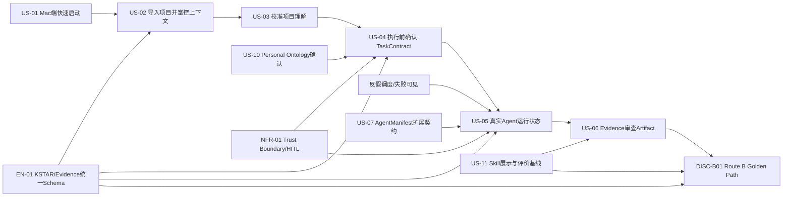

# P3394 Team2 Route B 依赖分发方案

> 依据：`/Users/sudai/Desktop/P3394_Team2_RouteB_任务梳理.docx` 与当前 Mate Agent 开发进度。  
> 编制时间：2026-07-23  
> 原则：按依赖链分发，不平均摊派；先打通 Golden Path，再补展示和评审材料。

## 0. 当前进度基线

### 已具备 / 已推进

- Mate Agent 仓库已导入 GitLab，并已形成代码基线。
- 指挥官后端配置已推进：Orkas Core Agent / Hermes CLI 后端可配置。
- Hermes 指挥官已具备结构化决策解析与调度入口，调度仍走 `group_chat.bus` 与 Wake Gate。
- Auth Profiles 解密失败恢复、interactive-cli push channel allow-list 已修复。
- 已有开发实施说明：`/Users/sudai/Documents/Mate Agent/docs/Mate Agent 开发实施说明.md`。
- 类型检查和目标测试已跑通过一轮。

### 仍是关键缺口

- 标准导入项目、ReferenceManifest、ProjectContext 校准还没有完整产品化闭环。
- TaskContract / Evidence / EvaluationRecord 需要统一字段并落到可演示样例。
- “已调度但没有真实结果返回”的反假调度机制还未固化，是 US-05 前置风险。
- Golden Path 还缺一条从启动、导入、校准、确认、真实 Agent 运行、Evidence 审查到 Gate 材料的完整证据链。

## 1. 总依赖图



## 2. 分发总表

| 优先级 | 任务包 | 主负责人 | 协同人 | 前置依赖 | 最小交付 | 截止建议 |
|---|---|---|---|---|---|---|
| P0 | T0 统一证据 Schema 与样例目录 | 吴嘉宇 | 冯静雯、张照航 | 无；必须立即开始 | 10个核心对象 JSON/MD 样例，证据目录规范 | 7/23 12:00 |
| P0 | T1 Mac 启动与环境复现 | 牛保康 | 张照航 | 无 | 两台 Mac 启动记录、环境表、Known Issues | 7/23 14:00 |
| P0 | T2 反假调度与失败可见 | 吴嘉宇 | 张照航 | 当前 Hermes/Commander 基线 | 调度状态真实可见；无真实 dispatch 不能声称“已调度” | 7/23 16:00 |
| P0 | T3 项目导入 + ReferenceManifest | 牛保康 | 吴嘉宇 | T0、T1 | 固定 Repo/Commit 导入，展示读/跳过/敏感边界 | 7/23 17:00 |
| P0 | T4 ProjectContext 校准 | 吴嘉宇 | 牛保康 | T3 | 项目理解报告、至少一项修正、修正前后 diff | 7/23 18:30 |
| P0 | T5 TaskContract + Ontology 确认 | 牛保康 | 冯静雯 | T0、T4、NFR草案 | Goal/Criteria/Context/Plan/Risk + PersonalOntologyRef 确认记录 | 7/23 20:00 |
| P0 | T6 真实 Agent Run | 吴嘉宇 | 张照航 | T2、T5、US07最小契约 | AgentRun、RunEvent、真实日志、Completed/Failed 状态 | 7/23 22:00 |
| P0 | T7 Artifact + Evidence 审查 | 冯静雯 | 吴嘉宇 | T6、T0 | Artifact 可打开，日志/来源/权限决策可追溯 | 7/24 09:30 |
| P1 | T8 AgentManifest 扩展契约 | 冯静雯 | 吴嘉宇 | T0 | AgentManifest字段、最小扩展示例/验证点 | 7/24 10:30 |
| P1 | T9 Skill 展示与评价基线 | 吴嘉宇 | 冯静雯 | T0、T6 | SkillManifestRef、SkillRun、EvaluationRecord | 7/24 11:30 |
| P0 | T10 NFR Trust Boundary | 冯静雯 | 牛保康 | T0 | PermissionDecision、脱敏/审计记录、HITL触发规则 | 7/24 12:00 |
| P0 | T11 Golden Path Gate 材料 | 张照航 | 全员 | T1~T10 | 固定场景证据链、价值/风险分析、Gate评分材料 | 7/24 15:00 |

## 3. 分人执行清单

### 牛保康：入口、导入、确认体验

1. **US-01 Mac端快速启动**
   - 输出：两台 Mac 启动录屏、环境记录、版本/已知问题说明。
   - 验收：从 README 步骤可启动，不以浏览器页面冒充桌面入口。
2. **US-02 导入项目并掌控上下文**
   - 输出：导入页面截图、ReferenceManifest、读取日志。
   - 关键：固定 Repo + 固定 Commit；展示已读、跳过、敏感边界。
3. **US-04 执行前确认目标和 Context 的 UI/流程**
   - 输出：TaskContract 确认页或确认消息记录。
4. **US-10 Personal Ontology 展示与确认**
   - 输出：PersonalOntologyRef、确认/修订记录、临时上下文与正式资产隔离说明。

### 吴嘉宇：认知锚点、Agent真跑、KSTAR/Skill

1. **EN-01 统一 KSTAR/Evidence Schema**
   - 输出：10个核心对象的字段定义与最小 JSON 样例。
2. **US-03 ProjectContext 校准**
   - 输出：目标、技术栈、关键文件、来源、不确定项；至少一项修正 diff。
3. **US-05 真实 Agent 运行**
   - 输出：AgentRun、RunEvent、真实 CLI/后端日志。
   - 硬约束：必须解决“假调度”风险，不能只显示静态成功文本。
4. **US-11 Skill 展示与评价基线**
   - 输出：SkillManifestRef、SkillRun、EvaluationRecord，与 TaskContract 绑定。

### 冯静雯：审查、安全、扩展契约、证据质量

1. **US-06 Evidence 审查**
   - 输出：Artifact、Evidence包、审查结论。
2. **US-07 AgentManifest 扩展契约**
   - 输出：Agent ID、能力、输入输出、权限、运行方式、生命周期、失败行为。
3. **NFR-01 Trust Boundary**
   - 输出：PermissionDecision、脱敏记录、审计日志、HITL触发规则。
4. **DISC-B01 质量评审支持**
   - 输出：风险清单、Decision Log 候选、Route B 优劣势判断。

### 张照航：集成、节奏、Gate 决策

1. 卡住关键路径：T0/T1/T2/T3/T6/T7/T11。
2. 每个 P0 任务只问三个问题：
   - 有无可打开/可运行的实物？
   - 有无日志/Schema/录屏证据？
   - 有无明确失败状态或边界说明？
3. 7/24 下午负责统一 Gate 材料和 Route B 结论。

## 4. 今日到明日节奏

| 时间 | 目标 | 必须完成 |
|---|---|---|
| 7/23 现在-12:00 | 定规范 | EN-01字段、证据目录、固定Repo/Commit |
| 7/23 12:00-16:00 | 打地基 | Mac启动、反假调度、导入流程起码可跑 |
| 7/23 16:00-20:00 | 打通前半链路 | ReferenceManifest、ProjectContext、TaskContract/Ontology确认 |
| 7/23 20:00-22:30 | 打通核心价值 | 真实AgentRun、RunEvent、失败可见 |
| 7/24 09:00-12:00 | 收Evidence | Artifact审查、SkillRun、PermissionDecision、审计材料 |
| 7/24 13:00-15:00 | Gate材料 | Golden Path、价值/风险、Decision Log、评分材料 |

## 5. 必须先砍掉的非关键事项

- 不先做完整 UI 美化，只保证信息可见、流程可信。
- 不先做多 Repo 通用导入，只做固定 Repo + 固定 Commit 的可验证场景。
- 不先做完整 Agent Marketplace，只做 AgentManifest 最小扩展示例。
- 不先做复杂长期记忆更新，只证明未经确认不得写入正式资产。
- 不允许用“已调度，稍等”替代真实 dispatch、真实日志和真实结果。

## 6. 每个任务提交时的统一证据模板

```text
任务编号：US-xx / EN-01 / NFR-01 / DISC-B01
负责人：
前置依赖：
执行时间：
输入：
产出物路径/截图/录屏：
运行日志路径：
Schema样例路径：
通过项：
失败/风险：
是否影响正式资产：是/否
是否触发HITL：是/否/本次无高风险动作
下一任务可接收条件：
```
