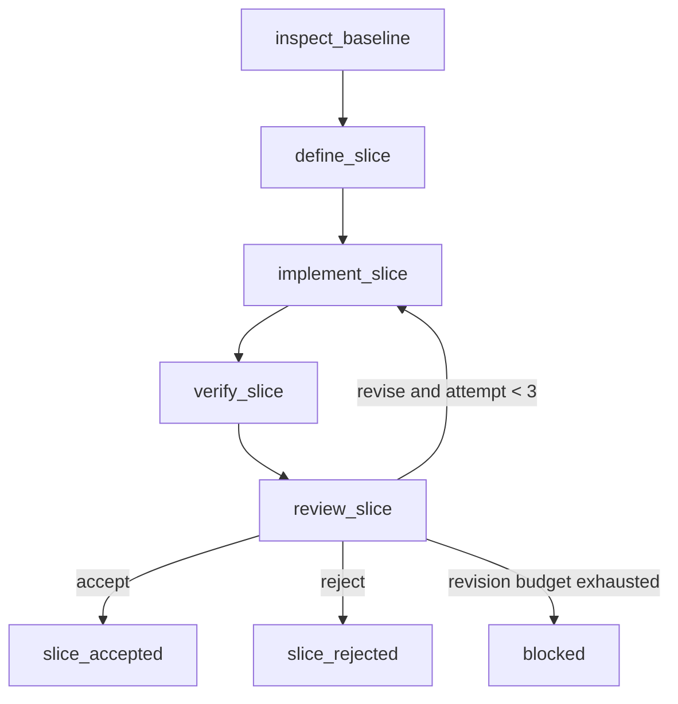

# Cognition Development Graph

这张 Graph 约束认知树后续开发的执行过程。它不是产品运行时 Graph；产品生命周期契约见 [`cognition-lifecycle-graph.md`](./cognition-lifecycle-graph.md)。

当前执行原则：

- 每轮只实现一个可独立验收的纵向切片。
- `verify_slice` 是确定性节点，不能由实现节点自行声明通过。
- 审查发现问题时最多回到实现节点两次；不能无限修改循环。
- 与用户数据、记忆写入和 IPC 相关的改动必须先检查现有路径边界，再决定是否扩展接口。
- 不引入新的 Graph 框架或 npm 依赖；Graph 先作为仓库内的明确执行契约。

机器可读契约见 [`cognition-development-graph-spec.json`](./cognition-development-graph-spec.json)。
