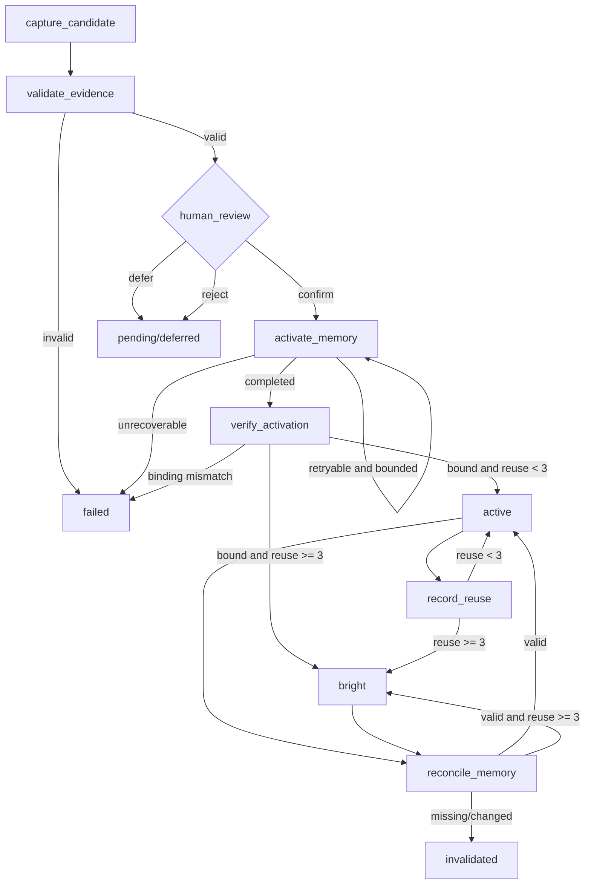

# Cognition Lifecycle Graph

这个 Graph 负责认知资产的生命周期，不负责把认知资产本身建模成知识图谱。

核心约束：

- `human_review` 是唯一允许进入 `activate_memory` 的人工门，模型或路由器不能绕过它。
- `activate_memory` 使用认知资产 ID 和正文哈希做幂等键；重试不会产生重复长期记忆。
- 每次副作用前后都有检查点，写入失败会保留可重试状态。
- 复用和失效都是有界、单调的状态转移；不存在无限重试或无限复用循环。
- 所有跨节点状态都是结构化字段，不能依赖重新回放完整聊天历史。

机器可读契约见 [`cognition-lifecycle-graph-spec.json`](./cognition-lifecycle-graph-spec.json)。
