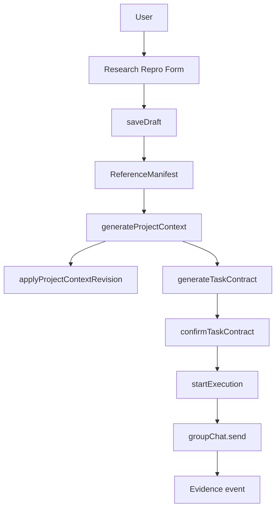

# Companion Research Repro 正式入口设计规范

日期：2026-07-23  
状态：已按用户确认方案起草  
范围：Mate Agent PC 中 `Paper + GitHub 论文复现` 固定场景的正式可复用入口

## 1. 背景

Mate Agent 当前已有 Electron 本地应用底座、group chat Commander、Hermes/Orkas commander backend 选择、Local Agent、Artifact、协作状态、KSTAR 运行记录等能力。它已经能执行任务并留下部分状态，但 Companion MVP 所需的前台主路径仍缺一条正式闭环：

```text
Paper + GitHub 导入
→ ReferenceManifest
→ ProjectContext
→ TaskContract
→ 用户确认
→ Codex/Hermes 执行
→ Evidence
```

用户已确认采用“正式入口，固定场景”的方案：入口和数据对象要可复用，不做一次性 Demo 拼接；第一版只服务论文复现场景，不做通用任务平台。

## 2. 产品目标

1. 在 Mate Agent 内提供一个正式的 Companion Research Repro 入口。
2. 让用户输入固定 Paper 选区、GitHub repo、commit、本地 workspace 和自然语言意图。
3. 系统生成可追溯 `ReferenceManifest`，说明读了什么、跳过什么、敏感边界是什么。
4. 系统生成可修订 `ProjectContext`，展示项目目标、技术栈、关键文件、来源、不确定项和用户修正。
5. 系统生成 `TaskContract`，明确目标、成功标准、Context、计划、风险和执行前确认状态。
6. 未确认 `TaskContract` 前，后端拒绝执行，前端也不启用执行入口。
7. 确认后通过现有 group chat / Commander / Hermes / Codex 链路启动执行。
8. 执行后保存最小 Evidence：运行状态、发送给 Commander 的任务、日志摘要、Artifact 引用、失败原因。

## 3. 非目标

1. 不解析整篇 PDF；第一版接受用户粘贴 Paper 选区文本。
2. 不自动 clone GitHub；第一版要求用户提供本地 workspace path，repo URL 和 commit 作为 manifest 元数据。
3. 不实现经验复用、Replay、Eval、负迁移检测。
4. 不新增 HTTP server、后台服务或新端口。
5. 不绕过 group chat bus、Local Agent runner、MCP connector spawn 等现有 choke point。
6. 不把 Hermes 当成存档系统；Hermes 只可作为草案生成和执行编排者。
7. 不让执行入口直接跑 shell；执行必须走现有 `groupChat.send`。

## 4. 架构方案

### 4.1 新 feature 模块

新增 `/Users/sudai/Documents/Mate Agent/src/main/features/companion_repro.ts`，业务逻辑集中在 feature 层。

存储路径：

```text
<uid>/cloud/chats/<cid>/companion_repro/
  state.json
  evidence.jsonl
```

如果会话属于 project，则通过 `conversationLayout(uid, cid)` 放到对应 project chat group dir 下：

```text
<uid>/cloud/projects/<pid>/chats/<cid>/companion_repro/
```

### 4.2 IPC 通道

新增 IPC handlers：

- `companionRepro.getState`
- `companionRepro.saveDraft`
- `companionRepro.generateProjectContext`
- `companionRepro.generateTaskContract`
- `companionRepro.applyProjectContextRevision`
- `companionRepro.confirmTaskContract`
- `companionRepro.startExecution`

Renderer 通过 `window.orkas.invoke(...)` 调用；不新增 HTTP server。

### 4.3 Renderer 入口

第一版在 conversation 页面新增一个 Companion Research Repro 卡片，而不是新建复杂页面。

卡片包含四个区域：

1. 导入表单：Paper 选区、repo URL、commit、workspace path、用户意图。
2. ReferenceManifest 预览。
3. ProjectContext 预览和一条用户修正输入。
4. TaskContract 预览、确认按钮、执行按钮。

执行按钮只有在 `task_contract.confirmed_at` 存在后启用。

### 4.4 数据流



## 5. 数据模型

### 5.1 CompanionReproState

```ts
interface CompanionReproState {
  version: 1;
  cid: string;
  updated_at: string;
  draft: CompanionReproDraft | null;
  reference_manifest: ReferenceManifest | null;
  project_context: ProjectContext | null;
  task_contract: TaskContract | null;
  execution: ReproExecutionState | null;
}
```

### 5.2 Draft

```ts
interface CompanionReproDraft {
  paper_title?: string;
  paper_selection: string;
  repo_url: string;
  commit: string;
  workspace_path: string;
  user_intent: string;
}
```

### 5.3 ReferenceManifest

```ts
interface ReferenceManifest {
  version: 1;
  repo_url: string;
  commit: string;
  paper_title?: string;
  paper_selection: string;
  included_files: Array<{ path: string; reason: string; size: number }>;
  skipped_files: Array<{ path: string; reason: string }>;
  sensitive_boundary: string[];
  workspace_path: string;
  read_time: string;
}
```

### 5.4 ProjectContext

```ts
interface ProjectContext {
  version: 1;
  project_goal: string;
  tech_stack: string[];
  key_files: Array<{ path: string; reason: string; source: string }>;
  sources: string[];
  uncertainties: string[];
  review_decisions: Array<{
    id: string;
    before: string;
    after: string;
    reason: string;
    decided_at: string;
  }>;
  updated_at: string;
}
```

### 5.5 TaskContract

```ts
interface TaskContract {
  version: 1;
  goal: string;
  success_criteria: string[];
  context_refs: string[];
  plan: string[];
  risks: string[];
  requires_user_confirmation: true;
  confirmed_by: string | null;
  confirmed_at: string | null;
  updated_at: string;
}
```

### 5.6 ReproExecutionState

```ts
interface ReproExecutionState {
  status: 'not_started' | 'started' | 'failed_to_start';
  started_at?: string;
  message_cid?: string;
  sent_prompt?: string;
  error?: string;
  evidence_refs: string[];
}
```

## 6. Generation 规则

第一版不调用额外模型生成结构，避免引入不稳定依赖。使用 deterministic heuristics 生成草案：

- tech stack 从 included files 推断：`package.json` → Node.js，`requirements.txt`/`.py` → Python，`pyproject.toml` → Python，`Cargo.toml` → Rust。
- key files 优先：`README*`、`package.json`、`pyproject.toml`、`requirements*.txt`、`examples/**`、`scripts/**`、`test/**`。
- project goal 使用用户意图 + Paper 选区摘要。
- uncertainties 必须包含至少一项，例如“未验证 README 命令是否能在当前 Mac 完整运行”。
- TaskContract success criteria 第一版包含：命令退出成功、生成 Artifact 或日志、Evidence 可追溯。

Hermes 后续可替换 generation 层，但第一版必须离线可测。

## 7. 执行门槛

`startExecution` 必须检查：

1. state 存在。
2. `reference_manifest` 存在。
3. `project_context` 存在。
4. `task_contract` 存在。
5. `task_contract.confirmed_at` 存在。

任一条件不满足，返回 `{ ok: false, error: 'task_contract_not_confirmed' | ... }`，不得调用 `groupChat.send`。

## 8. Evidence

`evidence.jsonl` 第一版记录：

- `draft_saved`
- `reference_manifest_created`
- `project_context_generated`
- `project_context_revised`
- `task_contract_generated`
- `task_contract_confirmed`
- `execution_started`
- `execution_start_failed`

Evidence 不冒充 Agent 内部日志。真正执行日志仍由 group chat / process events / Artifact 系统承载，本模块保存可追溯引用。

## 9. 测试要求

1. storage layout 测试。
2. saveDraft 生成 ReferenceManifest 测试。
3. generateProjectContext 生成来源、不确定项测试。
4. applyProjectContextRevision 保留 diff 测试。
5. generateTaskContract 测试。
6. startExecution 未确认时拒绝测试。
7. confirm 后 startExecution 调用 send adapter 测试。
8. renderer HTML helper 测试：未确认时执行按钮 disabled，确认后启用。

## 10. 演示验收

明天演示至少能展示：

1. 输入 Paper 选区、repo URL、commit、workspace path、用户意图。
2. ReferenceManifest 中 included/skipped/sensitive boundary。
3. ProjectContext 中来源、不确定项、至少一条修正。
4. TaskContract 中 goal、success criteria、plan、risks。
5. 确认前不能执行。
6. 确认后发送到 Commander。
7. Evidence 事件可查看或导出。
