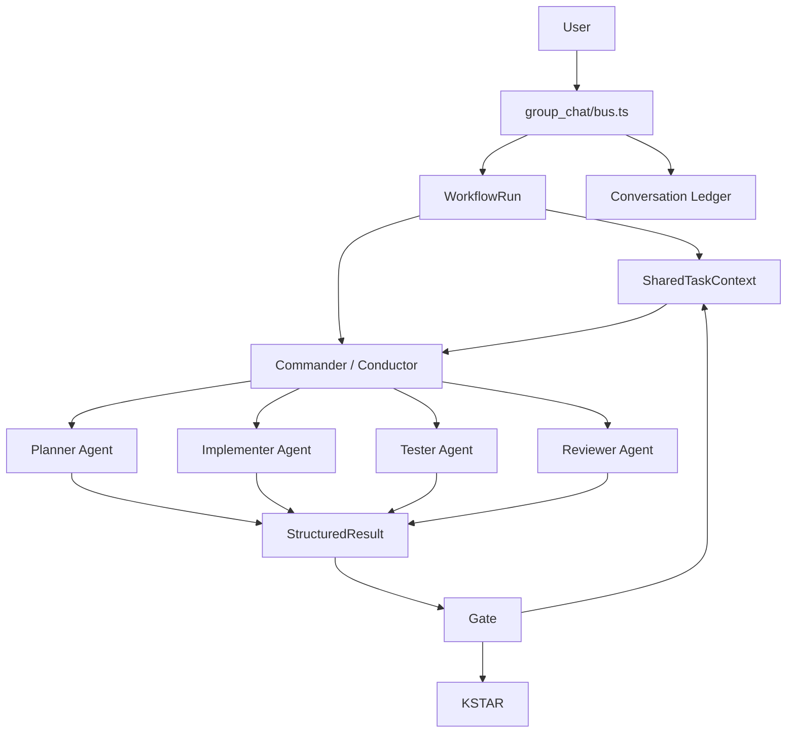

# Mate Agent 多 Agent 协作状态层设计规范

日期：2026-07-23  
状态：待用户评审  
范围：Mate Agent PC 本地多 Agent 协作、讨论、共享上下文、执行验收

## 1. 背景

Mate Agent 当前已经具备多 Agent 调度基础：用户消息进入 group chat 后，由 Commander 通过 `dispatch_to`、`hand_off_to`、`run_worker` 调用专家 Agent 或本地 CLI Agent，Agent 结果再回流到同一会话。

现有关键路径包括：

- `/Users/sudai/Documents/Mate Agent/src/main/features/group_chat/bus.ts`
  - `enqueue`
  - Commander turn
  - `dispatch_to`
  - `hand_off_to`
  - `run_worker`
  - `runNestedDispatch`
  - Wake Gate
- `/Users/sudai/Documents/Mate Agent/src/main/features/group_chat/visibility.ts`
  - per-actor visibility slice
- `/Users/sudai/Documents/Mate Agent/src/main/features/local_agents/runner.ts`
  - 本地 CLI Agent 的唯一 dispatch spawn path
- `/Users/sudai/Documents/Mate Agent/src/main/features/chat_artifacts.ts`
  - 会话产物存储
- `/Users/sudai/Documents/Mate Agent/src/main/features/p3394/kstar-runtime.ts`
  - KSTAR 运行记录、复盘和 experience candidate

但当前多 Agent 协作仍主要停留在“可调度”层面：Commander 可以叫 Agent，Agent 可以回复，回复可以写回 group chat。系统还缺少一个正式的“协作状态层”来描述：任务处于哪个阶段、哪些事实已经确认、哪些 Agent 输出只是观点、哪些内容已经成为正式决策、每一步是否真的通过验收。

## 2. 目标

### 2.1 产品目标

1. 让 Mate Agent 能组织多个 Agent 进行受控讨论，而不是多个 Agent 各自输出后简单拼接。
2. 让用户能看清多 Agent 任务当前状态：谁在执行、谁已完成、谁被阻塞、下一步是什么。
3. 防止“假调度”和“假完成”：Agent 自称完成不等于系统确认完成。
4. 把多 Agent 协作从纯聊天升级为可追踪、可恢复、可验证的执行流程。
5. 支持后续 KSTAR 从最终复盘扩展到 step 级别复盘。

### 2.2 架构目标

1. 在现有 group chat bus 上增加协作状态层，而不是重写调度主链路。
2. 保持 Electron 单进程边界：不引入 HTTP server、Redis 或额外本地服务。
3. 继续通过 IPC 和 `window.orkas` allow-list 与 renderer 通信。
4. 用户数据继续落在 `<container>/data/<uid>/{cloud,local}/` 规则内。
5. Local CLI Agent 仍然只通过 `features/local_agents/runner.ts` 派发。
6. 大内容进入 artifact，prompt 注入只使用摘要、引用和必要片段。

## 3. 非目标

1. 不在 PC 本地版本引入 Redis、Postgres 或独立调度服务。
2. 不新增 HTTP dashboard 或占用本地端口。
3. 不把所有 Agent 放进同一个无限共享上下文。
4. 不让 Agent 直接写入正式共享上下文事实源。
5. 不改变本地 CLI Agent 的唯一 spawn choke point。
6. 不把 Tutti 的 tmux/worktree/dashboard 模型原样搬进 Mate Agent。
7. 不在第一阶段实现云端 worker、跨设备分布式 Agent 执行或 Server-side Agent execution。

## 4. 当前问题归纳

### 4.1 Conversation 承担了过多职责

当前会话 JSONL 既记录用户消息，也记录 Agent 回复、调度事件、process trail 和部分状态。它是完整账本，但不是干净的任务共识。

问题是：后续 Agent 如果直接从聊天历史推断上下文，容易混淆：

- 正式事实
- 草稿想法
- 某个 Agent 的个人观点
- 被 Commander 否决的方案
- 已过时的中间状态
- 最终用户认可的决策

### 4.2 Visibility slice 解决可见性，但没有解决共识

`visibility.ts` 可以控制每个 actor 看到哪些消息，这是上下文隔离的基础。但它还没有提供一个一等对象来表达“当前任务正式上下文”。

### 4.3 Agent 输出缺少强契约

现有 `dispatch_to` / `hand_off_to` / `run_worker` 的结果主要是自然语言。自然语言适合展示，但不适合做自动验收、状态推进和上下文合并。

### 4.4 多 Agent 讨论缺少轮次协议

如果用户要求“让几个 Agent 讨论一下”，当前可以派发多个 Agent，但缺少统一协议来保证：

1. 第一轮独立观点；
2. 第二轮交叉质疑；
3. 第三轮冲突归纳；
4. 第四轮决策形成；
5. 第五轮审查确认。

### 4.5 缺少 Gate

系统需要区分：

```text
Agent 回复了
```

和：

```text
这个步骤真的完成了
```

真正完成应该由 gate 判断，而不是只看 Agent 最后一条消息。

## 5. 采用方案

推荐采用 **WorkflowRun + SharedTaskContext + ContextPatch + Gate + DiscussionProtocol** 的轻量协作状态层。

总体关系：



核心原则：

> Conversation Ledger 记录所有发生过的事；SharedTaskContext 只记录当前正式共识；Visibility Slice 决定每个 Agent 实际看到什么。

### 5.1 2026-07-23 优先级修订

在进入正式 `WorkflowRun + SharedTaskContext + ContextPatch + Gate` 实现前，先完成两个前置验证：

1. **P0：研究 Tutti agent 通信机制。** 确认 `tutti-os/tutti` 中 mention、agent session、agent start/send/wait/get、collaboration timeline、provider-native child sessions 的通信边界，形成 `/Users/sudai/Documents/Mate Agent/docs/research/tutti-agent-communication.md`。
2. **P1：shared file 双 Agent POC。** 在 Mate Agent 项目根目录用 `task.md`、`plan.md` 和 `.collab-poc/events.jsonl` 验证 Hermes 与 Codex 在不同进程、执行后断开的情况下，仍能通过文件系统恢复对方状态。

这两个前置步骤不改变 Mate Agent runtime，不引入 Redis，不新增 HTTP server，也不新增 CLI spawn path。它们只验证通信介质和协作纪律是否可用。验证通过后，再把 shared file POC 的成功经验抽象进正式 `WorkflowRun` 和 `SharedTaskContext`。


### 5.2 2026-07-23 第一实现切片

第一实现切片只落地后端状态层：`src/main/features/group_chat/collaboration.ts` 提供 `WorkflowRun`、`SharedTaskContext`、`ContextPatch`、`GateResult` 的 JSON 文件存储与合并逻辑，并在 nested dispatch 工具回流后做 best-effort step 记录。该切片不新增 renderer UI、不新增 IPC API、不改变 Agent 调度语义。

## 6. 核心数据对象

### 6.1 WorkflowRun

`WorkflowRun` 表示一次多 Agent 协作任务。

建议字段：

```ts
interface WorkflowRun {
  id: string;
  cid: string;
  objective: string;
  kind: 'discussion' | 'implementation' | 'review' | 'custom';
  status: 'created' | 'running' | 'blocked' | 'failed' | 'completed' | 'cancelled';
  phase: string;
  steps: WorkflowStep[];
  context_id: string;
  created_by: string;
  created_at: string;
  updated_at: string;
}
```

### 6.2 WorkflowStep

`WorkflowStep` 表示一个可分配给 Agent 或系统执行的步骤。

```ts
interface WorkflowStep {
  id: string;
  run_id: string;
  title: string;
  actor_id: string | null;
  type: 'prompt' | 'discussion_round' | 'implementation' | 'test' | 'review' | 'gate' | 'summary';
  status: 'pending' | 'running' | 'blocked' | 'failed' | 'completed' | 'skipped';
  depends_on: string[];
  expected_output?: OutputContract;
  result_ref?: string;
  gate_result_id?: string;
  started_at?: string;
  completed_at?: string;
}
```

### 6.3 SharedTaskContext

`SharedTaskContext` 是多 Agent 协作的正式共享上下文。

它不保存全部聊天，只保存当前有效状态：

```ts
interface SharedTaskContext {
  id: string;
  cid: string;
  run_id: string;
  objective: string;
  phase: string;
  constraints: ContextItem[];
  facts: ContextItem[];
  decisions: DecisionItem[];
  open_questions: ContextItem[];
  risks: RiskItem[];
  artifacts: ArtifactRef[];
  agent_outputs: Record<string, AgentOutputSummary>;
  gates: GateResult[];
  updated_at: string;
}
```

`ContextItem` 需要带来源：

```ts
interface ContextItem {
  id: string;
  text: string;
  source: 'user' | 'agent' | 'code' | 'artifact' | 'system' | 'spec';
  source_ref?: string;
  confidence: 'low' | 'medium' | 'high';
  added_by: string;
  created_at: string;
}
```

### 6.4 ContextPatch

Agent 不直接写 SharedTaskContext，只提交 patch。

```ts
interface ContextPatch {
  summary?: string;
  facts_add?: ContextItemDraft[];
  decisions_proposed?: DecisionDraft[];
  risks_add?: RiskDraft[];
  open_questions_add?: ContextItemDraft[];
  artifacts_add?: ArtifactRefDraft[];
  obsolete_item_ids?: string[];
}
```

合并规则：

1. Agent 输出 patch；
2. bus / Commander / gate 校验 patch；
3. 合法内容进入 SharedTaskContext；
4. 冲突内容进入 open questions 或 reviewer step；
5. 被拒绝内容保留在 conversation ledger，但不进入正式上下文。

### 6.5 GateResult

`GateResult` 判断某个步骤是否能推进。

```ts
interface GateResult {
  id: string;
  run_id: string;
  step_id: string;
  name: string;
  status: 'passed' | 'failed' | 'needs_review';
  checks: GateCheck[];
  reason?: string;
  created_at: string;
}
```

例如 plan gate：

```json
{
  "name": "plan_valid",
  "status": "passed",
  "checks": [
    { "name": "objective_exists", "status": "passed" },
    { "name": "target_files_identified", "status": "passed" },
    { "name": "acceptance_criteria_defined", "status": "passed" }
  ]
}
```

## 7. 存储设计

第一阶段建议采用 JSON/JSONL 文件，遵守现有数据域规则，不引入 sqlite 或 Redis。

建议逻辑位置：

```text
<uid>/cloud/conversations/<cid>/workflow_runs/<run_id>.json
<uid>/cloud/conversations/<cid>/workflow_contexts/<context_id>.json
```

如果现有 conversation layout 已经有更合适的 cid 目录，应复用现有 layout helper，不直接拼接路径。

设计要求：

1. 通过 `storage.ts`、`paths.ts` 和 conversation layout helper 访问。
2. 不缓存 uid-derived path 为模块级常量。
3. cloud 下只存用户可同步的正式协作状态。
4. 大内容仍走 chat artifact，不复制全文进入 SharedTaskContext。
5. 写入采用原子写或现有存储工具，避免并发截断。

## 8. 调度集成设计

### 8.1 不替换 `group_chat/bus.ts`

第一阶段只在现有回流点挂协作状态记录，不重写 bus。

建议集成点：

1. 用户发起复杂多 Agent 请求时创建 `WorkflowRun`。
2. Commander 调用 `dispatch_to` / `hand_off_to` / `run_worker` 时记录 step start。
3. `runNestedDispatch` 返回后记录 structured result 或 natural-language summary。
4. Gate 通过后把 patch 合并到 SharedTaskContext。
5. 失败、阻塞、等待用户时更新 run/step 状态。

### 8.2 OutputContract

Commander 调度 Agent 时可以携带轻量输出契约。

```ts
interface OutputContract {
  kind: 'analysis' | 'plan' | 'implementation_result' | 'test_result' | 'review_result' | 'discussion_opinion';
  required_fields: string[];
  optional_fields?: string[];
  artifact_required?: boolean;
}
```

第一阶段可以先不强制所有 Agent 完全 JSON 化，而是支持从回复中提取一个可选结构化块；没有结构化块时，gate 降级为 `needs_review` 或仅记录 summary。

## 9. 讨论协议

新增内置 discussion workflow 模板，用于“让几个 Agent 讨论一下”的场景。

推荐流程：

```text
Round 1: Independent Opinions
  Commander 同时或顺序派发多个 Agent，要求独立给出观点，不看其他 Agent 输出。

Round 2: Cross Review
  Commander 汇总第一轮观点摘要，把冲突点发给各 Agent 复评。

Round 3: Conflict Summary
  Commander 提取共识、冲突、风险和待用户确认问题。

Round 4: Decision Draft
  Commander 生成正式决策草案和 context patch。

Round 5: Final Review
  Reviewer 检查决策是否有遗漏、矛盾和高风险。
```

最终只有 Commander 或 runtime 合并后的内容进入 SharedTaskContext。

## 10. UI 设计

Renderer 后续可增加一个多 Agent 任务状态面板。

显示内容：

1. 当前 workflow run 名称和目标；
2. 当前阶段；
3. 参与 Agent；
4. step 状态；
5. 已确认事实；
6. 已确认决策；
7. 风险和 open questions；
8. artifacts；
9. gate 状态；
10. 下一步建议。

Renderer 约束：

1. 仍使用 classic scripts。
2. 新 API 必须通过 preload `contextBridge` allow-list。
3. 可见字符串进入 renderer locales。
4. 不新增第三方 npm UI 依赖。
5. 复用现有卡片、chip、button 和 z-index 层级。

## 11. 错误处理

### 11.1 Agent 无结构化输出

处理方式：

1. 保存自然语言结果到 conversation ledger；
2. step 标记为 `needs_review` 或 `completed_with_unstructured_output`；
3. 不自动合并决策；
4. Commander 可以请求 Agent 补交结构化结果。

### 11.2 Gate 失败

处理方式：

1. step 标记 failed；
2. WorkflowRun 标记 blocked 或 failed；
3. 写入失败原因；
4. 必要时触发 reviewer / KSTAR；
5. 用户可选择重试、跳过或修改目标。

### 11.3 ContextPatch 冲突

处理方式：

1. 不覆盖现有已确认决策；
2. 把冲突内容放入 open questions；
3. 生成 reviewer step 或 Commander summary；
4. 需要用户裁决时标记 `needs_user`。

### 11.4 Artifact 丢失或过大

处理方式：

1. 共享上下文只保存 artifact ref；
2. artifact 不存在时 gate failed；
3. 超大内容必须 cap / spill，不进入 prompt；
4. 所有 tool results 继续走 `util/tool-result-cap.ts`。

## 12. 安全与边界

1. 不引入 Redis 作为本地事实源。
2. 不新增 HTTP server。
3. 不新增本地 auth layer。
4. 不绕过 IPC。
5. 不让 renderer 直接读写 workflow 文件。
6. File-class tools 仍需 `util/path-sandbox.isPathAllowed`。
7. Local CLI Agent 只能通过 `/Users/sudai/Documents/Mate Agent/src/main/features/local_agents/runner.ts`。
8. MCP stdio connectors 只能通过 `/Users/sudai/Documents/Mate Agent/src/main/features/connectors/mcp-client.ts`。
9. Agent worker 只能看到自己的 visibility slice 与被注入的 shared context 摘要。
10. 不把 expert-signal 原文复制到日志、遥测或跨机器通道。

## 13. 测试计划

### 13.1 单元测试

覆盖：

1. WorkflowRun 创建、状态推进、取消、失败。
2. SharedTaskContext patch 合并。
3. 冲突 patch 不覆盖已确认决策。
4. Gate passed / failed / needs_review。
5. 无结构化输出时不自动合并正式上下文。
6. Artifact ref 缺失时 gate failed。

### 13.2 Group chat 集成测试

覆盖：

1. `dispatch_to` 后 step start / complete 被记录。
2. `hand_off_to` final delivery 能更新 workflow 状态。
3. `run_worker` 结果能进入 step output。
4. User abort 能统一取消 workflow run。
5. Wake Gate 等待/恢复不会导致重复 step。

### 13.3 Visibility 测试

覆盖：

1. Commander 可见全局 workflow 摘要。
2. Agent 只可见自身任务所需 shared context 摘要。
3. process trail 不泄露进 visibility slice。
4. handoff artifact 引用能被注入，但大内容不直接展开。

### 13.4 Renderer 测试

覆盖：

1. 任务状态面板渲染。
2. step 状态变化。
3. blocked / failed / needs_user 状态提示。
4. i18n-change 后动态文案重渲染。

## 14. 验收标准

第一阶段完成后，应满足：

1. 一个多 Agent 协作任务有明确 `WorkflowRun` 记录。
2. 每次 Agent dispatch 都能关联到 workflow step。
3. Agent 输出可以被记录为 structured result 或 unstructured summary。
4. SharedTaskContext 能保存正式事实、决策、风险、产物引用和 open questions。
5. ContextPatch 需要经过合并逻辑，Agent 不能直接覆盖正式上下文。
6. Gate 能阻止无证据的“完成”。
7. 用户能在 UI 或调试输出里看到任务阶段与 Agent 状态。
8. 所有数据路径符合 `<container>/data/<uid>/{cloud,local}/` 规则。
9. 未引入 Redis、HTTP server 或新的 CLI spawn path。

## 15. 分阶段实施建议

### Phase 1：后端协作状态最小闭环

新增：

```text
/Users/sudai/Documents/Mate Agent/src/main/features/group_chat/workflow_runs.ts
/Users/sudai/Documents/Mate Agent/src/main/features/group_chat/shared_context.ts
/Users/sudai/Documents/Mate Agent/test/main/features/group_chat/workflow_runs.test.ts
/Users/sudai/Documents/Mate Agent/test/main/features/group_chat/shared_context.test.ts
```

实现：

1. WorkflowRun CRUD；
2. WorkflowStep 状态推进；
3. SharedTaskContext 读写；
4. ContextPatch 合并；
5. GateResult 记录；
6. 与 `bus.ts` 的最小挂接。

### Phase 2：调度协议增强

实现：

1. `dispatch_to` / `hand_off_to` / `run_worker` 记录 step；
2. Agent prompt 注入 shared context 摘要；
3. 支持 optional structured output block；
4. 无结构化结果时进入 review/gate 分支。

### Phase 3：讨论协议

实现：

1. discussion workflow 模板；
2. Round 1 独立观点；
3. Round 2 交叉质疑；
4. Commander 冲突归纳；
5. Reviewer final check；
6. 正式 context merge。

### Phase 4：Renderer 状态面板

实现：

1. IPC read APIs；
2. preload allow-list；
3. renderer 状态卡片；
4. step timeline；
5. gate / blocker 展示；
6. i18n。

### Phase 5：KSTAR 深度接入

实现：

1. step-level KStarRun；
2. gate failed 自动生成 KSTAR review item；
3. successful pattern 形成 experience candidate；
4. 用户审核后沉淀经验。

## 16. 后续扩展

1. Server 侧如果引入 cloud worker，可使用 Redis 做 queue / pubsub / lease / cache。
2. PC 本地仍不直接依赖 Redis。
3. WorkflowRun 可进一步发展成可视化流程图。
4. SharedTaskContext 可增加压缩策略和版本 diff。
5. Agent 输出契约可逐步从 optional structured block 过渡到严格 schema。

## 17. 推荐实施顺序

推荐先做最小后端闭环：

1. `shared_context.ts`：定义正式上下文和 patch merge。
2. `workflow_runs.ts`：定义 run / step / gate 状态。
3. 测试 patch merge 和 gate 基本逻辑。
4. 在 `bus.ts` 的 nested dispatch 回流点只做记录，不改变现有行为。
5. 增加一个只读 IPC，供 renderer 或调试面板读取 run 状态。
6. 再推进 discussion protocol 和 UI。

该顺序风险最低，因为它先建立状态事实源，不急于改变 Commander 调度行为。
