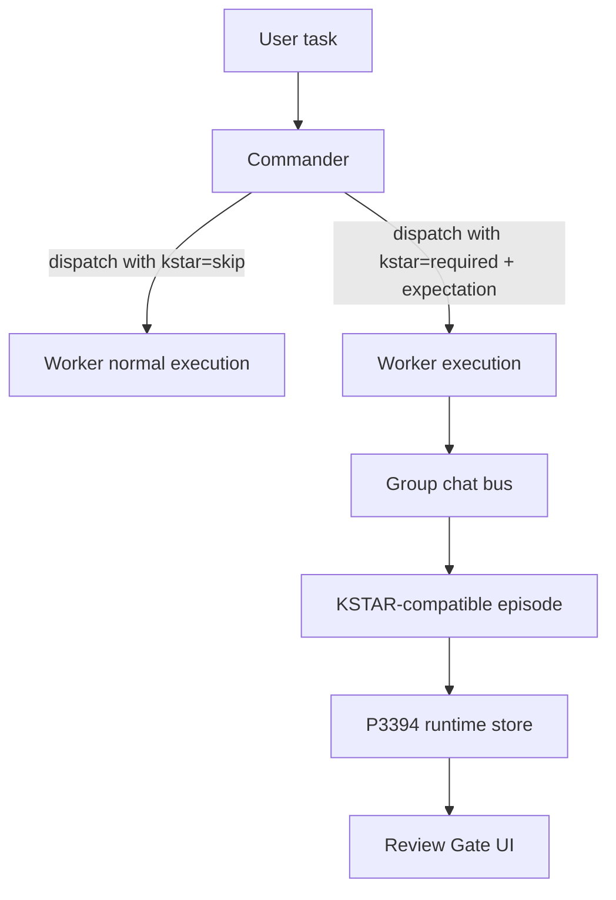

# KSTAR Agent Integration Design

## Summary

Mate Agent currently has a P3394 `KStarRun`/Review Gate flow that records agent results and lets the user accept or reject a deliverable. The user wants KSTAR to become part of the agent execution chain, but not as an unconditional task step: Commander decides whether a task needs KSTAR, and if it does, the group chat bus must enforce the gate.

This design aligns Mate Agent's first-stage KSTAR data model with the `meta-skill-engine-v2` package's KSTAR episode shape without yet invoking the full engine. A later second stage can connect the package as an MCP/internal engine for `capture_interaction`, `analyze_attribution`, `run_governance`, `propose_patch`, and `human_review`.

## Chosen approach

Use a three-layer integration:

1. **Methodology layer: Skill** — the meta-skill package remains the human/model-readable KSTAR methodology and authoring guide. It explains K/S/T/A/R, attribution, governance, and evolution rules.
2. **Enforcement layer: bus + P3394 runtime** — Commander emits a KSTAR decision when dispatching work. If `kstar=required`, the bus records a KSTAR-compatible episode and forces the UI into Review Gate (`needs_review`). This layer cannot be bypassed by a worker agent.
3. **Execution engine layer: MCP/internal service, later** — the full meta-skill engine is connected later as a callable engine. P3394 becomes Mate Agent's local episode store and Review Gate UI rather than a separate pseudo-KSTAR implementation.

This wins over a pure Skill approach because Skill usage is voluntary from the model's perspective, while the user requires a hard runtime gate. It also wins over immediately wiring the full engine because the current task asks for the first stage: schema alignment and enforced data capture, not full attribution/governance execution.

## Scope

### In scope for first stage

- Extend Commander dispatch contracts to carry a KSTAR decision:
  - `kstar: "required" | "skip"`
  - `kstar_reason?: string`
  - `kstar_expectation?: { situation, task, action_hat, result_hat, k_snapshot_ref? }`
- Update Commander prompt rules so it decides KSTAR per delegated task.
- Update bus dispatch handling to preserve the KSTAR decision through nested dispatch/hand-off/worker execution.
- Extend P3394 runtime data so a run can store a KSTAR-compatible episode:
  - `episode_id`
  - `bundle_id`
  - `k_snapshot_ref`
  - `situation`
  - `task`
  - `action_hat`
  - `result_hat`
  - `actual_action`
  - `actual_result`
  - `delta_r`
  - `delta_a`
  - `delta_a_confidence_gate`
  - `timestamp`
  - `session_id`
- When `kstar=required`, finalize the worker result into P3394 as `needs_review` and keep the UI Review Gate path.
- When `kstar=skip`, avoid creating a review gate for ordinary lightweight tasks.

### Out of scope for first stage

- Invoking `meta-skill-engine-v2` tools.
- Installing or running a new MCP server.
- Generating real `delta_r`/`delta_a` scores from attribution logic. First stage stores neutral placeholders until the engine exists.
- Auto-promoting skills, ontology patches, or governance records.

## Data flow

## First-stage episode semantics

The first-stage episode intentionally mirrors the package's `KSTAREpisode` fields.

- `k_snapshot_ref`: a stable placeholder or ontology/skill reference when known. For now, this may be `conversation:<cid>` or a skill/agent context reference rather than a full ontology snapshot.
- `situation`: Commander's context summary for why the task exists now.
- `task`: the delegated task instruction.
- `action_hat`: Commander's predicted action plan for the worker.
- `result_hat`: Commander's predicted successful result.
- `actual_action`: bus-derived summary of what actually happened, including produced files and agent turn metadata where available.
- `actual_result`: worker's final visible result text.
- `delta_r`, `delta_a`: first-stage neutral values, default `0`, because full attribution is deferred.
- `delta_a_confidence_gate`: default `pass` unless the bus detects a malformed/missing actual result.

## UI behavior

- KSTAR-required outputs are treated as drafts until Review Gate completion.
- Review pass updates the produced footer to final delivery.
- Review fail marks the output as failed/needs rework.
- KSTAR-skipped outputs remain normal final assistant/agent outputs.

## Error handling

- Missing or malformed `kstar_expectation` should not crash dispatch. The bus should normalize it using the task message and a conservative default reason.
- Invalid `kstar` values normalize to `skip` unless explicit required fields are present.
- P3394 write failures should be logged as recoverable errors and should not lose the worker's visible result, but the UI should not falsely show a passed KSTAR state.
- Later MCP engine failures should be stored as engine errors, not as human Review Gate failures.

## Tests

- P3394 runtime test: required-finalize stores a KSTAR-compatible episode with expectation and actual result fields.
- Group bus test: Commander dispatch with `kstar=required` passes expectation into P3394 and attaches `kstar_review` metadata to the visible agent result.
- Group bus test: `kstar=skip` does not create a Review Gate.
- Prompt/static test: Commander prompt instructs per-task KSTAR decision and required fields.
- Renderer tests continue to verify Review Gate and produced footer draft/final status.

## Open risks

- The full package has ontology/skill snapshot concepts that Mate Agent does not yet materialize. First stage uses references/placeholders and keeps full snapshot capture for the MCP stage.
- Automatically computing `delta_r` and `delta_a` before attribution logic would be fake precision. First stage stores neutral values only.
- Existing dirty working tree contains prior related changes; implementation must avoid overwriting unrelated edits.

## Next skill

`$superpower-writing-plans`

## Second-stage engine adapter update

The `meta-skill-engine-v2` package is an MCP stdio server rather than an in-process library. Mate Agent therefore connects it as a P3394-owned MCP adapter, not as a worker agent skill call and not as a flat SDK tool list.

Second-stage runtime behavior:

- P3394 still owns the local `KStarRun` and Review Gate UI state.
- When a required run is finalized, bus calls `runKStarEngineForRun`.
- The adapter uses the existing MCP stdio choke point (`features/connectors/mcp-client.ts::McpConnection`) so new subprocess spawning does not bypass project rules.
- The engine command is externally configured with `ORKAS_KSTAR_ENGINE_COMMAND`, `ORKAS_KSTAR_ENGINE_ARGS`, `ORKAS_KSTAR_ENGINE_CWD`, and optional `ORKAS_KSTAR_ENGINE_ONTOLOGY_DIR`.
- If the engine is not configured, P3394 records `kstar_engine.status = "skipped"` with a reason.
- If configured, the adapter calls:
  - `capture_interaction`
  - `analyze_attribution`
  - `route_recommendation`
- `propose_patch`, `run_governance`, and engine-level `human_review` stay gated until there is a concrete patch candidate. This avoids generating fake patches from a successful delivery episode. The P3394 Review Gate remains the human acceptance UI for the deliverable.

This keeps the engine integration real and callable while respecting governance boundaries: capture/analyze can happen automatically for required episodes, but patch/governance/human-review actions require an actual candidate artifact.

## Local environment configuration update

For source runs, the meta-skill engine package is installed under `userWorkSpace/meta-skill-engine-package`, which is ignored by git. `run.sh` and `run.cmd` auto-detect this directory and configure:

- `ORKAS_KSTAR_ENGINE_COMMAND=node`
- `ORKAS_KSTAR_ENGINE_ARGS=["<repo>/userWorkSpace/meta-skill-engine-package/dist/index.js"]`
- `ORKAS_KSTAR_ENGINE_CWD=<repo>/userWorkSpace/meta-skill-engine-package`
- `ORKAS_KSTAR_ENGINE_ONTOLOGY_DIR=<repo>/userWorkSpace/meta-skill-engine-package/ontologies`

On macOS source runs, `run.sh` also forwards these values as Electron argv so `bootstrap.cjs` can restore them inside the launched app process when LaunchServices does not reliably inherit shell env.
