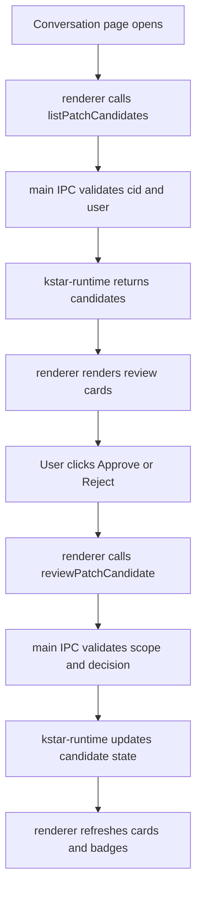

# KSTAR Review Center Design

> 日期：2026-07-24
> 版本：v0.1
> 适用产品：Mate Agent / P3394 KSTAR Review Center
> 状态：设计稿，待确认后进入实施计划

---

## 1. Summary

当前 Mate Agent 已经具备 P3394 KSTAR 运行态：

- `KStarRun` 记录 agent turn 的 KSTAR 兼容 episode
- `PatchCandidate` 记录 engine 推荐的可审查改进项
- IPC 已暴露会话级的 KSTAR / PatchCandidate 列表与审核接口
- renderer 已有 `KSTAR Review` 卡片与 `ExperienceCandidate` 审核交互

但 `PatchCandidate` 仍然只是后端状态：用户没有一个清晰、统一的页面去查看、审核、回写这类候选项。

本设计要做的是把 `PatchCandidate` 变成一个完整的**KSTAR Review Center**：

1. 用户能在会话里看到待审候选列表。
2. 用户能打开某条候选看详情。
3. 用户能执行 `Approve` / `Reject`。
4. 审核结果回写到 `kstar-runtime` 状态。
5. 页面刷新后能同步展示最新状态。

---

## 2. Chosen approach

采用 **后端 IPC + renderer 会话内嵌审核面板** 的组合方案。

### Why this approach

- **后端先行**：审核动作必须真实落库，不能只有 UI 壳。
- **内嵌面板**：最符合现有 KSTAR Review 的使用方式，用户不需要跳到独立管理页。
- **低侵入**：复用现有 conversation 页面、IPC shim、KSTAR 审核卡片风格，改动可控。
- **可扩展**：后续如果需要全局审核页，可以在同一套 IPC 上再加一个入口，不会推翻当前设计。

### Rejected alternatives

1. **只做后端 API**
   - 能把能力接好，但用户看不到入口。
   - 不满足“做出来能用”的目标。

2. **只做独立全局页面**
   - 信息架构更重。
   - 第一版会把范围拉大，拖慢交付。

---

## 3. Scope

### In scope

- 会话级 `PatchCandidate` 列表接口的消费与展示。
- 单条 `PatchCandidate` 的审核动作。
- 审核后刷新列表和卡片状态。
- 与现有 `KSTAR Review` 卡片和 produced footer 保持一致的视觉语义。
- 增加必要的 renderer locale 文案。
- 增加针对 IPC 与 renderer 交互的测试。

### Out of scope

- 全局跨会话审核中心。
- 高级筛选、搜索、分页。
- 多人协作审核。
- Patch 自动应用。
- 审核意见流转到外部知识库或 Notion。

---

## 4. Backend IPC design

现有 IPC 已有两个关键端点：

- `p3394.listPatchCandidates`
- `p3394.reviewPatchCandidate`

本阶段的后端目标不是重做数据模型，而是把这些端点的输出与 renderer 所需字段对齐，并保证行为一致。

### 4.1 list endpoint

返回会话内的 `PatchCandidate` 列表，前端主要依赖这些字段：

- `id`
- `conversation_id`
- `agent_id`
- `type`
- `status`
- `proposal.title`
- `proposal.summary`
- `proposal.rationale`
- `engine.route_action`
- `engine.attribution_id`
- `created_at`
- `updated_at`
- `review`

### 4.2 review endpoint

审核动作支持：

- `approve`
- `reject`

行为要求：

- 只允许审核当前会话下的候选。
- 审核前必须确认候选存在。
- 审核后回写 `status`、`review`、`updated_at`。
- 如果审核结果为通过，列表应立即显示为 `approved`。
- 如果审核结果为拒绝，列表应立即显示为 `rejected`。

### 4.3 Error handling

- 无效 `cid` / `candidateId`：返回参数错误。
- 候选不存在：返回 not found。
- 候选不属于当前会话：拒绝访问。
- 候选不处于可审核状态：返回明确错误。
- renderer 侧审核失败时保留当前卡片内容，并显示错误提示。

---

## 5. Renderer design

### 5.1 Placement

建议把 KSTAR Review Center 放在当前会话内容中，和已有 KSTAR Review 卡片同一信息域内，而不是单独开一个新页面。

推荐位置：

- 在 conversation 历史区域的 KSTAR 区块附近
- 或作为一个折叠面板，位于现有 review 卡片之上/之下

这样做的原因：

- 用户在看同一个会话时就能处理候选。
- 不会打断现有工作流。
- 审核对象和它的来源上下文天然在同一视图。

### 5.2 Card layout

每条候选卡片建议显示：

- 标题：`proposal.title`
- 状态 badge：`needs_review` / `approved` / `rejected`
- 类型 badge：`skill_patch` / `memory_patch` / `ontology_patch`
- 来源会话与来源 run
- 简短摘要：`proposal.summary`
- 展开详情区：
  - `proposal.rationale`
  - `proposal.proposed_content`
  - `engine.route_action`
  - `engine.attribution_id`
  - `review.notes`

### 5.3 Actions

每条卡片提供：

- `Approve`
- `Reject`
- 备注输入框（可选）

审核完成后：

- 卡片状态更新
- 列表刷新
- produced footer 如有需要同步状态色

### 5.4 Empty / loading / error states

- **Loading**：显示轻量 skeleton 或 loading 文案。
- **Empty**：显示“当前会话没有待审 PatchCandidate”。
- **Error**：显示“加载审核项失败，请重试”。

---

## 6. Data flow

---

## 7. Error handling and consistency rules

1. **Never fake approval**
   - renderer 不能只改本地状态。
   - 必须等 IPC 返回成功后才更新 UI。

2. **Never cross scope**
   - review 必须只对当前会话的候选生效。
   - 不允许从别的会话页审核到这里的对象。

3. **Never hide failures**
   - IPC 失败必须以可见提示反馈给用户。
   - 页面不能静默吞掉错误。

4. **Keep current KSTAR review semantics**
   - 新的 PatchCandidate 审核不替代现有 `KStarRun` Review Gate。
   - 两者共享风格，但语义不同。

---

## 8. Testing plan

### Backend tests

- IPC list endpoint returns patch candidates for a session.
- IPC review endpoint approves a candidate and persists state.
- IPC review endpoint rejects a candidate and persists state.
- Invalid candidate / invalid scope is rejected.

### Renderer tests

- Conversation page shows patch candidate cards when data exists.
- Approve / reject buttons call the right IPC route.
- Success refreshes card state.
- Failure shows an error state and keeps current data.

### Regression tests

- Existing KSTAR Review 卡片仍正常工作。
- `ExperienceCandidate` 审核 UI 不受影响。

---

## 9. Open risks

- 当前会话视图已经有不少信息块，需要避免 KSTAR Review Center 过宽或过长。
- 如果后续候选数量很多，可能需要分页或“仅显示待审”折叠策略。
- `PatchCandidate` 和 `KStarRun` 的视觉语义相近，容易被误认为同一类对象；UI 上要保持标题和状态命名清晰。

---

## 10. Next step

如果这份设计没有问题，下一步进入实施计划：

`$superpower-writing-plans`
