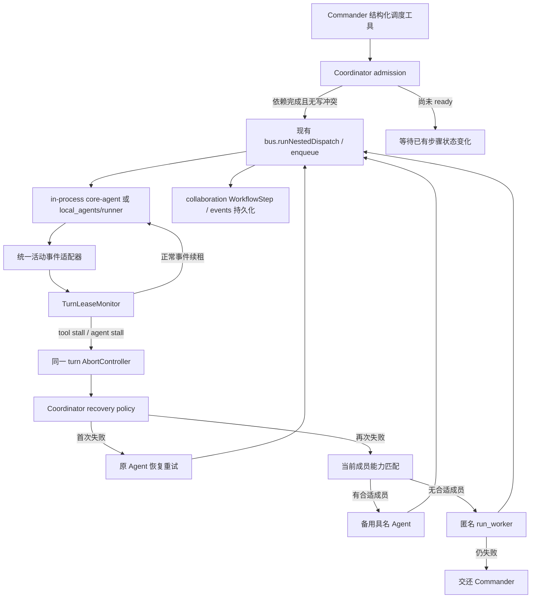

# 多 Agent 协调器与分阶段停滞恢复设计

**日期：** 2026-07-31
**状态：** 已批准
**范围：** Group Chat 中由 Commander 发起的 `dispatch_to`、`hand_off_to`、具名/匿名 `run_worker`，以及这些调度背后的 in-process Agent 和本地 CLI Agent

## 1. 目标

在不改变“Commander 负责拆任务”的前提下，为现有 Group Chat 调度增加一个主机侧协调器，负责：

1. 准确区分“工具调用尚未返回”和“工具已经返回、Agent 正在静默处理”。
2. 使用分阶段空闲租约发现真实停滞，而不是依赖总墙钟超时。
3. 停滞后自动终止当前 turn，优先让原 Agent 恢复重试一次。
4. 原 Agent 再次停滞或失败后，从当前会话成员中按能力选择备用 Agent；无合适成员时使用匿名 worker；仍失败则交还 Commander。
5. 继续使用现有结构化调度工具和 Group Chat bus，不生成第二条 enqueue、spawn 或 Agent 执行通道。
6. 对可并行的任务维持依赖约束、写入冲突约束和最多 3 个活跃子任务的上限。
7. 将停滞、探测、重试、换 Agent 和回退过程以可理解的状态展示给用户，同时避免记录敏感内容。

## 2. 已确认的产品决策

本设计采用以下已经确认的行为：

- **任务拆解仍由 Commander 负责。** 协调器只接管 Commander 已经通过结构化工具表达的任务，不自行把用户消息拆成 workflow。
- **自动恢复。** 空闲阈值达到后不要求用户决定，系统自动终止并重试。
- **原 Agent 只自动重试一次。** 第二次失败后进入能力匹配回退链。
- **回退链：** 当前会话中的匹配 Agent → 匿名 `run_worker` → Commander。
- **并行上限：** 每个会话默认最多 3 个活跃子任务；依赖未完成或写入范围可能冲突的任务不得并行。
- **用户主动停止不重试。** 用户 abort 永远不是 transient failure。

## 3. 本次日志的真实原因

日志中的：

```text
exec_command · 开始
pwd && ls ...
exec_command · 完成
no output for 99s
```

并不表示 `pwd && ls` 执行了 99 秒。持久化事件已经证明：

1. `exec_command` 的 result 很快返回；
2. 随后 Codex turn 长时间没有产生 Mate Agent 可见事件；
3. 90 秒后 runner 只发出信息性的 `idle` heartbeat；
4. Agent 后来继续工作并最终完成。

因此问题由两个因素叠加造成：

- **执行状态不够细。** 当前 runner 只有统一的 `lastEventAt`，不知道最后一个工具是否已经返回。
- **UI 归属容易误导。** `no output for ...` 紧跟在最后一个工具行下方，看起来像工具仍在执行，实际可能只是 Agent 在静默推理、等待远端响应或执行未映射为可见事件的内部阶段。

以下告警不是本次停滞的直接原因：

- `remote installed plugin bundle sync failed`
- `remoteControl/status/changed: disabled`

它们分别表示远端插件同步认证失败和远控未启用；本次 MCP bridge 后续可用，Agent 也最终完成。

## 4. 当前代码事实与设计约束

### 4.1 已有空闲机制

`src/main/features/local_agents/runner.ts` 当前存在三层时间机制：

- 90 秒：发出 `idle` 事件，仅用于显示 `no output for ...`；
- 30 分钟：无任何 backend event 时由 idle watchdog 终止 CLI；
- 2 小时：CLI 单次 dispatch 的最终墙钟保险。

`idle` 事件不会续租，这是正确的；但其他所有事件都只更新同一个 `lastEventAt`，没有工具生命周期状态。

### 4.2 已有调度和持久化入口

- `src/main/features/group_chat/bus.ts` 是 Group Chat 唯一调度入口，已经统一执行 in-process Agent、CLI Agent 和 nested dispatch。
- `runNestedDispatch` 已经是 `dispatch_to`、具名/匿名 `run_worker` 的同步子任务执行入口。
- `dispatchSlots` 已经限制 nested dispatch 并发，当前默认值是 4。
- `src/main/features/group_chat/collaboration.ts` 已经持久化 `WorkflowRun`、`WorkflowStep`、共享上下文和 nested dispatch 的 prepare/start/finish 生命周期。
- `src/main/features/group_chat/plan_executor.ts` 当前不再是 DAG scheduler，只负责 turn 结束后的输出决策。

### 4.3 `plan_set` 的分支差异

项目约束仍把 `plan_set` 描述为计划写入者，但当前分支的实际 Commander 工具目录中没有可执行的 `plan_set`，并且 `plan_executor.ts` 明确说明旧 DAG runtime 已移除。现有 nested dispatch 会自动写入 collaboration workflow，但每个步骤默认 `depends_on: []`，它更接近执行审计记录，而不是主动 scheduler。

因此第一版不能假装“直接接管现成 DAG”已经可用，也不能偷偷恢复一套旧 plan engine。设计采用兼容策略：

1. **停滞恢复、重试和换 Agent** 直接接在现有 nested dispatch/workflow step 上，可以独立落地。
2. **依赖调度** 只消费 Commander 明确提供的依赖和访问范围；没有结构化依赖时不自行推断业务依赖。
3. 如果产品需要恢复可见的 `plan_set`，它只能作为 `collaboration.planWorkflowSteps` 的薄适配器，不能再创建第二套计划文件或第二个执行循环。

## 5. 方案选择

### 方案 A：只修改 local CLI runner

优点：改动小，能快速杀掉卡住的 Codex/Claude 子进程。
缺点：看不到 Group Chat workflow、无法区分用户 abort、不能换 Agent、不能覆盖 in-process Agent，也无法处理依赖和写冲突。

**不采用。** 它只能解决进程层症状，无法实现已确认的协调行为。

### 方案 B：把所有策略直接堆进 `bus.ts`

优点：`bus.ts` 已经拥有所有运行上下文，接线最直接。
缺点：`bus.ts` 已经承担路由、持久化、模型、CLI、工具和 UI event 映射；继续加入租约状态机、重试策略和能力评分会让核心 chokepoint 更难验证。

**不采用。** `bus.ts` 只应负责调用和执行策略结果。

### 方案 C：新增纯策略协调模块，复用 bus 与 collaboration（推荐）

新增 `src/main/features/group_chat/coordinator.ts`，包含：

- turn 活动状态机；
- 分阶段租约；
- 自动恢复决策；
- 备用 Agent 选择；
- 依赖/写入范围准入；
- 有界尝试次数。

`bus.ts` 继续是唯一执行者，`collaboration.ts` 继续是唯一 workflow 持久化者，local-agent runner 继续是唯一 CLI spawn 路径。

**采用此方案。**

## 6. 总体架构



协调器不持有独立队列，不直接 spawn，不绕过 `bus.enqueue`、`runNestedDispatch`、`local_agents/runner.ts` 或 Group abort。

## 7. Turn 活动状态机

### 7.1 状态

每个正在执行的 turn 有一个仅驻留内存的 `TurnActivityState`：

```typescript
interface TurnActivityState {
  phase: 'starting' | 'agent_idle' | 'tool_in_flight' | 'awaiting_user' | 'terminal';
  lastActivityAt: number;
  openTools: Map<string, { tool: string; startedAt: number }>;
  probeSentAt?: number;
  abortReason?: 'tool_idle' | 'agent_idle';
}
```

`openTools` 使用 tool call id；缺少 call id 时使用 backend 事件序号生成仅限本 turn 的合成 id。合成 id 不写入业务日志。

### 7.2 会续租的事件

以下事件表示 Agent 或工具仍有真实进展，并更新 `lastActivityAt`：

- 文本 delta；
- thinking/reasoning；
- plan/process update；
- token usage；
- tool start；
- tool result；
- file change；
- stderr/raw/log 中的实际 backend 输出；
- 明确的 process progress；
- backend/session lifecycle 事件。

runner 自己生成的 `idle`、UI 重绘、重复状态快照不续租。

### 7.3 工具生命周期

- `tool start`：写入 `openTools`，phase 变为 `tool_in_flight`。
- `tool result`：按 call id 移除；若没有其他 open tool，phase 回到 `agent_idle`，并从 result 到达时重新计时。
- permission/form/OAuth 等明确等待用户的状态：phase 变为 `awaiting_user`，暂停自动停滞终止。
- 用户完成、拒绝或取消交互后重新进入正常租约。

这能保证本次日志在 `exec_command result` 到达后进入 `agent_idle`，不会继续显示为“命令执行中”。

## 8. 分阶段停滞策略

### 8.1 工具仍未返回

当 `openTools.size > 0` 且 120 秒没有任何真实活动：

1. 标记 `suspected_stall(tool_idle)`；
2. 检查 turn 是否正在等待用户许可/表单；若是则不终止；
3. 触发当前 turn 的协调器 abort；
4. 终端状态映射为 transient `coordinator_tool_idle`，而不是用户取消。

120 秒是第一版产品阈值。已知风险是某些合法 shell 下载会长时间完全静默；因此实施时必须保留 backend/tool override 能力。明确声明为长任务且无法产生 progress 的工具可以继续使用现有长 idle watchdog，而不是被强制套用 120 秒。不能通过分析任意 shell 字符串猜测命令时长。

### 8.2 工具已返回、Agent 静默

当 `openTools.size === 0`：

1. 5 分钟无真实活动：发出一次 `suspected_stall(agent_idle)` 和轻量存活探测；
2. 探测只检查执行容器是否仍存在，不把探测本身当作进展：
   - CLI：子进程仍存在、stdio/RPC transport 未关闭；
   - in-process：对应 session/turn 仍在 active registry 中；
3. 再等待 3 分钟；
4. 仍无任何真实事件：终止当前 turn，映射为 transient `coordinator_agent_idle`。

当前 backend 没有统一、安全的“向正在运行的 turn 注入继续消息”能力，因此第一版的 probe 是主机侧 liveness probe，不伪装成模型进展，也不修改 Agent 上下文。

### 8.3 保留现有保险

- 90 秒 `idle` heartbeat 继续用于用户提示，但文案改为“Agent 暂无新事件”，不再暗示最后一个工具仍在执行。
- CLI 现有 30 分钟 idle kill 作为底层兜底保留。
- 现有 2 小时 CLI wall cap 只作为 zombie insurance，不参与协调器的业务重试判断。
- 不给 LLM 增加新的总墙钟业务超时。

## 9. Abort 分类

同一个 `AbortController` 可能由不同来源触发，必须保存结构化来源：

```typescript
type TurnAbortSource =
  | { kind: 'user' }
  | { kind: 'group_abort' }
  | { kind: 'coordinator'; reason: 'tool_idle' | 'agent_idle' }
  | { kind: 'parent_abort' };
```

规则：

- `user` / `group_abort` / `parent_abort`：终止后不自动重试。
- `coordinator`：可进入自动恢复链。
- local runner 即使返回 `cancelled`，只要 abort source 是 coordinator，也要映射为 transient stall failure，不能沿用当前“cancelled = 用户主动停止”的处理。

## 10. 自动恢复链

一个逻辑 `WorkflowStep` 最多有以下执行尝试：

1. 原始 Agent，首次执行；
2. 原始 Agent，恢复重试一次；
3. 一个能力匹配的备用具名 Agent；
4. 一个匿名 worker；
5. 交还 Commander，不再自动执行。

### 10.1 原 Agent 恢复重试

协调器复用同一个 workflow step，不重新发送原始用户消息：

1. 将失败 attempt 结算为 transient stall；
2. 调用现有 `retryWorkflowStep` 将步骤恢复为 pending；
3. 使用步骤保存的 `dispatch_intent`、context dependencies 和已完成工作摘要构造 resume 指令；
4. 再通过原来的 nested dispatch 入口执行。

恢复指令必须包含：

- 不重复已经确认成功的工作；
- 若存在 tool start 但没有 tool result，先检查外部状态；
- 非幂等操作不得盲目重放；
- 使用已有文件、产物和 session 上下文继续。

CLI Agent 继续复用现有 `local_agents/sessions.ts` 绑定；runner 当前已经会在 timeout/failed turn 报告 session id 时保存它。in-process Agent 复用同一个 actor session，并使用结构化 resume turn，而不是复制原用户消息。

### 10.2 能力匹配备用 Agent

候选范围只包含当前 conversation members 中的具名 Agent。排除：

- Commander 和 user；
- 当前失败的 Agent；
- 本 step 已失败过的 Agent；
- 当前正在运行的 Agent；
- 被用户禁用或无法读取 spec 的 Agent；
- 与任务声明的硬性 runtime/capability 要求不兼容的 Agent。

第一版使用可解释、确定性的评分，不额外调用 LLM：

| 信号 | 分值 |
|---|---:|
| 明确 required capability/skill 命中 | +50 |
| category 与任务声明一致 | +25 |
| name/description/workflow 与任务关键词匹配 | 最高 +20 |
| `skill_list` 与任务关键词或 required skills 匹配 | 最高 +20 |
| 历史成功率达到最低样本阈值 | 最高 +5 |
| 曾在本 step 失败 | 直接排除 |

低于最低匹配阈值时视为“没有合适成员”，不能为了自动化随机挑一个 Agent。并列时按 `agent_id` 排序，保证重放和测试结果稳定。

协调器不自动安装 Agent，不把 marketplace 中未加入会话的 Agent 临时拉入会话，也不修改 Agent spec 或 `skill_list`。

### 10.3 匿名 worker 和 Commander 回退

没有合适具名 Agent，或备用 Agent 仍失败时：

1. 使用现有匿名 `run_worker` 路径执行一次；
2. 匿名 worker 失败后停止自动尝试；
3. 通过正常 Group Chat 消息/handback 把结构化失败摘要交还 Commander。

失败摘要只包含：

- workflow step id；
- 已尝试的 actor id/type；
- 稳定 failure code；
- 已确认产物路径引用；
- 未完成目标；
- 建议 Commander 决定的下一步。

不把原始敏感输出、stderr 或 expert-signal 内容复制到日志、遥测或跨机器通道。

## 11. Workflow 持久化模型

租约计时器、PID 和 transport 状态只存在于内存，不写入 cloud workflow。

逻辑恢复历史写入 `WorkflowStep`，建议增加有界字段：

```typescript
interface WorkflowAttempt {
  attempt: number;
  actor_id: string | null;
  actor_kind: 'agent' | 'anonymous_worker';
  status: 'running' | 'completed' | 'failed' | 'cancelled';
  failure_code?:
    | 'coordinator_tool_idle'
    | 'coordinator_agent_idle'
    | 'runtime_failed'
    | 'dependency_failed';
  started_at: string;
  completed_at?: string;
}

interface WorkflowStep {
  // existing fields...
  original_actor_id?: string | null;
  current_actor_id?: string | null;
  required_capabilities?: string[];
  access_mode?: 'read' | 'write';
  write_scopes?: string[];
  attempts?: WorkflowAttempt[]; // hard cap: 4
}
```

约束：

- 不保存本地 CLI run id、PID、真实 OS 命令或 raw output。
- attempts 最多 4 条，避免同步数据无限增长。
- 老数据缺少这些字段时按“尚未自动恢复”处理。
- `retryWorkflowStep` 清除本次执行结果，但保留 attempts 历史和 original actor。

同时向 collaboration event log 增加可审计事件：

- `step_stall_suspected`
- `step_stall_terminated`
- `step_retry_scheduled`
- `step_reassigned`
- `step_fallback_worker_started`
- `step_returned_to_commander`

事件 payload 只放 id、枚举、次数和时间，不放任务正文。

## 12. 依赖、并行与写冲突

### 12.1 并发上限

将 nested dispatch 默认上限从当前 4 调整为 3。有效上限为：

```text
min(ORKAS_MAX_DISPATCH_CONCURRENCY 或默认 3, 当前 ready step 数)
```

现有 `maxToolLoopsForActorKind` 是每 turn 工具轮数预算，不是并发预算，不能混用。如果以后增加真正的 conversation actor concurrency budget，再取更小值。

### 12.2 依赖准入

协调器只启动以下步骤：

- 所有 `depends_on` 步骤为 `completed` 或 `skipped`；
- 没有未解决的 context conflict；
- 没有阻塞 gate；
- 没有与活跃步骤冲突的写锁。

缺少结构化依赖时不通过 LLM 或关键词自动猜 DAG。Commander 在同一模型响应中并行发出的多个 dispatch 默认视为彼此独立，但仍需通过写冲突检查。

### 12.3 写范围

现有 `fileEditLock` 只保护同进程 `edit_file` 的单文件 read-modify-write，无法覆盖：

- `write_file`；
- 多文件修改；
- 本地 CLI 直接写 workspace；
- 两个 Agent 对同一目录的独立命令。

因此 dispatch 工具需要可选结构化字段：

```typescript
access_mode: 'read' | 'write';
write_scopes?: string[];
required_capabilities?: string[];
depends_on?: string[];
```

准入策略：

- `read` 与 `read` 可并行；
- `write` 只在规范化后的 scopes 明确不重叠时并行；
- `write` 未声明 scope 时，保守锁定整个 conversation workspace；
- CLI coding Agent 默认视为 `write`，除非 Commander 明确声明只读；
- scope 必须经过现有 path sandbox 和 workspace root 规范化，不能用它扩大文件权限。

等待写锁不设置新的 lock timeout；用户 abort 和 Group abort 仍可取消等待。

### 12.4 不创建第二调度通道

并行 dispatch 仍由 core-agent 的 parallel tool calls 发起，并继续通过 `dispatchSlots` 和 `runNestedDispatch` 执行。协调器只在真正执行前进行 admission/排队，不自己启动另一套 worker loop。

如果恢复 `plan_set`，它只负责把 Commander 的步骤、依赖和访问声明写入 collaboration workflow；实际执行仍由现有 dispatch 工具触发，第一版不从 plan 文件主动制造新的 Agent turn。

## 13. `hand_off_to` 特殊处理

`hand_off_to` 会改变 conversation floor 和 suspended orchestration ledger，因此不能在 attempt 开始前就永久提交交接状态。

规则：

1. 当前 attempt 成功并完成 terminal delivery 后，才把 `active_recipient` 指向成功的 Agent；
2. 原 Agent stall 后重试时，floor 不对用户暴露中间失败状态；
3. 换 Agent 成功时，ledger 的 owner 和 active recipient 更新为最终 Agent；
4. 全部失败并交还 Commander 时，floor 保持/恢复 Commander；
5. 等待 Agent 表单或用户输入时进入 `awaiting_user`，暂停停滞租约。

## 14. UI 与可观测性

### 14.1 用户可见状态

process rail 增加本地化状态：

- `Agent 暂无新事件，已等待 99 秒`
- `检测到工具长时间无进展，正在终止本次执行`
- `正在让原 Agent 从已有进度恢复`
- `原 Agent 再次失败，改由 <AgentName> 继续`
- `没有合适的会话成员，正在使用临时 worker`
- `自动恢复未成功，已交还 Commander`

工具 result 到达后必须关闭工具行；后续 `idle` 状态显示在 actor/turn 层，不附着在工具行。

### 14.2 日志与遥测

使用 `createLogger`，记录：

- uid/cid/actor/step/run 使用现有 mask helper；
- stall kind；
- idle duration；
- attempt number；
- fallback kind；
- open tool count；
- terminal status。

不记录 task、prompt、tool input/output、OS path、用户内容或 expert-signal excerpt。

遥测只发送计数和粗粒度状态，例如：

- `coordinator_stall_detected`
- `coordinator_retry_result`
- `coordinator_fallback_result`
- `coordinator_returned_to_commander`

## 15. 错误与恢复规则

| 场景 | 自动重试 | 处理 |
|---|---|---|
| 用户点击停止 | 否 | Group abort 单一路径终止所有 actor |
| permission/form/OAuth 等待用户 | 否 | 暂停租约，等待用户或会话结束 |
| 工具 120 秒无进展 | 是 | coordinator abort，原 Agent 恢复一次 |
| 工具已返回后 5+3 分钟静默 | 是 | probe 后 coordinator abort，原 Agent 恢复一次 |
| 网络 transient error | 使用现有网络重试 | 不混入 stall 计数，最终失败后再由协调器判断 |
| dependency/CLI missing | 不重试同 Agent | 直接尝试兼容备用 Agent；无兼容者交还 Commander |
| 非幂等工具 start 无 result | 有条件 | 恢复前必须检查外部状态，不盲目重放 |
| context conflict/gate blocked | 否 | 保持 blocked，等待既有 conflict/gate 流程 |
| 全部自动恢复失败 | 否 | 结构化摘要交还 Commander |

## 16. 测试方案

### 16.1 纯状态机测试

使用 fake clock 覆盖：

1. 普通事件滑动续租；
2. runner 自发 `idle` 不续租；
3. tool start/result 正确切换 `tool_in_flight`/`agent_idle`；
4. 工具 120 秒无活动触发 `tool_idle`；
5. Agent 静默 5 分钟只 probe，8 分钟才终止；
6. probe 不续租；
7. permission/form 状态暂停租约；
8. 用户 abort 不进入 retry policy；
9. terminal 后 timer 全部释放。

### 16.2 恢复策略测试

覆盖：

1. 原 Agent 只重试一次；
2. 重试复用同一个 workflow step，不创建重复逻辑步骤；
3. retry 保留 attempt 历史；
4. tool start 无 result 时 resume 指令要求先验证状态；
5. 第二次失败选择最高分且未运行的会话成员；
6. 低于阈值时选择匿名 worker，不随机选 Agent；
7. 匿名 worker 失败后只交还 Commander；
8. 四次 attempt 上限不能被重启或重复事件绕过；
9. CLI missing 只选择 runtime 兼容候选。

### 16.3 并行和冲突测试

覆盖：

1. 三个互不依赖的只读任务并行；
2. 第四个任务等待 slot；
3. 依赖未完成的步骤不启动；
4. 相同/父子 write scope 串行；
5. 不相交 write scope 可并行；
6. 未声明 write scope 的写任务锁定整个 workspace；
7. 等待 slot/lock 时用户 abort 能立即取消；
8. 不使用 lock wait timeout。

### 16.4 集成测试

重点固定本次真实陷阱：

1. CLI 事件顺序为 `tool use → tool result → 99s silence` 时，UI/状态判定为 Agent 静默，不是工具卡住；
2. `tool use` 后一直没有 result 时判定为工具停滞；
3. coordinator abort 的 CLI `cancelled` 被映射为 transient stall，不是用户取消；
4. CLI timeout 后 session id 仍可用于恢复；
5. in-process Agent 使用相同 session 恢复，不重新发送原用户消息；
6. `dispatch_to` parallel tool calls 仍走现有 `runNestedDispatch`；
7. `hand_off_to` 只有成功 attempt 才提交 floor；
8. Group abort 同时停止原 attempt、重试和 fallback；
9. collaboration events 不包含 task/output/raw path；
10. renderer 在工具 result 后把 idle 状态放到 actor 层。

平台验证至少覆盖 macOS 和 Windows 的进程终止、PID liveness check 和 parent abort 传播。

## 17. 实施阶段

### 阶段 1：状态准确性与 UI 修正

- 增加统一 turn activity tracker；
- 跟踪 open tool calls；
- 修正 `idle` 展示归属和文案；
- 先以 shadow mode 记录“如果启用将触发的 stall”，不自动终止；
- 验证真实 Codex/Claude 长任务事件分布。

### 阶段 2：分阶段自动终止与原 Agent 重试

- 启用 120 秒 tool stall 和 5+3 分钟 agent stall；
- 增加结构化 abort source；
- 复用 workflow step 和 session 实现一次 resume retry；
- 完成非幂等操作保护。

### 阶段 3：能力匹配与回退链

- 增加 attempt 持久化；
- 实现会话成员过滤和确定性评分；
- 接入具名 fallback、匿名 worker 和 Commander handback；
- 增加用户可见恢复状态。

### 阶段 4：依赖与写冲突准入

- 给现有 dispatch 工具增加 dependency/access metadata；
- 将默认 nested concurrency 从 4 调整为 3；
- 实现 conversation-scoped write admission；
- 如果确认恢复 `plan_set`，只增加到 collaboration workflow 的薄适配层。

每个阶段都必须独立可回滚；阶段 2 不能依赖阶段 4 才保证安全。

## 18. 验收标准

1. `exec_command result` 已返回后，UI 不再把后续静默显示成命令仍卡住。
2. 工具未返回和 Agent 静默使用不同阈值和不同 failure code。
3. Agent 静默在 5 分钟时只 probe，累计 8 分钟才自动终止。
4. stall 自动终止后原 Agent 恢复一次，且不会重发原始用户消息。
5. 用户 abort、Group abort、等待用户输入不会触发自动重试。
6. 第二次失败后按“会话成员匹配 Agent → 匿名 worker → Commander”有界回退。
7. 自动执行 attempt 总数有硬上限，不可能形成无限恢复循环。
8. 最多 3 个 nested 子任务同时活跃；依赖和写冲突会阻止不安全并行。
9. 所有 Agent 执行仍通过 Group Chat bus，所有 CLI spawn 仍只通过 `local_agents/runner.ts`。
10. workflow、日志、遥测中不新增原始敏感内容。

## 19. 非目标

第一版不做：

- 从用户自然语言自动拆解完整 workflow；
- server-side Agent execution 或 cloud worker；
- 自动安装 marketplace Agent；
- 用总墙钟超时替代 turn-count/idle watchdog；
- 通过 shell 命令字符串猜测任意命令的预计耗时；
- 新建独立 Group Chat enqueue/scheduler/spawn 路径；
- 把本地 PID、CLI run id 或 raw stderr 同步到 cloud。
