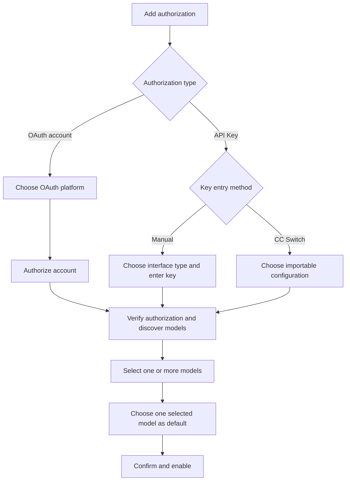

# Unified Model Authorization Design

**Date:** 2026-07-31  
**Branch:** `codex/unified-model-authorization`  
**Status:** Approved conversational design; awaiting written-spec review

## Goal

Replace the split Settings experience for “Model providers” and “Add model authorization” with one continuous authorization-first workflow:

```text
Choose authorization type
→ establish and verify credentials
→ discover models
→ select one or more models
→ choose a default model
→ save and enable
```

The implementation must reuse the existing provider, auth profile, model entry, secret storage, and model-routing systems. It must not introduce a parallel credential store or require a migration of existing model-call runtime code.

## Product Model

The UI distinguishes three separate concepts.

### Provider and endpoint definition

A provider definition describes how to communicate with an API:

- protocol: OpenAI-compatible, Anthropic-compatible, Gemini-compatible, or a built-in provider protocol;
- Base URL where applicable;
- provider display name;
- model discovery behavior;
- provenance such as manual creation or CC Switch import.

For built-in providers, this metadata is separate from credentials. In the current custom-provider implementation, endpoint metadata and the API Key intentionally live together in one encrypted `CustomProvider` record. The feature preserves that storage model instead of inventing a definition-only custom-provider store. Provider or endpoint selection is not the first choice in the normal workflow.

### Authorization

There are exactly two authorization types:

1. OAuth account;
2. API Key.

CC Switch is not a third authorization type. It is an API Key import mechanism.

### Model binding

One authorization may enable multiple models. Each enabled model remains an existing model entry referencing the same credential-bearing stored profile or custom-provider record. One selected model is the default.

## Unified Settings Surface

The Credentials tab is reorganized into one primary surface:

```text
Model authorization
├── Enabled authorizations
├── + Add authorization
└── Advanced management
    └── Custom endpoint authorizations
```

The current standalone custom-provider creation toolbar and the separate provider/model picker are removed as competing primary flows.

“Advanced management” remains available for editing custom endpoint authorizations, including name, protocol, Base URL, credential replacement, model-discovery metadata, and deletion. Creating or importing a custom endpoint during the authorization wizard returns directly to the wizard rather than ending in provider management.

## Authorization Wizard

The wizard begins with authorization type, not provider or model.



### OAuth path

1. Show only platforms with OAuth support.
2. The user chooses a platform and completes the existing OAuth flow.
3. After authorization, the app verifies the profile and discovers available models.
4. The user selects models and a default.
5. The app atomically creates model entries that share the OAuth profile.

Model selection never precedes OAuth completion.

### Manual API Key path

1. The user chooses an interface type:
   - OpenAI;
   - Anthropic;
   - Gemini;
   - custom compatible interface.
2. The user enters an API Key.
3. Base URL is shown when the selected provider requires or permits it.
4. The app verifies the credential and attempts live model discovery.
5. The user selects models and a default before saving.

An API Key alone is not used to guess protocol or provider type.

### CC Switch path

1. Preview CC Switch configurations without mutating app data.
2. Show configuration name, protocol, Base URL, credential availability, and declared models.
3. Configurations without an importable key or supported protocol are disabled with a reason.
4. Selecting a configuration creates a wizard draft containing the imported protocol, Base URL, key, source label, and declared model hints.
5. The app verifies the imported credential and performs live model discovery.
6. The user selects models and a default.
7. The final save creates an ordinary API Key authorization with `source: ccswitch` provenance.

The model runtime does not branch on CC Switch provenance.

## Model Selection

The discovery result supports:

- text search and filtering;
- multiple selected models;
- a single default-model choice constrained to selected models;
- original model IDs and user-facing names;
- a recommendation marker for models declared by the imported CC Switch configuration.

CC Switch selection behavior:

- declared models that also appear in discovery are preselected;
- undeclared discovered models are not automatically selected;
- if the configuration declares no models, nothing is preselected;
- the user must select at least one model.

The wizard cannot complete unless `defaultModel` belongs to `selectedModels`.

### Manual model fallback

If a provider explicitly does not support model-list discovery, the user may enter model IDs manually. At least one ID is required, and the UI marks those models as not automatically verified.

Network failure, authentication failure, protocol mismatch, and an explicitly unsupported model-list endpoint are separate states. A transient failure must not silently unlock manual fallback as if the provider lacked discovery support.

## Wizard State Machine

The Renderer owns an explicit wizard draft instead of sharing implicit state between separate modals.

```text
choose_auth_type
├── oauth_platform
│   └── oauth_authorizing
└── api_key_source
    ├── api_key_manual
    └── ccswitch_preview

credential_ready
→ discovering_models
→ select_models
→ confirm
→ saving
→ completed
```

The draft preserves safe, non-secret input when moving backward. The API Key remains only in the active modal state until transferred through the allowed IPC call; it is not written to DOM datasets, logs, telemetry, or local storage.

A failed verification returns to the credential step with provider type, label, and Base URL preserved. A failed save preserves the complete wizard draft for retry.

## Existing Data Reuse

### Built-in providers

Built-in provider metadata continues to come from the provider catalog. OAuth and direct built-in API Key credentials continue to use existing stored profiles.

### Custom endpoint authorizations

Existing custom providers remain the canonical combined endpoint-and-credential record. CC Switch import continues to materialize compatible `CustomProvider` records rather than creating a new data domain. Their encrypted key, protocol, Base URL, source, and model list stay in the current `customProviders` array.

A custom provider is exposed to the rest of auth through the existing synthetic provider/profile id `cp:<customProviderId>`. It does not receive an additional stored auth profile.

### Credential persistence

Stored profiles and custom providers both remain inside the same encrypted auth-profiles store and continue through the local-secret facade. No credential is copied into a second store.

### Model entries

Each selected model creates an existing model entry. For a built-in provider, entries share a normal stored profile:

```text
Authorization profile: profile_cc_01

Entries:
1. provider/model-default → profile_cc_01
2. provider/model-two     → profile_cc_01
3. provider/model-three   → profile_cc_01
```

For a custom or CC Switch authorization, entries use the synthetic id for both provider and profile:

```text
CustomProvider id: cp-record-01

Entries:
1. cp:cp-record-01/model-default → cp:cp-record-01
2. cp:cp-record-01/model-two     → cp:cp-record-01
```

All entries share one credential-bearing record. The default model is explicitly supplied and is ordered first in the effective priority list.

## Completion Contract

Add one business-level feature operation, exposed through a thin IPC handler, conceptually named:

```text
auth.completeAuthorization
```

The exact TypeScript types will be defined in implementation, but the request contains:

```js
{
  requestId,
  authType: "oauth" | "api_key",
  providerDefinition,
  credentialDraft,
  selectedModels: ["model-a", "model-b"],
  defaultModel: "model-a",
  source: "manual" | "ccswitch"
}
```

The feature operation validates:

- `userId` is provided by the IPC context, not the Renderer payload;
- the provider protocol is supported;
- selected models are non-empty and unique;
- the default model is selected;
- the OAuth profile or API Key draft is valid;
- CC Switch source metadata is bounded and contains no raw secret duplication.

It then performs one of two paths:

**Built-in provider path**

1. create or reuse the stored auth profile;
2. create model entries for all selected models;
3. make the selected default the first effective entry;
4. return a sanitized authorization summary.

**Custom manual or CC Switch path**

1. create or update one credential-bearing `CustomProvider` record;
2. use `cp:<id>` as the synthetic provider and profile id;
3. create model entries for all selected models;
4. make the selected default the first effective entry;
5. return a sanitized authorization summary.

## Atomicity, Idempotency, and Recovery

Profiles, custom providers, and entries already share one encrypted auth-profiles store. Completion must therefore avoid chaining existing public mutators that each save an intermediate state. Instead, the auth feature adds one scoped store mutation that:

- loads and validates the store once;
- builds the complete next profile/custom-provider/entry state in memory;
- saves the encrypted store once through the existing local-secret facade;
- invalidates runtime caches only after the save succeeds.

Validation and model discovery occur before this mutation. A failure before save leaves the store unchanged. A save failure does not expose an in-memory partial state.

OAuth is a necessary exception in timing: the existing OAuth flow persists its profile when provider authorization succeeds, before the user can choose models. If the user cancels or model discovery fails after OAuth completion, the profile remains as an explicit **unbound authorization** with zero enabled models. It is shown in the unified page with actions to resume model selection or remove the account; it is not hidden as corrupt partial state. Binding multiple entries and setting their default is still one store mutation.

`requestId` provides retry idempotency for the completion attempt. Repeating a completed request returns the existing sanitized result. Independently, existing `addEntry` idempotency prevents duplicate `(provider, model, profileId)` entries.

The implementation serializes completion mutations for the active user within the single process so concurrent submits cannot overwrite each other. It must not add a lock wait timeout or put mutation logic in IPC.

## Deletion and Update Rules

- Removing one model removes only its model entry.
- Removing the current default requires selecting another enabled model or removing the whole authorization.
- Removing a built-in authorization removes all entries that reference the stored profile, then removes that profile in one store mutation.
- Removing a custom authorization removes all entries that reference `cp:<id>`, then removes the `CustomProvider` record in the same store mutation.
- Editing a custom endpoint updates the existing credential-bearing custom authorization. It is deleted as one unit rather than deleting a separate definition.
- Reimporting a CC Switch configuration is an explicit update flow; it does not silently overwrite an existing authorization.
- Reimport shows discovered additions/removals and requires the user to confirm the final selected model set.

## Existing Data Compatibility

There is no eager migration.

The unified page derives authorization cards from existing profiles and model entries:

```text
Authorization label
OAuth or API Key · protocol · optional source
Enabled models: N
Default: model-a
```

Compatibility rules:

- existing model entries retain their current behavior and priority;
- profiles with different credentials remain separate cards;
- existing custom providers remain editable in Advanced management as combined endpoint-and-credential authorizations;
- existing CC Switch-created providers display their source but are not automatically reimported;
- malformed or orphaned legacy state is displayed as a recoverable warning rather than rewritten automatically.

## Error Handling

| Failure | UX response |
|---|---|
| Invalid API Key | Stay on credential step; permit key correction and retry |
| Base URL unavailable | Preserve fields; allow URL/protocol correction |
| Protocol mismatch | Explain mismatch and allow protocol change |
| OAuth cancelled | Return to OAuth platform selection |
| OAuth transient failure | Preserve platform and allow retry |
| CC Switch row lacks key | Disable row with explicit reason |
| Model list is empty | Offer manual IDs only when discovery is unsupported |
| Save fails | Preserve draft and retry; no partial authorization shown |
| Duplicate submission | Return prior successful result or reuse existing entries |

Renderer messages use localized, actionable error codes. Main logs use the module logger and include only provider IDs, protocols, source types, model counts, request IDs, and coarse statuses. API keys, OAuth tokens, connector secrets, and credential-bearing URLs are never logged or sent to telemetry.

## IPC and Layering

IPC handlers remain argument-validation and feature-forwarding only.

Expected operations include:

- preview CC Switch configurations;
- validate a credential draft and discover models;
- complete an authorization atomically;
- list authorization summaries;
- remove one model binding;
- remove an authorization and all of its bindings.

Credential verification and model discovery live in `features/`, reusing provider adapters and API-base routing. API profiles must continue through existing API-base helpers; production domains are not hard-coded.

## Renderer Structure

The Renderer remains classic JavaScript without a bundler.

The feature should be decomposed into guarded pure helpers that can be unit tested without DOM or IPC, including:

- wizard-state transitions;
- model selection/default normalization;
- CC Switch declared-model preselection;
- existing profile/entry grouping into authorization cards;
- request-payload construction with secret-field exclusion from persisted draft state.

The Settings module may delegate the wizard to a new classic script added to `src/renderer/index.html` if keeping the logic in `settings.js` would make the existing module materially harder to maintain.

All visible strings are added to the four Renderer locale files and rerender on `i18n-change`. Input Enter shortcuts honor IME composition.

## Long-Running Feedback

Credential verification, OAuth completion, CC Switch preview, model discovery, and final save all show explicit progress. Controls that could duplicate an operation are disabled while that operation is active. A stale model-discovery result is discarded if the user changes provider type, Base URL, key source, or OAuth platform before it returns.

## Test Strategy

### Renderer tests

Cover:

1. OAuth, manual API Key, and CC Switch state transitions;
2. manual API Key requires interface type;
3. CC Switch is represented as API Key provenance, not an auth type;
4. declared CC Switch models are preselected only when discovered;
5. no declared models means no automatic selection;
6. multiple model selection and one constrained default;
7. changing selected models repairs or clears an invalid default;
8. draft state survives verification and save failures;
9. stale discovery responses are ignored;
10. legacy profiles and entries group into correct cards;
11. IME composition does not trigger advance/save actions;
12. Settings markup no longer exposes two competing primary add flows.

### Feature tests

Cover:

1. credential verification and live model discovery for supported protocols;
2. unsupported discovery versus network/auth failure classification;
3. one profile shared by multiple entries;
4. explicit default ordering;
5. invalid default rejection;
6. idempotent completion requests;
7. a validation or store-save failure leaves the previous encrypted store state unchanged;
8. removal of one model preserves the profile;
9. authorization removal atomically cleans entries and the credential-bearing profile/provider record;
10. an OAuth profile with no model bindings is shown as resumable or removable;
11. legacy data remains unchanged on read.

### IPC and contract tests

Cover:

- user scoping from IPC context;
- payload validation and bounded arrays/strings;
- no raw credential in response;
- Renderer shim allow-list additions;
- i18n key parity across four locales.

### Regression verification

Run the focused auth/provider/CC Switch tests, Renderer contract tests, typecheck, full `npm test`, builtin manifest check, and `git diff --check`.

## Out of Scope

- replacing the existing auth profile or model-entry storage format;
- changing runtime model rotation semantics beyond setting the explicit default order;
- merging multiple existing credential profiles automatically;
- synchronizing CC Switch continuously in the background;
- adding a generic arbitrary API-key connector system;
- changing CLI agent provider-selection behavior except where it consumes the same already-saved custom provider definitions;
- changing hosted entitlement, account login, sync, or connector OAuth behavior.

## Success Criteria

The feature is complete when:

1. Settings presents one primary model-authorization flow;
2. OAuth and API Key are the only authorization types;
3. manual entry and CC Switch are API Key acquisition methods;
4. model discovery happens after credential establishment;
5. one authorization can enable multiple models with one explicit default;
6. CC Switch declared models are selectively preselected;
7. completion is idempotent and leaves no hidden partial state; an OAuth account completed before model selection is represented explicitly as unbound and resumable;
8. existing authorizations remain usable without migration;
9. all relevant tests and repository verification pass.
