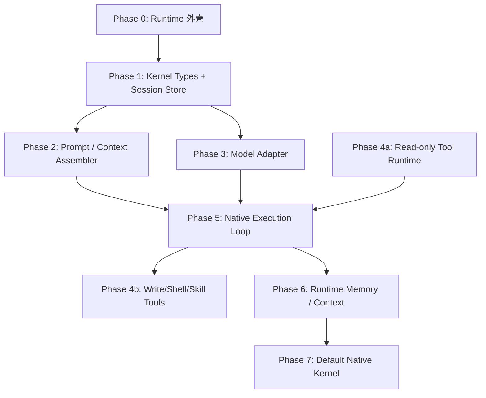

# Mate Agent 自研 Agent 内核完整计划书

## 1. 一句话目标

在现有 Mate Agent Runtime 隔离层基础上，逐步把底层 `core-agent` 执行内核替换为 Mate Agent 自己拥有的 Agent Kernel，同时保持现有 Mate Agent UI、IPC 表层、用户数据边界和已实现 Runtime 协议稳定。

最终目标不是一次性重写全部能力，而是建立一个可渐进替换的内核架构：

```text
Mate Agent UI / existing IPC
    ↓
Mate Agent main features
    ↓
Mate Agent Runtime facade
    ↓
Mate Agent Agent Kernel
    ↓
model adapters / tool runtime / session store / memory-context
```

当前过渡状态是：

```text
Mate Agent Runtime
    ↓
core-executor.ts
    ↓
core-agent / streamChatWithModel
```

目标状态是：

```text
Mate Agent Runtime
    ↓
Mate Agent Agent Kernel
    ├── session runner
    ├── model adapter
    ├── prompt/context assembler
    ├── tool catalog + tool runner
    ├── memory/context store
    ├── execution loop
    └── event stream
```

## 2. 核心原则

### 2.1 不大爆炸重写

不要把 `core-agent` 整套复制一份后立即替换。这样会复制历史耦合、prompt 包袱、group chat 语义和权限风险。

正确路线是：

```text
复用稳定基础设施
抽取通用逻辑
fork/adapt 边界敏感逻辑
最后替换执行 loop
```

### 2.2 Runtime 边界保持稳定

已经建立的 Mate Agent Runtime 约束继续作为硬边界：

- Runtime 不接 `features/group_chat/bus.ts`
- Runtime 不接受 `cid` 作为自身 session
- Runtime 不读取 Mate Agent 完整 conversation JSONL
- Runtime 不读取 `cloud/sessions/gconv-*` / `gmember-*`
- Runtime 只接受明确传入的 `task`、`context`、`attachments`
- Runtime 结果可以投影回 Mate Agent，但不做 transcript 双向同步
- Runtime 数据继续放在 `<uid>/local/mate_runtime/`

### 2.3 可以抄，但不能继承旧假设

允许从 `core-agent` copy/fork/adapt 代码，但每个模块必须过一遍边界审查：

- 是否隐式依赖 `cid`
- 是否隐式读取 cloud chat/session
- 是否暴露 group commander 工具
- 是否自动注入 memory/KB/connector
- 是否绕过 path sandbox
- 是否写入错误数据域
- 是否把 prompt 或 transcript 打进日志

只有去掉这些假设后，才可以进入 Mate Agent Agent Kernel。

## 3. 不做的事情

第一阶段不做：

- 不改 renderer UI
- 不改现有 IPC channel 名称
- 不删除现有 group chat bus
- 不迁移历史 `gconv-*` / `gmember-*` session
- 不立即删除 `core-agent`
- 不直接复制完整 `model/core-agent/runner.ts`
- 不把 connector MCP actions flat 注入 Runtime tools
- 不引入 HTTP server 或本地 auth layer
- 不新增 npm dependencies

## 4. 总体架构

### 4.1 分层结构

建议新增内核目录：

```text
src/main/features/mate_agent_runtime/kernel/
├── types.ts
├── session-store.ts
├── session-runner.ts
├── model-adapter.ts
├── prompt-assembler.ts
├── event-stream.ts
├── execution-loop.ts
├── cancellation.ts
├── errors.ts
├── tools/
│   ├── catalog.ts
│   ├── permissions.ts
│   ├── runner.ts
│   ├── file-tools.ts
│   ├── shell-tools.ts
│   ├── skill-tools.ts
│   └── result-cap.ts
├── memory/
│   ├── store.ts
│   ├── injector.ts
│   └── extractor.ts
└── context/
    ├── store.ts
    ├── importer.ts
    └── assembler.ts
```

现有文件保留为 Runtime 外壳：

```text
src/main/features/mate_agent_runtime/
├── protocol.ts
├── store.ts
├── worker-process.ts
├── worker.ts
├── worker-entry.ts
├── core-executor.ts       # 过渡 adapter；逐步变薄，最终删除
└── index.ts
```

### 4.2 数据流

目标数据流：

```text
RuntimeRunRequest
    ↓ validate protocol
RuntimeSessionRunner
    ↓ load mruntime session
PromptContextAssembler
    ↓ explicit task/context/attachments + runtime memory
ExecutionLoop
    ↓ model adapter
ToolRuntime
    ↓ bounded tool results
RuntimeEventStream
    ↓ worker stdout JSONL
Runtime facade
    ↓ optional result projection
Mate Agent visible message
```

### 4.3 事件流，不叫 bus

不要给 Runtime 新建一个和 group chat 同名的 `bus`。Runtime 内部可以有事件流，但命名应该表达“单请求执行流”，例如：

```text
RuntimeEventStream
RuntimeRunEvents
RuntimeProcessEvents
```

它只处理：

- started
- model_delta
- tool_call
- tool_result
- artifact
- warning
- result
- error
- cancelled

它不处理：

- commander dispatch
- group members
- visibility slice
- plan_set
- group retry/skip
- group abort bus

## 5. 模块计划

## 5.1 Runtime Kernel Types

### 目标

定义 Mate Agent Agent Kernel 的内部稳定类型，避免继续直接使用 core-agent 的类型作为 feature 层契约。

### 建议文件

```text
src/main/features/mate_agent_runtime/kernel/types.ts
```

### 核心类型

```ts
export interface RuntimeKernelRequest {
  userId: string;
  requestId: string;
  runtimeSessionId: string;
  task: string;
  context: RuntimeContextItem[];
  attachments: RuntimeAttachment[];
  agentId?: string;
  modelProfile?: string;
  workingDir?: string;
  readOnlyRoots: string[];
}

export interface RuntimeKernelEvent {
  type: 'started' | 'model_delta' | 'tool_call' | 'tool_result' | 'result' | 'error' | 'cancelled';
  requestId: string;
  runtimeSessionId: string;
  text?: string;
  metadata?: Record<string, unknown>;
}
```

### 复制策略

不从 core-agent 复制类型。这里应该是 Mate Agent Runtime 自己的最小契约。

### 验收标准

- feature 层不需要 import `#core-agent` 类型
- Runtime kernel event 可以完整映射到现有 JSONL protocol event
- 类型中没有 `cid`、`gconv`、`gmember`

## 5.2 Runtime Session Store

### 目标

把 Runtime session history 完全从 `model/core-agent/session-store.ts` 中拆出来，变成 Runtime 自己的 session 文件、turn 文件和 active-run 状态。

### 建议文件

```text
src/main/features/mate_agent_runtime/kernel/session-store.ts
```

### 数据目录

```text
<uid>/local/mate_runtime/sessions/<mruntime-id>.jsonl
<uid>/local/mate_runtime/sessions/<mruntime-id>.context.json
<uid>/local/mate_runtime/runs/<run-id>/meta.json
<uid>/local/mate_runtime/runs/<run-id>/events.jsonl
```

### 可以参考/抄改

可以参考：

```text
src/main/model/core-agent/session-store.ts
src/main/storage.ts
src/main/util/locks.ts
```

但不能继承：

- cloud session routing
- `gconv` / `gmember` / `skill` / `agent` kind 语义
- cross-session memory scope 逻辑

### 设计要求

- session id 必须是 `mruntime-*`
- 所有读写路径从 `paths.ts` helper 获取
- 不允许根据 uid 拼接之外的相对路径
- 支持 append JSONL
- 支持读取 bounded history
- 支持 active run 恢复和取消标记
- 支持 request id 去重，避免 worker 重启后重复执行同一 request

### 验收标准

- Runtime session 不出现在 `<uid>/cloud/sessions/`
- Runtime session 不出现在 Mate Agent conversation list
- 同一 `request_id` crash 后 retry 不重复执行已完成 request
- 删除 Runtime session 不影响 `gconv-*` / `gmember-*`

## 5.3 Prompt / Context Assembler

### 目标

替换 core-agent 的 prompt 拼接路径，建立 Runtime 自己的小 prompt 体系。

### 建议文件

```text
src/main/features/mate_agent_runtime/kernel/prompt-assembler.ts
src/main/features/mate_agent_runtime/kernel/context/assembler.ts
```

### 输入

只允许这些来源：

```text
task
explicit text context
explicit file context
explicit attachments
runtime memory summary
runtime context references
```

### 禁止来源

```text
Mate Agent full transcript
cloud/chats/<cid>.jsonl
cloud/sessions/gconv-*.jsonl
cloud/sessions/gmember-*.jsonl
group_chat visibility slice
commander plan state
```

### Prompt 原则

Runtime prompt 应短小、可审计、稳定：

```text
你是 Mate Agent Runtime worker。
你只能使用本请求中显式提供的 task/context/attachments。
不要读取或请求 Mate Agent conversation transcript。
如果上下文不足，说明缺少什么，而不是猜测。
```

### 可以参考/抄改

可以参考 core-agent 中 message normalization、history resource handling、tool result summarization。

不要复制完整 chat prompt、agent authoring prompt、group chat prompt。

### 验收标准

- prompt 中不出现真实项目路径或产品内部源码路径
- prompt 中不包含完整 Mate Agent transcript
- prompt builder 有 fixture tests，覆盖普通上下文、文件上下文、空上下文、恶意 transcript 伪装

## 5.4 Model Adapter

### 目标

把模型 provider 选择、streaming、abort、error normalization 从 core-agent 执行器中抽出来，形成 Mate Agent Runtime 自己的 model adapter。

### 建议文件

```text
src/main/features/mate_agent_runtime/kernel/model-adapter.ts
```

### 可以复用

可以继续复用已有 account/profile/API-base helper：

```text
src/main/model/*
src/main/features/accounts/*
src/main/features/custom_providers/*
```

实际路径以当前代码为准，迁移时用代码图或搜索确认。

### 可以抄改

可以从 core-agent adapter 抄：

- streaming delta normalization
- provider error classification
- abort signal handling
- usage accounting
- cache retention 处理
- reasoning/thinking 参数映射

### 必须去掉

- `cid` 传播
- group-chat execution lifecycle
- 自动 skill prompt 注入
- 自动 memory block 注入
- 自动 connector block 注入

这些应由 Runtime Kernel 上层明确传参决定。

### 输出类型

```ts
export type RuntimeModelEvent =
  | { type: 'delta'; text: string }
  | { type: 'tool_call'; call: RuntimeToolCall }
  | { type: 'usage'; usage: RuntimeUsage }
  | { type: 'error'; code: string; message: string }
  | { type: 'done' };
```

### 验收标准

- 单测使用 fake provider，不打真实网络
- abort 后不继续 yield delta
- provider 5xx、auth error、rate limit 映射为稳定 code
- adapter 不 import `features/group_chat/*`

## 5.5 Tool Catalog and Tool Runtime

### 目标

Runtime 自己决定能用哪些工具，而不是继承 core-agent 的完整工具列表。

### 建议文件

```text
src/main/features/mate_agent_runtime/kernel/tools/catalog.ts
src/main/features/mate_agent_runtime/kernel/tools/permissions.ts
src/main/features/mate_agent_runtime/kernel/tools/runner.ts
src/main/features/mate_agent_runtime/kernel/tools/file-tools.ts
src/main/features/mate_agent_runtime/kernel/tools/shell-tools.ts
src/main/features/mate_agent_runtime/kernel/tools/skill-tools.ts
```

### 第一版工具白名单

建议第一版只支持：

```text
stat_file
read_file
search_files
grep_files
write_file
edit_file
bash
run_skill
```

其中：

- file tools 必须检查 `util/path-sandbox.isPathAllowed`
- bash 必须复用现有命令风险/权限策略或抽出公共 guard
- run_skill 必须通过 `bin/run-skill.cjs`
- tool result 必须通过 `util/tool-result-cap.ts`

### 不进入第一版的工具

```text
group dispatch tools
plan_set
agent management tools
flat connector MCP tools
chat history tools
memory extraction tools
reflection tools
```

### 可以复用/抄改

可以从下面模块抄改具体工具实现：

```text
src/main/model/core-agent/local-tools.ts
src/main/model/core-agent/file-tools.ts
src/main/model/core-agent/kb-tools.ts
src/main/model/core-agent/tool-catalog.ts
```

抄改要求：

- 每个工具入口先做 Runtime permission check
- 每个文件路径先过 sandbox
- 不允许工具自己解析 `cid`
- 不允许工具读取 Mate Agent transcript
- 工具事件统一映射为 RuntimeKernelEvent

### 验收标准

- catalog snapshot test：Runtime 第一版工具列表固定且无 group/chat 工具
- path traversal tests：拒绝 `../`、symlink escape、cloud transcript path
- oversized tool result tests：spill 到 local runtime tool-results，返回 preview/ref
- bash tests：高风险命令需要权限策略，不静默执行

## 5.6 Runtime Memory and Context

### 目标

Runtime 有自己的 memory/context，不默认继承 Mate Agent memory、KB 或 Library。

### 建议文件

```text
src/main/features/mate_agent_runtime/kernel/memory/store.ts
src/main/features/mate_agent_runtime/kernel/memory/injector.ts
src/main/features/mate_agent_runtime/kernel/memory/extractor.ts
src/main/features/mate_agent_runtime/kernel/context/store.ts
src/main/features/mate_agent_runtime/kernel/context/importer.ts
```

### 数据目录

```text
<uid>/local/mate_runtime/memory/
<uid>/local/mate_runtime/contexts/
```

### 规则

- 默认 memory 为空
- 只有 Runtime 明确写入的 memory 才进入 Runtime memory
- Mate Agent Library 文件必须由调用方显式选择后才进入 Runtime context
- Runtime context importer 只复制或引用经过 sandbox 校验的文件
- 不扫描用户 Library 全量目录
- 不直接访问 KB vector DB，除非后续设计 Runtime KB adapter

### 可以复用

可以复用：

- text chunking utilities
- JSON/JSONL storage utilities
- path sandbox
- tool result cap

不直接复用 Mate Agent memory 注入策略。

### 验收标准

- Runtime memory 存在 local domain，不进 cloud sync
- Runtime 不读取 `<uid>/cloud/memory/MEMORY.md`
- Runtime context importer 拒绝 transcript 路径
- memory extractor 只处理 Runtime session summaries

## 5.7 Execution Loop

### 目标

最终替换 `streamChatWithModel`，由 Mate Agent Kernel 自己执行：

```text
messages → model → tool call → tool result → model → final result
```

### 建议文件

```text
src/main/features/mate_agent_runtime/kernel/execution-loop.ts
src/main/features/mate_agent_runtime/kernel/session-runner.ts
src/main/features/mate_agent_runtime/kernel/cancellation.ts
src/main/features/mate_agent_runtime/kernel/errors.ts
```

### 职责

- 加载 Runtime session history
- 组装 prompt/messages
- 调用 model adapter
- 识别 tool calls
- 调用 tool runner
- 写 Runtime session history
- 写 run events
- 处理 abort/cancel
- 处理 idle watchdog
- 处理 max tool rounds
- 处理 terminal result

### 可抄改

可以参考 core-agent AgentRunner 的 loop，但建议重写结构，不要整文件复制。

可复用的逻辑：

- tool call/result message shape 转换
- stream delta aggregation
- max tool loop guard
- idle watchdog 思路
- compaction 触发条件

必须重新定义的逻辑：

- Runtime session history shape
- Runtime tool permission policy
- Runtime memory injection
- Runtime final result event
- Runtime cancellation semantics

### 验收标准

- fake model + fake tool 的端到端 tests
- tool call 失败后产生稳定 error event
- max tool rounds 触发 terminal failed/timed_out
- cancel 不重放原始 task
- worker crash 后不会重复执行 completed request

## 5.8 Core-Agent Compatibility Adapter

### 目标

在迁移期间保留 core-agent 作为 fallback，但把依赖限制在一个文件里。

### 当前文件

```text
src/main/features/mate_agent_runtime/core-executor.ts
```

### 迁移策略

阶段内保持：

```text
core-executor.ts → streamChatWithModel
```

随着自研模块上线，改成：

```text
core-executor.ts → compatibility fallback only
kernel/session-runner.ts → primary path
```

最终删除或只保留测试/调试 fallback。

### 验收标准

- `features/mate_agent_runtime/` 中只有 `core-executor.ts` 可以 import `../../model/client`
- 新 kernel 模块不 import `#core-agent`
- fallback 由 feature flag 控制
- fallback 和 native kernel 输出同一 Runtime JSONL event contract

## 6. 迁移阶段

## Phase 0：已完成的 Runtime 外壳

当前已完成或已开始：

- Runtime protocol
- worker process
- `mruntime-*` session routing
- local run store
- request validation
- result projection callback
- core-agent compatibility adapter

验收命令：

```bash
npm run test:js -- test/main/features/mate_agent_runtime test/main/util/packaged-entrypoint-gate.test.ts --maxWorkers=1
npm run typecheck
npm test
```

## Phase 1：Runtime Kernel Types + Session Store

交付物：

```text
kernel/types.ts
kernel/session-store.ts
kernel/session-runner.ts 的空壳
```

目标：Runtime session history 先独立，不再通过 core-agent session-store。

验收：

- `mruntime-*` history 写入 local runtime session
- 不写 cloud sessions
- request id 幂等记录可查
- crash/retry metadata 可恢复

## Phase 2：Prompt / Context Assembler

交付物：

```text
kernel/prompt-assembler.ts
kernel/context/assembler.ts
```

目标：Runtime prompt 完全由 Mate Agent Runtime 生成，核心规则是 explicit-only。

验收：

- prompt fixture tests
- transcript injection rejection tests
- no `cid` in prompt
- no cloud transcript path in prompt

## Phase 3：Model Adapter

交付物：

```text
kernel/model-adapter.ts
```

目标：先用 fake provider 跑通 streaming contract，再接现有 provider/profile helper。

验收：

- fake streaming delta tests
- abort tests
- provider error mapping tests
- no group_chat imports

## Phase 4：Tool Runtime MVP

交付物：

```text
kernel/tools/catalog.ts
kernel/tools/permissions.ts
kernel/tools/runner.ts
kernel/tools/file-tools.ts
```

目标：先支持只读文件工具和 bounded result。

建议顺序：

1. `stat_file`
2. `read_file`
3. `search_files`
4. `grep_files`
5. result cap
6. write/edit tools
7. bash
8. run_skill

验收：

- catalog snapshot 不含 group tools
- file sandbox tests
- symlink escape tests
- cloud transcript path rejection tests
- oversized result cap tests

## Phase 5：Native Execution Loop

交付物：

```text
kernel/execution-loop.ts
kernel/session-runner.ts
kernel/cancellation.ts
kernel/errors.ts
```

目标：使用 Mate Agent 自己的 model adapter + tool runtime 跑完整 single-turn / multi-tool turn。

验收：

- fake model asks fake tool, gets result, final answer
- tool error path
- cancel path
- max rounds path
- no core-agent import in native path

## Phase 6：Runtime Memory / Context

交付物：

```text
kernel/memory/store.ts
kernel/memory/injector.ts
kernel/context/store.ts
kernel/context/importer.ts
```

目标：Runtime 有自己的 local memory/context。

验收：

- memory 写 local runtime root
- 不读 cloud memory
- context importer explicit-only
- memory summary 不含 raw transcript 日志

## Phase 7：默认切换到 Native Kernel

交付物：

```text
kernel/index.ts
core-executor fallback flag
```

目标：默认执行路径改为 Mate Agent Native Kernel，core-agent fallback 只用于调试/回滚。

验收：

- feature flag off：native kernel 执行
- feature flag on：core-agent fallback 执行
- 两条路径都输出相同 Runtime protocol events
- 全量 `npm test` 通过

## 7. 复制/抽取/自研矩阵

| 模块 | 策略 | 理由 |
| --- | --- | --- |
| `storage.ts` JSON/JSONL helpers | 直接复用 | 基础设施稳定，不含 agent 语义 |
| `paths.ts` helper | 直接复用并扩展 | 数据域 choke point |
| `path-sandbox.ts` | 直接复用 | 安全边界基础设施 |
| `tool-result-cap.ts` | 直接复用 | 已有 bounded output 机制 |
| provider streaming normalization | 抽取或 fork/adapt | 通用价值高，但要去掉 core-agent 假设 |
| model error classification | 抽取或 fork/adapt | 通用价值高 |
| file tools | fork/adapt | 工具权限和根目录策略不同 |
| bash tool | fork/adapt | 风险高，必须 Runtime permission wrapper |
| skill runner invocation | 复用 `bin/run-skill.cjs` | 项目硬约束要求 |
| session store | 自研，参考 core-agent | session 是 Runtime 边界核心 |
| prompt assembler | 自研 | 不能继承旧 prompt 包袱 |
| tool catalog | 自研 | Runtime 必须自己决定工具列表 |
| memory injection | 自研 | 不能默认继承 Mate Agent memory |
| execution loop | fork 思路，自研结构 | 最终内核核心，不能整文件复制 |
| group_chat bus | 不复用 | 与 Runtime 独立执行边界冲突 |

## 8. 安全和隐私要求

### 8.1 文件路径

所有 file-class tools 和 context importer 必须：

```text
isPathAllowed(candidate, allowedRoots)
```

并且额外拒绝：

```text
<uid>/cloud/chats/*.jsonl
<uid>/cloud/sessions/*.jsonl
```

### 8.2 日志

日志只能包含：

- ids 的 masked form
- counts
- lengths
- status
- error code
- path hash/ref

日志不能包含：

- raw prompt
- raw transcript
- secrets
- full tool output
- full attachment text

### 8.3 权限

Runtime 权限来自 Runtime request 的 agent profile / policy，不继承 group commander 权限。

### 8.4 数据域

Runtime 写入只允许：

```text
<uid>/local/mate_runtime/
```

除非通过明确 result projection 把最终结果写回 Mate Agent 会话。

## 9. 测试策略

### 9.1 单元测试

覆盖：

- protocol validation
- session path routing
- request id idempotency
- prompt assembler fixtures
- model adapter fake streaming
- tool catalog snapshot
- file sandbox
- result cap
- memory store local-only

### 9.2 集成测试

覆盖：

- worker handshake
- worker crash/restart
- cancel
- fake model + fake tool full loop
- native kernel vs core-agent fallback event contract compatibility

### 9.3 回归测试

必须证明：

- Runtime 不接 `group_chat.bus`
- Runtime 不读 cloud chats
- Runtime 不读 cloud sessions
- Runtime 不暴露 group commander tools
- Runtime result projection 不做 transcript back-sync

### 9.4 验收命令

每阶段至少运行：

```bash
npm run test:js -- test/main/features/mate_agent_runtime --maxWorkers=1
npm run typecheck
```

关键阶段运行：

```bash
npm test
```

## 10. 风险和控制

### 风险 1：复制 core-agent 后双份维护

控制：只 fork/adapt 小模块；通用逻辑优先抽公共 helper；禁止整文件复制 runner。

### 风险 2：Runtime 重新继承 group chat 语义

控制：测试禁止 `features/mate_agent_runtime/kernel` import `features/group_chat`；protocol 禁止 `cid`。

### 风险 3：工具权限扩大

控制：Runtime 自有 catalog snapshot；每个工具必须 permission wrapper；默认最小工具集。

### 风险 4：memory/context 泄漏

控制：Runtime memory/context local-only；explicit importer；拒绝 transcript path。

### 风险 5：一次替换导致产品不可用

控制：保留 `core-executor.ts` fallback；native kernel 用 feature flag 灰度。

## 11. 成功标准

最终达到以下状态：

1. Runtime 默认不再调用 `streamChatWithModel`。
2. Runtime native kernel 不 import `#core-agent`。
3. Runtime session、memory、context、runs 全部在 `<uid>/local/mate_runtime/`。
4. Runtime tools 由 Mate Agent Runtime catalog 控制。
5. Runtime 不读取 Mate Agent 完整 conversation JSONL。
6. Runtime 不接 `group_chat.bus`。
7. Runtime result 可以投影回 Mate Agent UI，但不双向同步 transcript。
8. core-agent fallback 可以关闭并删除。
9. 全量 `npm test` 通过。

## 12. 推荐的下一步

下一步不要直接做 execution loop。推荐先做 Phase 1：

```text
Runtime Kernel Types + Runtime Session Store
```

原因：

- session 是内核边界的根
- 风险低
- 测试容易写
- 不影响 UI
- 不需要真实模型
- 做完后 core-agent 依赖会明显变薄

Phase 1 完成后，再进入 prompt/context assembler。这样每一步都有独立验收，不会陷入“大重写”。

---

## 13. 补充：阶段依赖关系图

自研 Agent Kernel 不允许多个阶段无序并行。推荐依赖如下：



依赖说明：

- Phase 1 是根依赖：后续所有模块都依赖 `RuntimeKernelRequest`、session history 和 request ledger。
- Phase 2 依赖 Phase 1 的 session history 读取接口，但第一版可以只用 explicit context 做 fixture tests。
- Phase 3 可以与 Phase 2 部分并行，因为 fake provider adapter 不依赖 prompt assembler。
- Phase 4 拆成 4a 和 4b：只读工具先做，写入、bash、run_skill 后做，避免高风险工具阻塞 native loop。
- Phase 5 必须等 Phase 2、Phase 3、Phase 4a 完成后再做。
- Phase 6 可以在 Phase 5 后加入，不应该在 native loop 稳定前自动写 memory。
- Phase 7 只做默认路径切换，不再引入新能力。

## 14. 补充：回滚和退化策略

Native Kernel 上线必须保留可操作回滚路径。回滚分三层：

### 14.1 全量回滚

环境变量或配置项：

```text
ORKAS_MATE_RUNTIME_KERNEL=core
```

语义：

- 所有 Runtime request 走 `core-executor.ts` fallback。
- Native Kernel 不初始化 model adapter、tool runtime、memory extractor。
- Runtime protocol、worker、run store 仍保留。

### 14.2 按用户回滚

用户配置建议存于 local domain：

```text
<uid>/local/mate_runtime/config.json
```

字段：

```json
{
  "kernel_mode": "native",
  "fallback_reason": "",
  "updated_at": "2026-08-04T00:00:00"
}
```

允许值：

```text
native
core
shadow
```

- `native`：默认走 Native Kernel。
- `core`：该用户走 core-agent fallback。
- `shadow`：主结果走 core-agent，后台用 Native Kernel dry-run 记录 events，但不投影结果。

### 14.3 按请求回滚

Runtime request 可携带 host-owned execution option，不进入 worker protocol 的 model prompt：

```ts
interface RuntimeExecutionOptions {
  kernelMode?: 'native' | 'core' | 'shadow';
  fallbackOnNativeError?: boolean;
}
```

策略：

- `fallbackOnNativeError=true` 只允许在 native 失败且尚未执行写工具时触发。
- 如果已执行 write/bash/run_skill，不自动 fallback，避免重复副作用。
- fallback event 必须写入 run metadata：`fallback_from`, `fallback_to`, `reason_code`。

## 15. 补充：早期 Runtime 数据兼容策略

当前 Phase 0 已经会产生 `<uid>/local/mate_runtime/` 下的数据。Native Kernel 不能假设这些数据不存在。

### 15.1 兼容原则

- Phase 0 run logs 保留原样，不迁移。
- Phase 0 `mruntime-*` session JSONL 如果是 core-agent 格式，Native Kernel 默认只读 metadata，不直接当作 native history 执行。
- Native Kernel session 文件增加 header record 区分格式。

### 15.2 Native session header

第一条 JSONL record：

```json
{
  "type": "session_header",
  "version": 1,
  "kernel": "mate-agent-native",
  "runtime_session_id": "mruntime-...",
  "created_at": "2026-08-04T00:00:00"
}
```

### 15.3 旧 session 处理

如果读取到没有 header 的 `mruntime-*` session：

- 标记为 `legacy_core_agent_session`
- 不删除
- 不自动迁移
- 新 native run 写入新的 native session 文件或 append header 前先创建 `.legacy-copy.jsonl` 备份

推荐第一版更保守：

```text
native session store 只创建新格式；遇到 legacy 文件直接拒绝 native resume，提示 fallback core。
```

## 16. 补充：关键配置项

Native Kernel 默认配置集中定义在：

```text
src/main/features/mate_agent_runtime/kernel/config.ts
```

建议初始值：

```ts
export const DEFAULT_RUNTIME_KERNEL_CONFIG = Object.freeze({
  idleTimeoutMs: 30 * 60 * 1000,
  streamIdleTimeoutMs: 3 * 60 * 1000,
  maxToolRounds: 80,
  maxModelRetries: 2,
  requestLedgerRetentionMs: 14 * 24 * 60 * 60 * 1000,
  maxInlineToolResultChars: 24_000,
  maxPromptContextChars: 120_000,
  maxMemoryInjectionChars: 12_000,
  allowWriteToolsByDefault: false,
  allowShellByDefault: false,
  allowSkillRunByDefault: false
});
```

触发行为：

- `idleTimeoutMs`：整轮无任何 model/tool event 超时，终止为 `failed`，code=`runtime_idle_timeout`。
- `streamIdleTimeoutMs`：模型已经开始输出文本后长时间无 delta，终止为 `failed`，code=`runtime_stream_idle_timeout`。
- `maxToolRounds`：超过后终止为 `failed`，code=`runtime_tool_round_limit`。
- `maxModelRetries`：只用于 provider/network transient error；工具副作用执行后不自动重试整个 turn。
- `requestLedgerRetentionMs`：用于清理 request id 幂等记录。

## 17. 补充：权限策略结构

Runtime permissions 必须先定义数据结构，再实现工具。

建议类型：

```ts
export interface RuntimeToolPolicy {
  fileRead: 'none' | 'explicit_roots';
  fileWrite: 'none' | 'explicit_writable_roots';
  shell: 'none' | 'low_risk_only' | 'allow_with_confirmation';
  skillRun: 'none' | 'allowlisted_skills';
  network: 'none';
  connectors: 'none';
}
```

默认策略：

```ts
export const DEFAULT_RUNTIME_TOOL_POLICY: RuntimeToolPolicy = {
  fileRead: 'explicit_roots',
  fileWrite: 'none',
  shell: 'none',
  skillRun: 'none',
  network: 'none',
  connectors: 'none'
};
```

`bash` 初始策略：

- 默认关闭。
- 第一版不做黑名单模型；使用白名单/风险分级。
- `low_risk_only` 只允许无重定向、无管道副作用、无删除/移动/权限修改的只读命令，例如 `pwd`、`ls`、`cat` 仍需路径 sandbox 约束。
- `allow_with_confirmation` 需要 host 层确认；Runtime worker 不直接弹 UI。

工具动态扩展：

- 第一版不允许第三方动态注册 Runtime tools。
- 后续扩展只能通过 `kernel/tools/catalog.ts` 的 host-owned registry，不能由模型或 connector flat 注入。

## 18. 补充：Context 预读与工具读取的区别

计划中必须区分两条路径：

### 18.1 Context importer / assembler

用于构建初始 prompt。只处理显式传入的：

```text
context[]
attachments[]
```

它可以预读文本文件摘要，但必须受：

- path sandbox
- transcript path rejection
- maxPromptContextChars

约束。

### 18.2 Tool runtime file read

模型运行中如果调用 `read_file`，这是工具执行路径，不是 context importer。它仍必须受：

- RuntimeToolPolicy.fileRead
- explicit read roots
- path sandbox
- transcript path rejection
- result cap

约束。

用户在 task 中写“读取 /path/to/file”不等于自动授权。只有该 path 位于 request 显式 allowed roots / attachments / context file roots 中，工具才能读。

## 19. 补充：Memory 格式和写入时机

第一版 Native Kernel memory 默认关闭自动写入。

### 19.1 Memory 文件格式

建议先用 Markdown，便于人工审查：

```text
<uid>/local/mate_runtime/memory/runtime.md
<uid>/local/mate_runtime/memory/agents/<agent-id>.md
```

结构：

```markdown
# Runtime Memory

## Stable user preferences

- ...

## Runtime task learnings

- ...
```

### 19.2 写入时机

- Phase 6 前不自动写 memory。
- Phase 6 第一版只在 successful final result 后触发 extractor。
- extractor 输入只能是 Runtime session summary，不是 raw Mate Agent transcript。
- extractor 输出必须经过 schema/sanitizer，拒绝 credentials、tokens、完整文件内容。

## 20. 补充：日志和 transcript path 防护

### 20.1 日志掩码

统一使用现有：

```text
src/main/util/log-redact.ts
```

不得新建另一套 mask 规则。若现有工具不足，扩展 `log-redact.ts`。

Runtime 日志只记录：

- `maskId(id)`
- `logPathRef(path)`
- counts
- durations
- status codes

### 20.2 transcript path rejection

除了拒绝：

```text
<uid>/cloud/chats/*.jsonl
<uid>/cloud/sessions/*.jsonl
```

还要拒绝：

- realpath 后落在上述目录的 symlink
- basename 匹配 `gconv-*` / `gmember-*` 且扩展为 `.jsonl` 的文件，除非它位于 Runtime 自己的 local root 下并且有 native session header
- project-scoped chat/session transcript paths，例如 `cloud/projects/<pid>/chats/*.jsonl` 和 `cloud/projects/<pid>/sessions/*.jsonl`

## 21. 补充：并发和锁

Native Kernel 必须支持并发不同 session，串行同一 session。

规则：

- 同一 `runtime_session_id` 同时只允许一个 active run。
- 不同 `runtime_session_id` 可以并发，受全局 Runtime concurrency limit 控制。
- request ledger 写入必须原子化。
- session JSONL append 必须用 per-file lock。
- cancel 和 crash recovery 必须先写 terminal metadata，再释放 lock。

建议配置：

```ts
export const DEFAULT_RUNTIME_CONCURRENCY = Object.freeze({
  maxConcurrentRuns: 3,
  maxConcurrentRunsPerUser: 2,
  maxConcurrentRunsPerSession: 1
});
```

## 22. 补充：真实模型烟雾测试和性能基线

常规 CI 不打真实模型。新增 opt-in smoke：

```bash
ORKAS_RUNTIME_LIVE_MODEL_SMOKE=1 npm run test:js -- test/main/features/mate_agent_runtime/live-model-smoke.test.ts --maxWorkers=1
```

要求：

- 默认 skip
- 只验证最小 single-turn no-tools
- 不包含用户隐私数据
- 超时失败有稳定 error code

性能基线：

- fake model single-turn kernel overhead 目标小于 100ms
- 读取 100 条 session history 的 assembler overhead 目标小于 50ms
- 10 个小文件 `stat/read` fake tool loop 目标小于 500ms

性能测试不作为第一阶段阻塞项，但 Phase 5 前必须建立 baseline。

## 23. 补充：对外接口和工厂

Native Kernel 对外只暴露统一工厂：

```text
src/main/features/mate_agent_runtime/kernel/index.ts
```

接口：

```ts
export interface MateAgentKernel {
  run(request: RuntimeKernelRequest, options?: RuntimeKernelRunOptions): AsyncIterable<RuntimeKernelEvent>;
  cancel(requestId: string): Promise<void>;
  getSession(runtimeSessionId: string): Promise<RuntimeKernelSessionSummary>;
}

export function createMateAgentKernel(deps: MateAgentKernelDeps): MateAgentKernel;
```

其他 Runtime 外壳模块只 import `kernel/index.ts`，不直接 import kernel 内部深层文件，测试除外。

## 24. 补充：代码审查和文档要求

每个迁移阶段必须满足：

- 新增/复制自 core-agent 的模块必须在文件头注明来源和删掉的旧假设。
- PR 或本地 review checklist 必须包含：无 `group_chat` import、无 `cid`、无 transcript path read、无 raw prompt logs。
- 关键 public interface 必须有 doc comment。
- 每阶段完成后更新本计划书或阶段实施计划中的验收记录。

## 25. 补充：用户可见兼容

虽然不改 UI，但 Runtime 事件内容会影响用户可见消息。

要求：

- final result 文本语义与 core fallback 保持一致：成功时给 answer，失败时给稳定错误摘要。
- error code 可变，但 renderer-facing 文案需要通过现有错误归一化层映射。
- kernel 切换不能改变 existing IPC channel contract。
- shadow mode 对用户不可见，只写 local run diagnostics。
