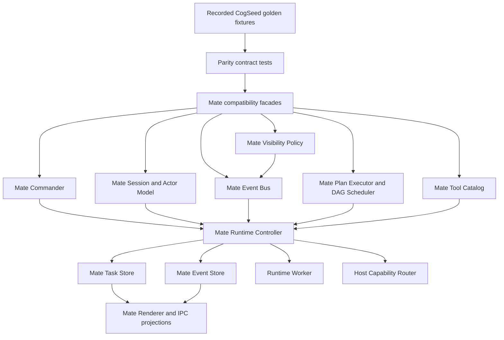
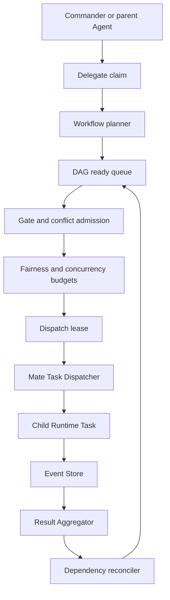

# Mate Agent CogSeed Parity and Surpass Design

## 1. Decision

Mate Agent will reach full capability parity with the CogSeed collaboration and agent surfaces while remaining a CogSeed-owned backend. The implementation will use a strangler/compatibility architecture, with recorded golden-fixture comparison on critical paths.

This means:

- Mate owns its runtime, tasks, sessions, events, storage, visibility, scheduler, tools, and renderer projections.
- CogSeed behavior is treated as a reference contract, not as a runtime business dependency.
- Mate may reuse generic infrastructure and pure semantics where permitted, but must not directly import CogSeed Group Chat/Core Agent business layers or read CogSeed data files as live state.
- A feature is not considered complete merely because its normal path works; parity requires state, event, visibility, cancellation, recovery, and migration coverage.
- After parity, Mate adds measurable improvements in recovery, scheduling, isolation, observability, and conflict handling.

## 2. Goals

### 2.1 Capability goals

Mate will provide CogSeed-native equivalents for:

- CogSeed Group Chat Commander behavior.
- `gconv` / `gmember`-style commander and member session semantics.
- Visibility slices and event delivery rules.
- Group Chat bus scheduling behavior.
- The complete approved Core Agent tool catalog through Mate adapters.
- Connector, KB, Office, and Browser business capabilities with CogSeed-owned stores and lifecycle control.
- Explicit historical CogSeed/Mate session migration with preview, journal, resume, and rollback.
- Renderer and IPC parity for collaboration, task, approval, artifact, browser, and migration surfaces.
- CogSeed plan-executor semantics represented by the common collaboration control plane and CogSeed-specific scheduler/dispatcher adapters.

### 2.2 Surpass goals

After parity, Mate will exceed the reference behavior with:

- Durable DAG ready queues and fair scheduling.
- Per-role and per-user concurrency budgets.
- Idempotent dispatch claims and leases.
- No-resend recovery for completed steps.
- Parent/child cancellation cascade with orphan detection.
- Event replay and deterministic snapshot reconstruction.
- Stronger visibility and host-tool scope binding.
- Isolated Browser, Office, Connector, and Runtime lifecycles.
- Conflict evidence, resolution history, and replayable decisions.
- Operational timelines and recovery journals.

### 2.3 Non-goals

- Directly coupling Mate runtime code to `features/group_chat`, `model/core-agent`, Renderer implementation modules, or CogSeed data paths.
- Adding an HTTP server or a second application communication channel.
- Allowing Runtime Worker code to create Electron objects or arbitrary child processes.
- Replacing the existing approved child-process choke points.
- Adding total wall-clock timeouts where existing idle/watchdog/cancellation semantics apply.
- Implicit startup migration of historical sessions.

## 3. Current baseline

The current Mate branch already contains a native Runtime Worker, Runtime JSONL protocol, Main-side host capability routing, Office and Browser adapters, a bounded Coordinator, a reusable collaboration control engine, domain-aware P3394 Wake routing, Mate admission, and recovery wiring.

The current Coordinator is intentionally bounded:

- maximum direct children: 4;
- maximum delegation depth: 1;
- parent-driven `cogseed_delegate` dispatch;
- `cogseed_tasks` status reads;
- `cogseed_cancel` cancellation;
- workflow-level retry, skip, resume, and inspection controls.

The parity program extends this baseline; it does not discard the already-verified runtime isolation or host capability boundaries. This baseline currently exists as pre-specification working-tree changes, so Phase 0 is not accepted until those changes are reviewed, committed as dedicated baseline commit(s), and the worktree used for parity implementation is clean except for approved parity documents and fixtures.

## 4. Architecture



### 4.1 Canonical Mate model

The canonical model is CogSeed-owned and versioned independently from CogSeed:

- `CogSeedCommanderSession`
- `CogSeedActorRole`
- `CogSeedActor`
- `CogSeedMemberSession`
- `CogSeedConversation`
- `CogSeedTask`
- `CogSeedWorkflow`
- `CogSeedWorkflowStep`
- `CogSeedVisibilitySlice`
- `CogSeedEvent`
- `CogSeedToolCall`
- `CogSeedMigrationJournal`

`CogSeedActorRole` is the canonical role enum and includes `commander`, `member`, `child`, and `reviewer`. Reviewer is a scoped `CogSeedActor` role, not a separate execution or storage path.

CogSeed fields are mapped into this model by explicit adapters. The mapping must preserve user scope, actor identity, causal lineage, and terminal status without reusing CogSeed identifiers as Mate storage keys.

### 4.2 Capability parity matrix

Create:

```text
docs/superpowers/parity/cogseed-cogseed-capability-matrix.md
```

The canonical matrix is a Phase 0 deliverable, is capped at 300 non-empty lines, and must keep one auditable row per capability. Supporting fixture inventories may live in linked files when more detail is required; they do not replace the canonical row. Phase 0 ends with an explicit human review checkpoint, and Phase 1 must not begin until the matrix is approved.

Every row records:

- capability;
- reference CogSeed entry points and behavior fixtures;
- Mate canonical model and adapter;
- current implementation status;
- known differences;
- contract/state/event/visibility/recovery tests;
- surpass metric;
- owner and phase.

Allowed statuses:

```text
not_started
contract_only
adapter_ready
behavior_parity
surpasses
```

A row can become `behavior_parity` only when normal, failure, cancellation, recovery, visibility, event-order, and cross-layer contract tests pass. A row can become `surpasses` only when the additional Mate metric is covered by a regression test.

## 5. Commander and session model

### 5.1 Mate Commander

Mate Commander owns:

- the user-facing parent task;
- actor roster and role resolution;
- workflow creation and lifecycle;
- task dispatch admission;
- visibility projection;
- child result aggregation;
- retry/skip/resume/abort control;
- event publication and renderer projection.

It does not directly execute model calls. Model execution remains behind the Mate Runtime Controller and Runtime Worker.

### 5.2 Session compatibility

Map the reference session concepts as follows:

```text
CogSeed gconv       -> Mate commander session
CogSeed gmember     -> Mate member session / actor task
CogSeed child task  -> Mate task + runtime session
CogSeed plan state  -> Mate workflow run + workflow events
```

The compatibility facade preserves public semantic fields where required, but storage paths, ids, locks, and event journals remain CogSeed-owned.

Session lifecycle must cover:

- create;
- resume;
- abort;
- terminal cleanup;
- member join/leave/rename;
- task-to-session association;
- crash recovery;
- migration journal association.

## 6. Visibility and event bus

### 6.1 Visibility policy

Every read or event projection must be evaluated against a `CogSeedVisibilityPolicy`. A visibility slice contains only the actor's permitted:

- messages;
- workflow steps;
- child summaries;
- artifacts;
- collaboration events;
- gate and conflict records.

Default policies:

| Actor | Visibility |
|---|---|
| Commander | Full conversation, workflow, actor roster, and child summaries |
| Member Agent | Assigned task, explicitly shared context, permitted related events |
| Child Agent | Parent summary, explicit context, own task and tool events |
| Reviewer | Gate, proposal, conflict, and evidence required for review |
| User | Renderer-safe projection of all user-authorized state |

The full conversation JSONL must never be passed to a child as a shortcut around policy.

### 6.2 Event bus

Mate Event Bus is append-first and projection-second:

```text
validate scope
  -> append event under store lock
  -> update durable projection
  -> publish filtered event
  -> update renderer snapshot
```

Event families:

- task lifecycle;
- workflow lifecycle;
- collaboration/gate/conflict;
- tool invocation/result;
- migration;
- recovery;
- renderer projection.

The bus must support subscriptions by:

- user;
- commander session;
- actor;
- workflow;
- task;
- visibility slice.

Duplicate scheduling paths are forbidden. All task dispatch goes through the Mate Scheduler/Dispatcher, and all events go through the Mate Event Bus.

## 7. Multi-Agent Scheduler

### 7.1 Dispatch model

The parent Agent may still call `cogseed_delegate`, but delegation becomes a scheduler request rather than an immediate untracked spawn.



### 7.2 Durable scheduler state

Split scheduler state by durability and machine ownership. Syncable workflow truth lives in cloud:

```text
<uid>/cloud/cogseed/coordinations/<coordinationId>/
├── run.json
├── context.json
├── events.jsonl
└── projections.json
```

Machine-local scheduling state lives in local and is never marked dirty for cloud sync:

```text
<uid>/local/cogseed/coordinations/<coordinationId>/
├── queue.json
└── leases.json
```

`queue.json` contains ready, blocked, and deferred step ids for this machine. `leases.json` contains idempotent dispatch claims with owner, generation, last-progress time, expiry, and lease state. A different machine reconstructs its local queue from cloud run/context/events rather than receiving another machine's queue or leases. Completed steps retain their execution reference and are never resent during recovery.

### 7.3 Scheduling rules

- Dependencies must be terminal-success or explicitly skipped before a step becomes ready.
- Gates and conflicts can block a ready step.
- A step requires a valid dispatch claim before execution.
- Claims are idempotent by `(scope, stepId, generation)`.
- Per-user, per-commander, per-role, and global concurrency budgets are enforced before dispatch.
- Fairness prevents one role or parent from monopolizing the queue.
- Retry is task/network-specific and does not use a total wall-clock timeout.
- Parent abort prevents new dispatches and cancels running children.
- Orphaned leases are reconciled from task status during recovery.
- Running claims use an inactivity lease TTL renewed only by accepted task/process progress events; expiry is an idle/liveness signal, not a total task wall-clock timeout.
- Lease expiry marks an execution suspect rather than immediately retryable. Reconciliation must query dispatcher/task status first; a still-running but inactive execution is resolved through the existing scoped idle-watchdog/cancellation path, and a new generation may dispatch only after the prior execution is terminal or confirmed missing.
- Reconciliation runs on relevant task/process events and through a bounded periodic sweep registered by the boot initialization mechanism; raw startup timers and async IIFEs are forbidden.
- Result aggregation is explicit and records source task ids and summaries.

### 7.4 Current-to-target migration

The current bounded Coordinator remains as the compatibility facade. It will call the durable scheduler for new work while preserving `cogseed_delegate`, `cogseed_tasks`, and `cogseed_cancel` tool names.

The target scheduler adds:

- multiple ready steps;
- explicit join/barrier steps;
- fair queue selection;
- retry policy records;
- automatic dependency wake-up;
- recovery reconciliation;
- aggregate result projection.

## 8. Tool and host capability parity

### 8.1 Tool catalog

Mate will expose the complete approved tool surface through one catalog and runner wiring. Tools are categorized as:

- file;
- shell;
- skill;
- connector meta-tools;
- KB;
- host capabilities;
- collaboration control.

Every tool must enforce:

- schema validation;
- user/session scope;
- path sandbox where applicable;
- permission policy;
- cancellation;
- bounded result output;
- event audit;
- recovery behavior.

### 8.2 Host capabilities

Office and Browser remain Main-side adapters behind the Worker reverse host-tool JSONL protocol. The Worker never receives Electron objects, raw cookies, localStorage, arbitrary Node modules, or unapproved process handles.

Connector and KB adapters use CogSeed-owned storage and account/secret facades. Shared utilities may be reused only when they do not import CogSeed business features or read business data outside the approved path choke points.

## 9. Historical migration

Migration is explicit and journaled:

```text
preview -> validate -> transform -> write -> verify -> finalize
```

A migration journal records:

- source id;
- target id;
- source schema version;
- target schema version;
- converted/skipped event counts;
- tool-call decisions;
- warnings;
- rollback metadata;
- last completed phase.

Migration must be resumable and idempotent. It must never execute a historical tool call merely because it was present in the source transcript. `finalize` marks the target authoritative, redirects future opens to the Mate target, freezes the source as read-only, and records rollback metadata. It does not delete the source in the same release; later deletion requires an explicit retention policy or user-authorized cleanup.

## 10. Renderer and IPC

Renderer surfaces consume Mate projections through the existing `window.cogseed` allow-list IPC. New APIs require matching Main handlers and renderer shims. No HTTP endpoint is introduced.

Required projection surfaces:

- commander/session overview;
- actor roster;
- workflow DAG and step status;
- child task tree;
- visibility/debug-safe summary;
- gate/conflict review;
- retry/skip/resume/abort controls;
- Office artifacts;
- Browser session/artifacts;
- migration preview and report;
- recovery and event timeline.

Renderer strings use existing locale rules, and classic scripts remain the only renderer script format.

## 11. Error handling, cancellation, and recovery

### 11.1 Error classes

Errors are classified as:

- validation/scope;
- permission/admission;
- transient network/provider;
- task execution;
- dependency/gate/conflict;
- worker/protocol;
- migration;
- invariant/corruption.

Only network/provider-specific failures may use network retry semantics. User abort is terminal and never becomes a transient retry.

### 11.2 Recovery

On startup, explicit recovery, relevant task/process events, or a bounded periodic liveness sweep:

1. load run/context/events;
2. replay durable events;
3. inspect scheduler queue and leases;
4. query dispatcher execution status;
5. mark completed executions complete;
6. mark missing executions recoverable or failed according to policy;
7. expire or release claims whose inactivity TTL elapsed without accepted progress;
8. enqueue only eligible, not-completed steps;
9. publish a recovery event and renderer projection.

## 12. Testing and parity verification

### 12.1 Test layers

Each capability requires:

- contract tests;
- lifecycle/state transition tests;
- event order tests;
- visibility tests;
- cancellation tests;
- recovery tests;
- migration tests;
- IPC/renderer schema tests;
- boundary tests;
- macOS and Windows-specific tests where behavior differs.

### 12.2 Recorded golden-fixture comparison

Critical CogSeed flows are captured during Phase 0 from existing public CogSeed entry points using synthetic, non-secret inputs, reviewed, and committed as immutable deterministic golden fixtures with source revision and capture-command metadata. The ordinary parity harness reads those fixtures and runs only the Mate implementation; it does not live-import CogSeed Group Chat/Core Agent business modules or read CogSeed data files. A canonicalizer removes non-semantic ids/timestamps and compares:

- returned result;
- terminal state;
- event sequence;
- visibility projection;
- retry/abort behavior;
- recovery result;
- renderer snapshot.

### 12.3 Completion states

```text
not_started
contract_only
adapter_ready
behavior_parity
surpasses
```

No phase is complete until its matrix rows and verification commands pass.

### 12.4 Surpass metrics

A `surpasses` claim requires a named, reproducible acceptance metric rather than a qualitative label:

- **fairness:** under a deterministic equal-weight load, no eligible parent or role starves across 1,000 dispatch admissions, and normalized service-share deviation is at most 10% after warm-up;
- **recovery:** fault injection at each documented dispatch boundary produces no duplicate completed-step execution and converges to the canonical projection within one startup reconciliation or one lease TTL plus one sweep;
- **isolation:** failure or cancellation in one user/coordination/host-capability scope produces zero state, event, secret, or artifact leakage into another scope;
- **visibility:** the negative fixture set exposes zero unauthorized messages, tool data, artifacts, gates, or conflict evidence for every actor role;
- **observability:** every task can be reconstructed into one ordered timeline from durable events with task, workflow, actor, execution, and recovery correlation;
- **conflict handling:** replaying the same proposal/conflict event history yields the same resolution snapshot and preserves the complete decision history.

The Phase 0 matrix assigns applicable metrics and exact fixture/benchmark commands to each candidate `surpasses` row. Phase 9 may refine thresholds only through a reviewed specification amendment; it is not an open-ended scope expansion phase.

## 13. Phases

### Phase 0: Baseline and parity matrix

- review and commit the current pre-specification Mate baseline as dedicated commit(s);
- require a clean parity worktree before fixture capture;
- inventory CogSeed capability surfaces;
- capture immutable golden fixtures through existing public CogSeed entry points and record source revision/capture commands;
- create the canonicalizer and the capped canonical parity matrix;
- record current Mate gaps and proposed surpass metrics;
- freeze current behavior with tests;
- stop at an explicit matrix/fixture approval checkpoint before Phase 1.

### Phase 1: Commander and sessions

- implement Mate Commander;
- implement actor/member/session model;
- add gconv/gmember compatibility facade;
- add session lifecycle and recovery tests.

### Phase 2: Visibility and event bus

- implement visibility policy;
- implement append-first Mate Event Bus;
- add subscriptions and projections;
- route task/workflow/tool events through the bus.

### Phase 3: Durable multi-agent scheduler

- add ready queue, leases, fairness, concurrency budgets;
- add join/barrier and aggregate result projection;
- preserve existing control tool names;
- add crash/recovery and no-resend tests.

### Phase 4: Tool catalog parity

- inventory all approved CogSeed Core Agent tools;
- implement Mate schemas and adapters;
- preserve connector umbrella exposure;
- add tool contract and scope tests.

### Phase 5: Business capability parity

- Connector;
- KB;
- Office;
- Browser;
- artifacts and lifecycle cleanup.

### Phase 6: Plan executor parity and compatibility window

- map plan state transitions;
- move remaining Group Chat-specific logic behind adapters;
- verify retry/skip/resume/abort and event parity;
- route new sessions through the Mate implementation after parity passes;
- retain the legacy compatibility path for every unmigrated historical session;
- do not remove duplicated legacy state machines in this phase.

### Phase 7: Historical migration and legacy finalization

- preview/validate/transform/write/verify/finalize pipeline;
- idempotent migration journal;
- rollback and resume;
- historical tool-call safety rules;
- keep unmigrated sessions on the Phase 6 compatibility path;
- remove duplicated legacy state machines only after all supported sessions are migrated or explicitly retained as read-only/non-executable, the rollback window is closed, and migration parity tests pass.

### Phase 8: Renderer and IPC parity

- add projections and controls;
- keep IPC allow-list;
- preserve renderer schema compatibility;
- add UI and localization tests.

### Phase 9: Surpass audit

- fairness and concurrency benchmarks;
- recovery fault injection;
- visibility/security boundary tests;
- cross-platform Office/Browser verification;
- event replay determinism;
- final parity matrix review.

## 14. Risks and mitigations

| Risk | Mitigation |
|---|---|
| CogSeed behavior is implicit in implementation details | Reviewed immutable golden fixtures and canonical comparison |
| Two state machines diverge | One Mate control engine plus adapters |
| Session migration duplicates work | Migration journal and tool-call decision records |
| Visibility leaks data | Main-side policy and negative tests |
| Scheduler duplicates child tasks | Idempotent claims and leases |
| Renderer coupling returns | Projection-only IPC boundary |
| Cross-platform Office/Browser drift | Platform-specific verification matrix |
| Scope becomes unbounded | Phase gates and matrix status requirements |

## 15. Definition of done

The parity program is complete only when:

- every matrix row is `behavior_parity` or `surpasses`;
- critical flows pass recorded CogSeed golden-fixture/Mate comparison;
- historical migration passes preview, resume, rollback, and no-duplicate execution tests;
- all Mate tasks route through the Mate Scheduler/Dispatcher;
- all Mate events route through the Mate Event Bus;
- no Mate production source or ordinary parity-harness code directly imports forbidden CogSeed Group Chat/Core Agent business layers; Phase 0 fixture capture uses existing public entry points only;
- `git diff --check`, typecheck, focused tests, smokes, full JS tests, and resource tests pass;
- surpass metrics are recorded with reproducible benchmarks or fault-injection tests.
