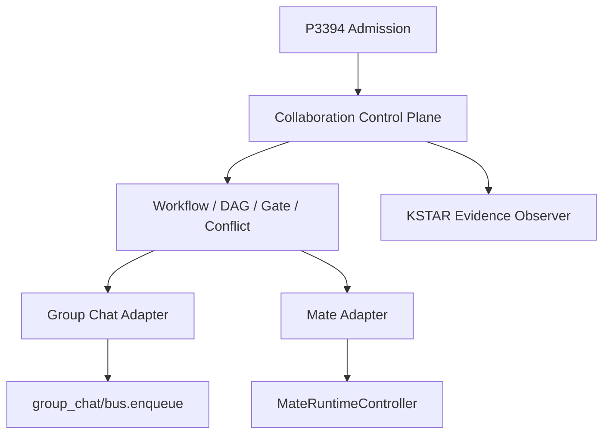

# Collaboration Control Plane 抽取设计

## 1. 目标

将当前绑定在 `features/group_chat/collaboration.ts`、P3394 wake/controller 和 Group Chat bus 中的协作控制语义抽成通用 `features/collaboration_control/`，同时保留现有 Orkas Group Chat 行为，并让 Mate Agent 通过独立 adapter 使用相同的 Workflow、DAG、Gate、Conflict、Retry/Skip/Resume/Abort、event replay 和 recovery 语义。

迁移采用 strangler pattern：先抽内核和 ports，再让 Group Chat 走兼容 adapter，最后接入 Mate；在双 adapter 验证完成前不删除 Group Chat。

## 2. 非目标

- 不一次性删除 `features/group_chat/`。
- 不让 Mate 读写 Group Chat conversation/collaboration 目录。
- 不让通用控制面 import Group Chat、Mate Backend、renderer 或 IPC。
- 不恢复已删除的旧 `plan_executor.ts` bus-driven 静态 DAG runtime。
- 不把 P3394 admission、KSTAR evidence 和 Workflow 状态机重新合并成一个巨型模块。
- 不在迁移中改变现有 renderer collaboration snapshot schema。

## 3. 目标架构



### 3.1 通用内核

新目录：

```text
src/main/features/collaboration_control/
├── types.ts
├── lifecycle.ts
├── dependency-reconciler.ts
├── ports.ts
├── engine.ts
├── event-replay.ts
└── index.ts
```

内核拥有：

- `WorkflowRun` / `WorkflowStep`
- `SharedTaskContext`
- `GateResult`
- `ContextProposal` / `ContextConflict`
- 合法状态转换
- dependency ready/blocked reconciliation
- Gate/Conflict blocker reconciliation
- Retry/Skip/Resume/Abort
- event replay reducer
- children/depth/concurrency budget 判断

内核不拥有路径、文件 IO、actor message 或 renderer snapshot。

### 3.2 Ports

```ts
interface CollaborationStore {
  readRun(scope, runId): Promise<WorkflowRun | null>;
  writeRun(scope, run): Promise<void>;
  readContext(scope, contextId): Promise<SharedTaskContext | null>;
  writeContext(scope, context): Promise<void>;
  appendEvent(scope, event): Promise<void>;
  readEvents(scope, afterSequence?, limit?): Promise<CollaborationEvent[]>;
  withLock<T>(scope, fn): Promise<T>;
}

interface CollaborationDispatcher {
  dispatchStep(input): Promise<DispatchReceipt>;
  cancelExecution(executionId): Promise<void>;
  readExecution(executionId): Promise<ExecutionSnapshot>;
}

interface CollaborationApprovalPort {
  requestApproval(input): Promise<ApprovalReceipt>;
  readApproval(id): Promise<ApprovalSnapshot | null>;
}
```

所有 port 的 scope 使用 opaque domain id；通用层不解析 `cid`、task id 或 uid。

## 4. Group Chat Adapter

保留 Group Chat 专属内容：

- `conversationLayout`
- `cid`
- `COMMANDER_ID` / `USER_ID`
- `bus.enqueue`
- visibility slice
- handback/process bubble
- renderer snapshot projection

目标文件：

```text
src/main/features/group_chat/collaboration-store-adapter.ts
src/main/features/group_chat/collaboration-dispatcher.ts
src/main/features/group_chat/collaboration.ts
```

迁移期间 `group_chat/collaboration.ts` 保持原 export 形状，内部调用通用 engine；现有 bus/index/IPC 无需同时重写。

## 5. Mate Adapter

Mate 使用自己的路径：

```text
<uid>/cloud/mate_agent/coordinations/<coordinationId>/
├── run.json
├── context.json
└── events.jsonl
```

Adapter：

```text
src/main/features/mate_agent_backend/collaboration-store-adapter.ts
src/main/features/mate_agent_backend/collaboration-dispatcher.ts
```

Dispatcher 映射：

```text
dispatchStep → mateRuntimeController.startMateTask
cancelExecution → mateRuntimeController.cancelMateTask
readExecution → readMateTask + Mate Event Store
```

现有 `mate_delegate`、`mate_tasks`、`mate_cancel` 保持模型工具兼容，内部逐步切换到通用 engine。

## 6. P3394

### Admission

`P3394Controller` 保留依赖注入形态。分别实例化：

- Group Chat：现有 session source、epoch store、collaboration snapshot。
- Mate：Mate session source、Mate epoch store、Mate collaboration context。

### Wake

把 `p3394/wake-controller.ts` 分成：

- 通用 wake decision/service：审批、过期、幂等、状态。
- Group Chat wake dispatcher：`bus.enqueue` + orchestration ledger。
- Mate wake dispatcher：恢复 blocked workflow run，dispatch 下一 ready step。

现有 IPC `p3394.decideWakeRequest` 根据 request domain 路由 adapter，保持 renderer contract。

### KSTAR

KSTAR 变成 Collaboration event observer，不进入 workflow 状态转换内核。

## 7. 兼容性与迁移

1. 先用 characterization tests 冻结现有行为。
2. 第一阶段只抽类型、纯 reducer/reconciler，不改数据路径。
3. 第二阶段 Group Chat Store adapter 接管 IO，旧 exports 仍然存在。
4. 第三阶段 Mate adapter 使用独立路径，不读 Group Chat 文件。
5. 第四阶段 wake/admission 双域接入。
6. 所有调用切换并完成旧数据读取验证后，才删除 `collaboration.ts` 中重复实现和 `plan_executor.ts` inert exports。

旧 Group Chat workflow 文件不迁移到 Mate；Group Chat adapter 继续原地读取。

## 8. 状态机规则

- Terminal run：`completed | failed | cancelled`，不可恢复为 running；显式 retry 创建新 attempt 或将允许的 failed step 转为 ready。
- Step dependency：只有全部 dependency 为 `completed | skipped` 才 ready；failed/cancelled dependency 阻塞。
- Gate：blocking gate 为 `needs_review | failed` 时阻塞关联 step；批准后重新 reconcile。
- Conflict：active conflict 阻塞 `affected_step_ids`；resolved/dismissed 后解除。
- Skip：只允许非 terminal run 中的 ready/blocked/failed step；保留审计事件。
- Resume：只恢复 paused/gate-blocked/recoverable run，不重复 completed step。
- Abort：单向终态，同时调用 dispatcher cancel active executions。
- User abort 绝不自动 retry。

## 9. 验收标准

- 通用目录没有 Group Chat/Mate/renderer/IPC import。
- 原 Group Chat collaboration tests 行为不变。
- Mate 与 Group Chat 使用相同 lifecycle/reconciler contract tests。
- Mate 数据仅进入 Mate cloud/local 域。
- P3394 wake approval 可恢复 Group Chat 或 Mate domain。
- Retry/skip/resume 有真实生产调用者，不再只是孤立 export。
- 完整 `npm test`、typecheck、Mate smokes 通过。

## 10. 自审

- 明确区分 P3394 admission、wake、KSTAR 与 Collaboration workflow engine。
- 避免先删除 Group Chat造成大爆炸迁移。
- 保留现有 IPC/renderer schema，控制面通过 adapter 渐进替换。
- Mate 不共享 Group Chat 路径和 session id，符合独立后端边界。
