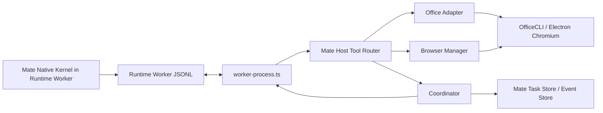

# Mate Agent Host Capabilities：Office、Browser 与 Multi-Agent 设计

## 1. 目标与已确认范围

本阶段把已完成的 Mate Agent Native Runtime 扩展为三个仍缺失的 Mate-owned 能力：

1. **Office**：由 Mate Runtime 使用受控的 OfficeCLI adapter 读取、创建、编辑和渲染 `.docx`、`.xlsx`、`.pptx`；PDF 仍通过既有 `stat_file`/`read_file` 路径，不伪装成 OfficeCLI 格式。
2. **Browser**：由 Main 进程维护无 Node 权限的、按 Runtime session 隔离的 Electron `BrowserWindow`，提供导航、页面摘要、引用元素点击、文本输入和截图。
3. **Multi-Agent Coordinator**：由 Mate 自己持有 coordinator record、子任务关系、并发/深度预算和聚合事件；子任务仍走 Mate Task Store 与 Native Runtime，不进入 Orkas Group Chat。

原会话已经确认实现顺序为 Office → Browser → Multi-Agent，并批准“通过 Mate 自己的受控 adapter/protocol 接入 host capability，而不是在 Worker 中任意 spawn”。本规格把该批准具体化为可测试的契约。

## 2. 非目标

- 不导入 `src/main/model/core-agent/office-tools.ts`、`local-tools.ts`、`features/group_chat/*` 或 Core tool catalog。
- 不把 OfficeCLI、浏览器或子 Agent 的调用暴露成新的 HTTP 服务。
- 不让 Runtime Worker 直接创建 BrowserWindow、直接 spawn OfficeCLI，或直接启动第二类 child process。
- 不引入 Playwright/Puppeteer npm 依赖；浏览器使用 Electron 已有 Chromium。
- 不迁移现有 Orkas Group Chat 的 Commander、visibility、plan executor、retry/abort 语义。
- 不允许浏览器输出原始 cookies、localStorage、完整 HTML 或页面脚本。
- 不为 Multi-Agent 增加总墙钟超时；每个子任务继续使用既有 idle/watchdog/cancel 语义。

## 3. 方案选择

### 方案 A：Worker 直接调用能力模块

优点是改动少；缺点是 Worker 可以越过主进程边界访问 Electron、spawn OfficeCLI，并且难以统一取消、路径校验和 session 清理。违反本项目对 Mate Runtime Worker 的隔离约束，放弃。

### 方案 B：Worker ↔ Main 反向 host-tool JSONL（推荐）

Worker 只发出结构化 `host_tool_call`，Main 的 `worker-process.ts` 校验并路由到 Mate-owned adapters，结果再以 `host_tool_result` 返回。Office、Browser、Coordinator 均是 Main-side capability；Worker 仍只有 Native kernel 与既有 shell/skill choke points。该方案满足进程边界、复用现有 Runtime worker、支持取消和事件审计，推荐采用。

### 方案 C：每一种能力独立 child process

隔离更强，但会引入新的 spawn choke points、进程恢复协议和打包复杂度；Browser 仍必须回到 Electron Main，且 OfficeCLI 已有唯一 engine wrapper。当前阶段没有必要，放弃。

## 4. 总体架构



新增的反向消息只允许两类：

```ts
interface RuntimeHostToolCall {
  type: 'host_tool_call';
  request_id: string;
  runtime_session_id: string;
  call_id: string;
  name: 'office_read' | 'office_create' | 'office_edit' | 'office_render'
      | 'browser_open' | 'browser_snapshot' | 'browser_click' | 'browser_type' | 'browser_screenshot'
      | 'mate_delegate' | 'mate_tasks' | 'mate_cancel';
  input: Record<string, unknown>;
}

interface RuntimeHostToolResult {
  type: 'host_tool_result';
  request_id: string;
  runtime_session_id: string;
  call_id: string;
  content: string;
  is_error?: boolean;
}
```

`worker-process.ts` 保存每个运行请求的原始、已规范化 `RuntimeRunRequest`，将 `user_id`、`read_only_roots`、`working_dir` 和取消 signal 传给 host router。Worker 的 host client 只写 JSONL，不获得 Node/Electron 对象。host call 完成后，Runtime kernel 正常产生 `tool_call`/`tool_result` 事件，Main 仍以现有 `MateTaskEvent` 投影。

## 5. Office Adapter

### 5.1 工具契约

Mate catalog 新增四个 `kind: 'host'` 工具：

- `office_read({path})`：读取 `.docx/.xlsx/.pptx` 的结构化文本/元素路径；不得接受输出路径。
- `office_create({path, operations, preview?})`：只在允许的 writable root 下创建 `.docx/.xlsx/.pptx`，先 `create --force`，再将受限 batch operations 写入，默认返回第一页预览路径。
- `office_edit({path, operations, preview?})`：只对已有文件执行 `set/add/remove` batch operation；操作列表非空，失败时 stop-on-error。
- `office_render({path, page?})`：将指定页/幻灯片渲染到 Runtime 临时目录，返回受限的图片引用和页号。

`operations` 不接受任意 argv；adapter 将每个操作规范化为 `{command, path, parent, type, props}`，拒绝未知字段、以 `-` 开头的目标/页号、过长字符串和非对象 props。OfficeCLI 总是通过 `features/office/office_engine.ts` 的 argv-array API 调用，并在 `finally` 执行 `closeOfficeFile`。

### 5.2 路径与输出

- 入口先调用 `isPathAllowed`；输入文件必须在 `read_only_roots` 或 `working_dir` 下。
- create/edit 输出只能在 `working_dir`（由主进程预先校验并加入 writable scope）下。
- 允许的扩展名只有 `.docx`、`.xlsx`、`.pptx`；PDF 不走该 adapter。
- 返回值只包含 bounded text、relative output reference、byte/character counts；不返回 secrets 或无限 stdout。

## 6. Browser Adapter

### 6.1 Session 与生命周期

Main 侧 `MateBrowserManager` 以 `(userId, runtimeSessionId)` 为 key，使用 Electron `BrowserWindow`：`nodeIntegration: false`、`contextIsolation: true`、`sandbox: true`、独立临时 partition、`show: false`。Runtime request 完成、取消、失败或 runtime shutdown 时销毁对应窗口并清理引用。所有默认调用使用注入的 BrowserWindow factory，便于纯 Node 测试。

### 6.2 工具契约

- `browser_open({url})`：仅接受 `http`/`https` URL；拒绝 `file:`, `data:`, `javascript:`、URL credentials 和明显的 loopback/private address。导航完成后返回 URL/title。
- `browser_snapshot({maxChars?})`：在当前页面提取 title、URL、可见文本（有上限）和带数字 ref 的可交互元素 `{ref, tag, role, label, value}`；不返回 HTML/script/cookie。
- `browser_click({ref})`：只允许最近 snapshot 返回的数字 ref；点击后返回新的 URL/title。
- `browser_type({ref,text,submit?})`：只允许最近 snapshot 的 input/textarea/contenteditable ref；文本有长度上限，使用 DOM value/input/change 事件，不接受 selector 或 JS。
- `browser_screenshot({path?})`：`capturePage` 后只能写入已校验的 writable root；未指定 path 时返回 bounded temporary reference。

每个 session 只保留一个当前页面和 refs；导航后 refs 立即失效。检测到已有 anti-bot/WAF challenge 时返回稳定 `E_BROWSER_WAF_USER_ACTION_REQUIRED`，同一 URL 不自动重试，不安装浏览器 runtime。

## 7. Multi-Agent Coordinator

### 7.1 数据模型

新增 cloud 数据域 `<uid>/cloud/mate_agent/coordinations/`，每个 coordinator 一个 JSON：

```ts
interface MateCoordinationRecord {
  schemaVersion: 1;
  coordinationId: string; // mate-coord-...
  ownerId: string;
  parentTaskId: string;
  parentRuntimeSessionId: string;
  status: 'running' | 'completed' | 'failed' | 'cancelled';
  childTaskIds: string[];
  maxChildren: number;
  maxDepth: number;
  createdAt: string;
  updatedAt: string;
}
```

子 Task record 增加可选 `coordinationId`、`parentTaskId`、`coordinationDepth`；没有这些字段的普通任务语义不变。

### 7.2 工具契约与预算

- `mate_delegate({task, role?, context?})`：创建一个独立 Mate task，传入显式 context，不传父 transcript；默认最多 4 个 child，深度最多 1（Coordinator 自己可以并行派发，child 不再派发）。立即返回 child task id、session id 和 `running` 状态。
- `mate_tasks({task_ids})`：返回指定 child 的 user-scoped status/output summary 和最新 event sequence，不返回其他用户或完整 transcript。
- `mate_cancel({task_id})`：只能取消当前 coordination 的 child；通过同一个 Mate runtime controller，绝不重新发送原始 prompt。

Coordinator 只做派发、读取、取消和 bounded aggregation；父 Agent 是否采纳结果由父模型决定。取消父任务时，host router 调用 coordinator cancellation，先取消仍运行的 child，再销毁 Browser session。child 完成/失败/取消只写 Mate Event Store 与 coordination record，不进入 Orkas bus。

## 8. 安全、错误与兼容性

- Host tool 名称必须在静态 allowlist；未知名称返回 `E_RUNTIME_HOST_TOOL_UNKNOWN`。
- 每个 adapter 入口都验证 user/session/request scope；跨 user、跨 session、跨 coordination 的 id 返回稳定错误。
- Host result 经过 `tool-result-cap`，协议只传 bounded content。
- Office unavailable 返回 `E_OFFICE_ENGINE_MISSING`；Browser 未在 Electron Main 可用返回 `E_BROWSER_UNAVAILABLE`；Coordinator 超预算返回 `E_MATE_COORDINATION_BUDGET`。
- Host call 的取消由 Runtime abort signal 贯穿 OfficeCLI、Browser navigation/capture 和 Coordinator child cancellation；不新增总墙钟 timeout。
- 升级 Runtime protocol 到 version 2；hello capabilities 明确 `mate-host-tools-v1`。旧 worker 与新 Main 不互相静默降级。
- 不修改既有 Orkas tool catalog、Group Chat bus、Orkas Connector/KB business layer。

## 9. 验收与测试

### Office

1. catalog 暴露四个 host tool，不暴露 `src/main/model/core-agent/*` 业务工具。
2. 输入/输出路径 sandbox、扩展名、batch 操作和 resident close 均有失败测试。
3. fake OfficeCLI 验证 create/edit/render 的 argv、stdin、finally close 和 abort。

### Browser

1. fake BrowserWindow 验证安全 webPreferences、URL 拒绝、snapshot refs、click/type、navigation 后 refs 失效、screenshot sandbox 和 dispose。
2. 不安装 Playwright/Puppeteer；WAF challenge 有稳定拒绝测试。

### Coordinator

1. store 验证 user scope、child link、预算、深度和幂等 request。
2. fake controller 验证 delegate/read/cancel，不调用 Group Chat。
3. 集成测试验证父 host call 可启动 child、child event 不污染父 transcript、父取消会取消 children。

### 完整验收

```bash
git diff --check
npm run typecheck
npm run test:js -- test/main/features/mate_agent_runtime test/main/features/mate_agent_backend test/main/ipc/mate-agent-backend.test.ts
npm test
node scripts/smoke-mate-agent-native.mjs
```

## 10. 规格自审

- 没有把 Orkas Office/Browser/Group Chat business layer 作为 Mate 依赖。
- 所有新增跨进程通信都有显式消息契约与取消路径。
- Office/Browser/Coordinator 各自可独立测试并按顺序落地。
- PDF、HTTP server、Playwright 安装和总墙钟 timeout 均明确排除，避免把当前阶段扩成不可验收的迁移。
