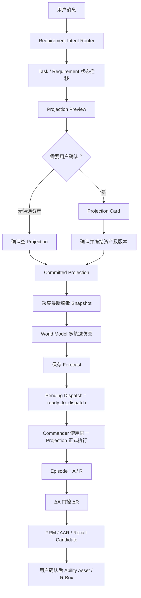

# KSTAR / Recall 世界模型闭环强化设计

日期：2026-08-13

状态：已获用户批准
目标分支：`dev/remove-p3394-kstar`

## 1. 目标

本设计将当前 KSTAR / Recall 链路从“Projection Preview 与 World Model 并列读取资产、Forecast 可缺失后继续执行”的第一版实现，强化为严格的执行前因果预测闭环：

```text
Intent Router
→ Task / Requirement 状态迁移
→ Projection Preview
→ 用户确认
→ Committed Projection
→ 采集最新脱敏 Snapshot
→ World Model 生成并冻结 Forecast (Â, R̂)
→ Commander 使用同一 Projection 正式执行
→ Episode 记录 A / R
→ ΔA 门控 ΔR
→ PRM / AAR
→ Recall Candidate
→ 用户确认后提升为 Ability Asset / R-Box Rule
```

必须满足以下不变量：

```text
K_forecast = K_execution
Forecast.createdAt < Execution.startedAt
没有有效 Forecast，不得恢复 Commander
没有有效执行证据，不得生成确定性学习信号
```

## 2. 范围与非目标

### 2.1 本次范围

1. 将 confirmed Projection 定义为 KSTAR 的 committed knowledge boundary。
2. World Model 和 Commander 只消费同一个 committed Projection。
3. Forecast 成功保存成为恢复原始用户消息派发的必要条件。
4. 扩充 World Model 的 K/S/T 输入，保存资产版本、规则引用、Snapshot 和验收标准。
5. World Model 显式生成多个候选干预—状态轨迹，并由本地确定性评分选择最终 `Â/R̂`。
6. 增强实际 `A/R` 记录和 `ΔA/ΔR` 对账。
7. 将可信偏差转换为带完整来源的 Recall Candidate；用户确认后才能提升为 Ability Asset / R-Box Rule。

### 2.2 非目标

1. 不训练独立神经世界模型。
2. 不保存或展示模型隐藏 Chain-of-Thought。
3. 不新增 HTTP 服务、后台云执行或并行 Group Chat 派发路径。
4. 不恢复旧 p3394 KSTAR 实现。
5. 不为 topic switch 新增独立弹卡产品功能。
6. 不自动提升 Recall Candidate；能力资产仍由用户治理。
7. 不把通用 LLM 预训练知识序列化进本地本体。

## 3. 术语

### 3.1 Projection Preview

系统根据资产状态、Workspace、Scope、Source Availability 和语义相关度生成的候选知识集合。Preview 尚未获得用户授权，不能作为 World Model 或 Commander 的最终 K。

### 3.2 Committed Projection

持久化状态仍使用已有 `status: 'confirmed'`，避免迁移历史数据；代码和文档语义上称为 committed Projection。

Committed Projection 冻结：

- `assetIds`
- `assetVersions`
- `confirmedAt`
- `workspaceId`
- `taskRunId`
- `purpose`
- 匹配与来源信息

确认后不得修改同一 Projection。若用户需要改变资产集合，必须创建或保留新的 Preview，再确认新的 Projection。

### 3.3 Forecast

执行前冻结的世界模型记录，包含：

- 输入 K/S/T
- 候选干预—状态轨迹
- 最终选择的 `Â/R̂`
- 使用的 Projection、资产版本、规则引用和 Snapshot
- 选择评分和可审计因果依据

### 3.4 Episode

正式执行后记录的实际世界箭头 `A → R`，包含实际 Actor、工具调用、参数摘要、状态、产生文件、验证证据和终态。

## 4. 总体架构



## 5. P0：统一预测和执行使用的 K

### 5.1 Projection 状态与数据契约

保留现有状态联合类型：

```ts
type ContextProjectionStatus =
  | 'preview'
  | 'confirmed'
  | 'deferred'
  | 'rejected'
  | 'expired'
  | 'revoked';
```

新增纯判断：

```ts
function isCommittedProjection(
  projection: ContextProjectionRecord,
): boolean {
  return projection.status === 'confirmed';
}
```

`confirmContextProjection` 必须：

1. 仅接受 `preview`。
2. 检查未过期。
3. 重新读取每个选中资产。
4. 校验资产仍为 `active`。
5. 校验资产仍满足 Workspace、Scope 和 Source Availability。
6. 校验当前资产版本等于 Preview 中的 `assetVersions`。
7. 原子写入 `status: 'confirmed'`、`confirmedAt`、`decidedAt`。
8. 返回被冻结的 `assetIds + assetVersions`。

历史 confirmed Projection 保持可读。缺少 `assetVersions` 的旧记录可用于展示，但不能用于新的强一致 Forecast；调用方必须报 `projection_versions_missing` 并要求重新确认。

### 5.2 Pending Dispatch 状态机

扩展 Group Chat 状态：

```ts
interface PendingProjectionDispatch {
  projectionId: string;
  requirementId: string;
  taskRunId: string;
  userMessageId: string;
  userMessageText: string;
  status:
    | 'waiting_confirmation'
    | 'forecasting'
    | 'world_model_failed'
    | 'ready_to_dispatch';
  forecastId?: string;
  errorCode?: string;
  errorMessage?: string;
  createdAt: string;
  updatedAt: string;
}
```

状态迁移：

```text
waiting_confirmation
→ forecasting
→ ready_to_dispatch
→ 清除 pending 并派发
```

失败：

```text
forecasting
→ world_model_failed
```

`world_model_failed` 不得自动恢复 Commander。用户修复模型配置后，可以针对同一 committed Projection 重试 Forecast。

### 5.3 执行前时序调整

当前 `previewTaskBoundary` 中立即运行 World Model 的行为移除。新 Requirement 只创建 Projection Preview并保存：

- `requirement.projectionId`
- `requirement.projectionIds[]`

用户确认 IPC 调整为编排服务：

```text
confirmContextProjection
→ forecastCommittedProjection
→ 保存 requirement.forecastId
→ pending = ready_to_dispatch
→ resumePendingProjectionDispatch
```

任何阶段失败：

- Projection 保持 confirmed（用户授权事实不能回滚）。
- Pending 保持 `world_model_failed`。
- Commander 不执行。
- IPC 返回结构化错误。

### 5.4 World Model 输入边界

`runWorldModelAtBoundary` 改为必须接收：

```ts
interface RunWorldModelAtBoundaryInput {
  taskRunId: string;
  requirementId: string;
  committedProjectionId: string;
  workspaceId?: string;
  taskText: string;
  constraints: string[];
  acceptanceCriteria: string[];
}
```

它不得调用 `listAbilityAssets()`。流程必须为：

```text
readContextProjection(committedProjectionId)
→ validate committed status
→ validate frozen asset versions
→ read exact projected assets
→ build K
→ collect latest S
→ simulate
→ persist Forecast
```

### 5.5 Commander Recall 注入

`buildRecallTurnPromptContext` 增加显式 committed Projection 输入：

```ts
interface RecallTurnPromptInput {
  cid: string;
  taskRunId: string;
  taskText: string;
  workspaceId?: string;
  committedProjectionId?: string;
}
```

KSTAR 恢复派发必须把 `projectionId` 和 `forecastId` 放入 QueueItem/Message provenance。存在 `committedProjectionId` 时：

1. 只加载该 Projection。
2. 不扫描历史会话卡片。
3. 不创建 Automatic Projection。
4. 校验资产版本与 Forecast 绑定版本一致。
5. Prompt citations 全部带同一 `projection_id`。

非 KSTAR 普通聊天、Skill Draft 等既有 Automatic Projection 场景保持不变。

## 6. P1：完整、受限、可复现的 K/S/T

### 6.1 K 数据结构

```ts
interface WorldModelAbilityAsset {
  id: string;
  version: string;
  title: string;
  type: AbilityAssetType;
  statement: string;
  scope: string;
  maturity: RecallAbilityAssetRecord['maturity'];
  learningSignal?: KstarLearningSignal;
  causalRule?: CausalRule;
  ontologyRefs: AbilityAssetOntologyRef[];
  evidenceRefs: CognitionSourceRef[];
}

interface WorldModelKnowledge {
  projectionId: string;
  projectionConfirmedAt: string;
  abilityAssetRefs: string[];
  abilityAssets: WorldModelAbilityAsset[];
  assetVersions: Record<string, string>;
  rules: WorldModelCausalRuleRef[];
}

interface WorldModelCausalRuleRef {
  id: string;
  assetId: string;
  assetVersion: string;
  rule: CausalRule;
}
```

边界限制：

- 最多 12 个资产。
- 单个 `statement` 最多 2,000 字符。
- 证据引用最多 20 条，只保存 taxonomy、kind、id、title 等引用字段。
- 不传真实 OS 路径、凭证、Token、原始附件全文或未授权资产。

### 6.2 S 数据结构

Snapshot 是 Forecast 的真实 A-Box 基线：

```ts
interface WorldModelSituation {
  snapshotId: string;
  workspaceId?: string;
  conversationSummary: string;
  environment: {
    workspaceAvailable: boolean;
    modelConfigured: boolean;
    fileSystemAvailable: boolean;
    shellAvailable: boolean;
  };
  execution: {
    groupChatStatus: 'idle' | 'running' | 'aborted';
    availableActors: string[];
    accessConstraints: string[];
    energyConstraints: string[];
  };
  lifecycle: {
    requirementStatus?: string;
    projectionStatus: 'confirmed';
  };
  recall: {
    selectedAssetCount: number;
    selectedRuleCount: number;
  };
}
```

Snapshot 在用户确认之后重新采集。真实 workspace 路径只用于主进程环境检查，不写入 LLM 输入和持久化 Forecast；持久化只记录可用性和 `workspaceId`。

### 6.3 T 数据结构

```ts
interface WorldModelTask {
  userGoal: string;
  constraints: string[];
  acceptanceCriteria: string[];
}
```

来源优先级：

1. 用户明确约束/验收条件。
2. Requirement `rHat.acceptanceSignals`。
3. Router 结构化输出。
4. 空数组。

用户目标文本不得自动充当已经满足的验收证据。

### 6.4 Forecast 来源绑定

```ts
interface WorldModelForecastRecord {
  projectionId: string;
  projectionConfirmedAt: string;
  assetVersions: Record<string, string>;
  ruleRefs: string[];
  snapshotId: string;
  input: WorldModelSimulationInput;
  forecast: WorldModelForecast;
  createdAt: string;
}
```

Requirement 保存：

```ts
projectionId
projectionIds[]
forecastId
```

Episode 保存：

```ts
projectionId
forecastId
k.abilityAssetRefs
```

从而可以证明 Forecast K 与 Execution K 相同。

## 7. P2：显式多候选干预—状态轨迹

### 7.1 输出结构

```ts
interface WorldModelCausalLink {
  interventionIndex: number;
  mechanism: string;
  ruleRefs: string[];
  assumptions: string[];
}

interface WorldModelCandidateForecast {
  id: string;
  aHat: {
    plan: string[];
    expectedTools: string[];
    expectedActors: string[];
  };
  rHat: {
    summary: string;
    acceptanceSignals: string[];
    predictedFiles: string[];
  };
  causalLinks: WorldModelCausalLink[];
  assumptions: string[];
  predictedRisks: PredictedRisk[];
  score: WorldModelCandidateScore;
}

interface WorldModelCandidateScore {
  goalFit: number;
  feasibility: number;
  observability: number;
  causalSupport: number;
  riskPenalty: number;
  total: number;
}

interface WorldModelForecast {
  candidates: WorldModelCandidateForecast[];
  selectedCandidateId: string;
  aHat: WorldModelCandidateForecast['aHat'];
  rHat: WorldModelCandidateForecast['rHat'];
  causalLinks: WorldModelCausalLink[];
  assumptions: string[];
  predictedRisks: PredictedRisk[];
}
```

### 7.2 模型职责

模型一次返回 2–4 条候选轨迹，每条必须同时包含：

- 干预 `Â`
- 对应未来状态 `R̂`
- 结构化因果依据
- 可审计假设
- 风险
- 0–1 范围内的维度自评

不允许返回 Markdown、自由文本前后缀或隐藏推理过程。

### 7.3 本地评分

最终 `total` 由本地重新计算，不能信任模型提交的总分：

```text
total =
  goalFit      * 0.35 +
  feasibility  * 0.25 +
  observability* 0.20 +
  causalSupport* 0.20 -
  riskPenalty  * 0.25
```

结果截断到 `[0, 1]`，保留四位小数。

本地还应用硬约束：

- 候选引用的工具必须在当前可用工具能力范围内。
- `ruleRefs` 必须属于 Forecast K。
- 所有字段长度和数量有上限。
- 空计划、空结果摘要、无验收信号的候选无效。
- 至少一个候选有效，否则 Forecast 失败并阻断派发。

选择规则：

1. `total` 最高。
2. 分数相同则风险较低。
3. 再相同则验收可观察性较高。
4. 再相同则保持模型返回顺序。

## 8. P3：增强执行后对账

### 8.1 Episode 扩展

`KstarToolCall` 保留当前字段并扩展：

```ts
interface KstarToolCall {
  id?: string;
  sequence?: number;
  actor?: string;
  name: string;
  argumentsSummary?: string;
  status?: 'ok' | 'error' | 'cancelled' | 'unknown';
}
```

`KstarAgentAction` 扩展：

```ts
interface KstarAgentAction {
  sequence?: number;
  actor?: string;
  action: string;
  summary?: string;
  status?: 'ok' | 'error' | 'cancelled' | 'unknown';
}
```

Group Chat Episode 必须从已持久化 process/tool 事件采集实际工具调用，不能继续固定 `toolCalls: []`。Runtime Episode 复用已有 kernel tool event 解析。

### 8.2 ΔA 结构化对账

```ts
interface ActionDeltaDetail {
  missingTools: string[];
  unexpectedTools: string[];
  missingActors: string[];
  unexpectedActors: string[];
  missingPlanSteps: string[];
  extraActions: string[];
  failedActions: string[];
  orderMismatch: boolean;
}
```

比较内容：

- 工具名称与调用顺序
- 参数摘要中的可验证目标（例如文件 basename、命令类别），不比较敏感原文
- Actor
- 执行状态
- 计划步骤与实际动作的规范化语义匹配

`deltaA`：

- 关键干预完整且成功：`0`
- 存在缺失、失败、错误 Actor 或关键顺序错误：按缺口比例计算 `[-1, 0)`
- 预测或实际轨迹不足：`unknown`

只要 `deltaA !== 0 && deltaA !== 'unknown'`：

```text
deltaR = unknown
attribution = execution_gap
```

### 8.3 ΔR 验收信号核验

```ts
interface AcceptanceSignalResult {
  signal: string;
  status: 'met' | 'not_met' | 'unknown';
  evidence: string;
}

interface ResultDeltaDetail {
  acceptanceSignals: AcceptanceSignalResult[];
  missingPredictedFiles: string[];
  unexpectedProducedFiles: string[];
  terminalStatus: KstarTaskStatus;
}
```

证据优先级：

1. Host 结构化 verification。
2. Produced files。
3. Terminal status 和 failure code。
4. 结构化工具结果。
5. 禁用工具的 Review Model 语义判断。

不得仅凭 `finalText` 存在判定 `met`。

`deltaR` 根据已知验收项满足比例计算；所有验收项未知时为 `unknown`。

### 8.4 归因规则

按下列优先级归因：

```text
1. ΔA 非零                         → execution_gap
2. 命中的 R-Box 规则方向/效果错误   → rule_gap
3. 选中模板与任务结构不匹配          → template_gap
4. 能力步骤缺失或方法失败            → skill_gap
5. K 中没有足够知识解释偏差           → knowledge_gap
6. 证据不足                          → unclear
```

模型可以提供归因建议，但最终归因必须由本地证据规则校验。

### 8.5 Recall 回流

只有同时满足以下条件才生成自动学习 Candidate：

```text
Forecast 存在
Projection 是 confirmed
Forecast.assetVersions = Projection.assetVersions
Episode.projectionId = Forecast.projectionId
ΔA / ΔR 至少一个为已知
证据引用非空
Review confidence 达到阈值，或用户已确认
```

Candidate 增加来源字段：

```ts
interface KstarLearningProvenance {
  projectionId: string;
  forecastId: string;
  episodeId: string;
  ruleRefs: string[];
  attribution: KstarAttribution;
  actionDelta?: ActionDeltaDetail;
  resultDelta?: ResultDeltaDetail;
}
```

当 `attribution === 'rule_gap'` 或 `knowledge_gap` 且用户选择提升为 Rule 时，Promotion UI/IPC 必须提交明确的 `causalRule`。系统不得无用户确认自动生成并启用 R-Box Rule。

## 9. 错误处理

### 9.1 错误码

至少定义：

```text
projection_not_found
projection_not_committed
projection_expired
projection_versions_missing
projection_asset_missing
projection_asset_inactive
projection_asset_version_changed
model_not_configured
model_auth_required
world_model_unavailable
world_model_invalid_output
world_model_no_valid_candidates
forecast_persist_failed
forecast_projection_mismatch
```

### 9.2 用户可见行为

确认 Projection 后 Forecast 失败：

- 卡片或状态区域显示“世界模型预测失败，任务尚未开始”。
- 保留原消息和 Projection。
- 提供重试动作。
- 不创建空 Forecast。
- 不恢复 Commander。
- 不将失败冒充 Recall 或执行成功。

### 9.3 幂等性

- 同一 confirmed Projection + Requirement 的 Forecast 重试，如果已有有效 Forecast，则返回现有记录。
- 如果之前状态为 `world_model_failed`，成功重试更新 pending 为 `ready_to_dispatch`。
- `resumePendingProjectionDispatch` 仅在 `ready_to_dispatch` 时清除 pending。
- 重复确认 Projection 不创建第二份资产快照。
- 重复恢复不得产生第二个 Commander Turn。

## 10. 存储与兼容

1. Projection 和 Forecast 继续使用 JSON 记录。
2. 不修改用户数据根目录结构。
3. 旧 confirmed Projection 继续显示，但强一致 Forecast 要求完整版本映射。
4. `projectionId` 保留最新指针，`projectionIds[]` 保留完整历史。
5. 旧 Forecast 可用于旧数据展示；新对账只有在 provenance 完整时才产生自动学习信号。
6. 不缓存 uid 派生路径为模块级常量。
7. 所有 user-private feature 函数继续以 `userId` 为第一参数。

## 11. 测试设计

### 11.1 P0

- Preview 不允许 World Model 运行。
- Confirm 冻结选中 ID 和版本。
- World Model 只读取 Projection 资产，未投影 active 资产不得进入 K。
- Commander Prompt 只包含同一个 Projection 的资产。
- Automatic Projection 在 KSTAR committed 路径中不运行。
- Forecast 失败时 Pending 保持并且 Commander 队列为空。
- Forecast 成功后只恢复一次。
- 版本变化、暂停、撤销均阻断 Forecast。

### 11.2 P1

- ForecastRecord 保存完整受限 K/S/T provenance。
- 不持久化真实 workspace 路径。
- 资产 statement 和证据引用按上限截断。
- Acceptance criteria 正确来自 Requirement。
- Projection、Forecast、Episode 的资产版本一致。

### 11.3 P2

- 解析 2–4 个合法候选。
- 拒绝无效 JSON、未知 Rule、不可用 Tool、空验收条件。
- 本地重算评分且不信任模型 total。
- 稳定选择最高分候选。
- 保存全部候选和 selectedCandidateId。

### 11.4 P3

- 工具缺失、失败、顺序错误和错误 Actor 产生非零 ΔA。
- ΔA 非零时 ΔR 为 unknown。
- 验收信号逐条得到 met/not_met/unknown。
- Produced files 与 verification 共同决定 ΔR。
- rule/template/skill/knowledge/execution 归因覆盖。
- provenance 不完整时不生成 Candidate。
- 有效 Candidate 保存 Forecast/Projection/Episode/Rule refs。
- Promotion 只有用户明确提供 causalRule 时才创建 R-Box Rule。

### 11.5 回归验证

按项目规则执行：

```text
npm run typecheck
npm test -- <定向用例由 scripts/run-tests.mjs 实际承载>
npm test
scripts/restart-mate.sh
```

重启后检查：

- `~/.cogseed/runtime-variants/messaging/data/logs/<date>.log`
- `/tmp/mate-agent-messaging-run.log`

真实环境验证：

1. 新任务弹出 Projection Preview。
2. 确认前 Commander 不执行。
3. 确认后 World Model 预测。
4. 无模型时显示错误且不执行。
5. 模型恢复后重试成功并派发。
6. Commander Prompt citations 与 Forecast projectionId/assetVersions 一致。
7. 终态 Episode 与 Forecast 完成 ΔA/ΔR 对账。

## 12. 分阶段提交

```text
feat: commit recall projection as kstar knowledge boundary
feat: bind forecast and commander dispatch to committed projection
fix: block pending dispatch until forecast succeeds
feat: persist bounded world-model knowledge and situation
feat: select scored intervention-state forecast candidates
feat: reconcile action traces and acceptance signals
feat: preserve causal learning provenance in recall candidates
```

每个提交都必须具备独立定向测试和 typecheck 证据，不把无关未跟踪文件纳入提交。

## 13. 验收标准

本设计完成的判定条件：

1. 在正式执行前，Projection 已 confirmed，Forecast 已成功持久化。
2. Forecast 和 Commander Prompt 使用完全相同的 `projectionId + assetVersions`。
3. 世界模型不再读取全部 active assets。
4. 无模型、模型错误、Projection 版本漂移时 Commander 不执行。
5. Forecast 保存完整受限 K/S/T、候选轨迹、规则引用和选择依据。
6. Episode 保存可用于轨迹比较的实际 Actor、工具、顺序和状态。
7. ΔA 对 ΔR 执行严格门控。
8. 每条 acceptance signal 有结构化核验结果。
9. 自动 Recall Candidate 具有完整 Projection/Forecast/Episode provenance。
10. 用户未确认前不生成 Ability Asset 或启用 R-Box Rule。
11. KSTAR/Recall 定向测试通过；全量测试新增失败为零。
12. messaging 真实运行环境完成一次成功路径和一次无模型阻断路径验证。
