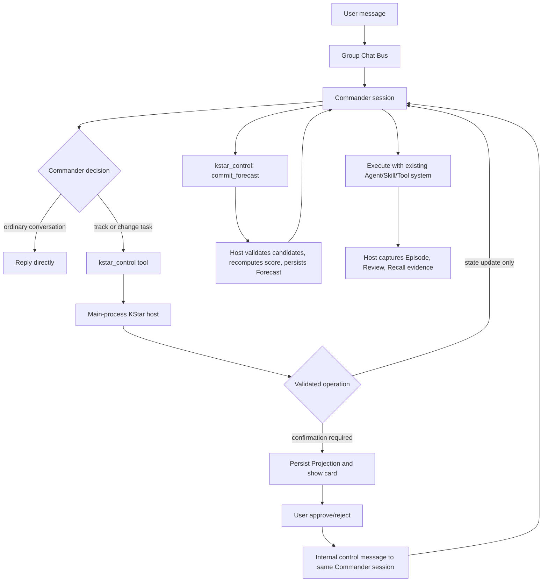

# Commander-Centric KStar Design

**Date:** 2026-08-14
**Status:** Approved
**Branch:** `codex/commander-centric-kstar`

## 1. Goal

Replace the current multi-router KStar flow with a Commander-centric architecture:

- the user message reaches the Commander first;
- the Commander is the only LLM used for routing, forecasting, and task execution;
- the Commander uses its existing provider/model/profile/credential configuration for the entire turn;
- ordinary conversation creates no KStar Task, Requirement, Projection, or Forecast;
- the main process remains the deterministic persistence, authorization, validation, idempotency, and human-approval boundary;
- existing KStar records remain readable and recoverable;
- semantically valid tool-free forecasts accept `expectedTools: []` without weakening structural validation.

This design also records a separate, bounded runtime-integrity workstream for marketplace update monotonicity and benign log cleanup. That work does not share KStar state and must be implemented as an independent task in the implementation plan.

## 2. Problems in the Current Architecture

### 2.1 Four fixed requirement routes

The current router forces every non-empty user message into one of:

- `new`
- `continue`
- `complete`
- `topic_switch`

There is no ordinary-conversation route. When classification is unavailable or low-confidence:

- no open task -> `new`
- open task -> `continue`

Consequently, a message such as `你好` creates a Task, Requirement, Projection, and confirmation card.

### 2.2 Multiple independent LLM instances

The current runtime can invoke three cognitive actors for one message:

1. Requirement Router LLM;
2. World Model LLM;
3. Commander LLM.

The Router and World Model each call `buildRunner` independently. They use the user's configured model system, but they are not guaranteed to reuse the exact provider/model/profile/credential entry selected for the active Commander turn.

### 2.3 Message withholding before Commander cognition

KStar routing runs synchronously in the group-chat bus before Commander dispatch. If a Projection preview is created, the original message is withheld from the Commander until confirmation and Forecast completion.

A routing or Forecast failure can therefore prevent the Commander from seeing a harmless user message.

### 2.4 Tool-free Forecast rejection

`validateWorldModelCandidate` currently requires a non-empty `expectedTools` array. A valid plan may need no tools, so `expectedTools: []` must be accepted. Missing, non-array, oversized, or malformed values must still fail.

The observed production state was:

```text
message: 你好
projection: confirmed
pending dispatch: world_model_failed
error: invalid_candidate_expected_tools
Commander received original message: no
```

### 2.5 Error-code flattening

Candidate contract errors are currently flattened to `world_model_unavailable`. This loses the distinction between:

- provider/model unavailable;
- model output not strict JSON;
- invalid candidate schema;
- unavailable requested tool;
- invalid rule reference.

## 3. Design Principles

1. **One cognitive actor:** Commander is the only LLM.
2. **No pre-Commander task classification:** user messages are delivered to Commander without KStar gating.
3. **Tool use is the routing decision:** no KStar control tool call means ordinary conversation.
4. **Host-enforced state:** Commander proposes state operations; the main process validates and commits them.
5. **Host-enforced approval:** Commander cannot bypass required Projection confirmation.
6. **Same Commander session:** confirmation resumes the same conversation/Commander session through an internal control message.
7. **Strict but semantic validation:** empty collections are allowed only where empty is meaningful.
8. **Backward-compatible storage:** existing schemaVersion 1 KStar/Recall data remains readable.
9. **Fail open to conversation, fail closed to privileged effects:** KStar bookkeeping failure must not suppress a normal reply, but must block unapproved high-impact execution.

## 4. Target Architecture



## 5. Commander Model Configuration

No separate Router or World Model runner is built.

The active Commander turn remains the source of truth for:

- provider;
- model;
- profile;
- credential/entry rotation;
- project and conversation scope;
- enabled Agent/Skill/Tool capability set;
- model parameters and timeout policy.

KStar does not copy credentials or construct a second auth selection. It receives only the resolved Commander execution metadata required for validation and audit.

## 6. Commander Context

Before the Commander turn, the main process injects a bounded KStar context block containing facts, not routing instructions with fixed labels:

```ts
interface CommanderKstarContext {
  conversationId: string;
  task?: {
    id: string;
    status: string;
    title: string;
  };
  requirement?: {
    id: string;
    status: string;
    goalText: string;
    expectedResult?: KstarExpectedResult;
  };
  pendingProjection?: {
    id: string;
    status: string;
    purpose: string;
  };
  forecast?: {
    id: string;
    selectedCandidateId: string;
  };
  confirmation?: {
    projectionId: string;
    decision: 'approved' | 'rejected';
  };
}
```

The block is read-only. It contains no raw local paths, secrets, or unrelated historical KStar records.

## 7. Routing Semantics

There is no replacement enum for `new | continue | complete | topic_switch`.

The route is implicit in Commander behavior:

- **ordinary conversation:** Commander does not call `kstar_control`;
- **task lifecycle change:** Commander calls `kstar_control` with explicit state operations;
- **execution without approval:** host commits the state operation and Commander continues;
- **execution requiring approval:** host persists a Projection and pauses privileged execution;
- **task completion:** Commander submits result and closure evidence through `kstar_control`.

The absence of a control call is deliberately meaningful. It avoids a second model round trip for greetings and normal chat.

## 8. KStar Host Tool

Expose one Commander-only tool, `kstar_control`, with an operation discriminator. This is one control surface, not multiple LLM routes.

### 8.1 Common envelope

```ts
interface KstarControlInput {
  operation:
    | 'upsert_state'
    | 'request_projection'
    | 'commit_forecast'
    | 'finish'
    | 'abandon';
  idempotencyKey: string;
  task?: KstarTaskMutation;
  requirement?: KstarRequirementMutation;
  projection?: KstarProjectionProposal;
  forecast?: KstarForecastProposal;
  result?: KstarResultProposal;
}
```

The tool is available only to the formal Commander session. Sub-agents cannot mutate KStar lifecycle state.

### 8.2 `upsert_state`

The Commander may propose generic state operations:

```ts
interface KstarTaskMutation {
  operation: 'keep' | 'create' | 'update' | 'close';
  taskId?: string;
  title?: string;
  closeReason?: string;
}

interface KstarRequirementMutation {
  operation: 'keep' | 'create' | 'update' | 'close';
  requirementId?: string;
  goalText?: string;
  expectedResult?: KstarExpectedResult;
}
```

These are state operations, not fixed message-route classes. The host checks legal transitions against the current persisted state.

### 8.3 `request_projection`

The Commander calls this only when the proposed task action needs frozen Recall knowledge or human approval.

The host:

1. validates the referenced Task/Requirement;
2. creates a preview Projection;
3. binds it to the current requirement;
4. posts the confirmation card;
5. returns `confirmation_required`;
6. prevents high-impact execution until approval.

The Commander ends the current response with a concise explanation to the user.

### 8.4 Confirmation resume

Approval does not run a separate Forecast LLM. The host enqueues an internal control message to the same Commander conversation/session:

```json
{
  "type": "kstar_projection_decision",
  "projectionId": "proj-...",
  "decision": "approved",
  "confirmedSnapshot": {
    "assetIds": [],
    "ruleRefs": []
  }
}
```

Rejection similarly resumes the Commander with a rejected decision and no privileged execution permission.

### 8.5 `commit_forecast`

After approval, the Commander generates two to four candidate futures and submits them to the host. The host retains deterministic validation and scoring:

- schema validation;
- allowed-tool validation;
- allowed-rule-reference validation;
- score recomputation;
- deterministic candidate selection;
- Forecast persistence.

The Commander remains the sole model; the host remains the scoring and persistence authority.

### 8.6 `finish` and `abandon`

The Commander submits terminal evidence. The host validates:

- final status;
- produced files;
- acceptance evidence;
- tool/actor trace;
- Projection and Forecast provenance.

The existing Episode, Review, Recall-candidate, and requirement-closure services remain host-side.

## 9. Candidate Validation

### 9.1 Collection semantics

| Field | Empty allowed | Missing allowed | Reason |
|---|---:|---:|---|
| `plan` | No | No | A Forecast candidate needs an intervention sequence. |
| `expectedTools` | Yes | No | Some valid actions require no tools. |
| `expectedActors` | No | No | A planned intervention must have an accountable actor. |
| `acceptanceSignals` | No | No | A predicted result must be observable. |
| `predictedFiles` | Yes | No | Many valid tasks produce no file. |
| `causalLinks` | Yes | No | Knowledge may contain no matching causal rule. |
| `assumptions` | Yes | No | A candidate may make no explicit assumptions. |
| `riskRuleRefs` | Yes | No | No known risk may match. |

`expectedTools: []` is therefore valid. The following remain invalid:

- missing `expectedTools`;
- `expectedTools` not an array;
- non-string items;
- duplicate/oversized/overlong entries according to existing bounds;
- a non-empty tool not present in the Commander's allowed tool set.

### 9.2 Prompt contract

The Commander system guidance must explicitly state:

```text
expectedTools may be an empty array when the candidate requires no tool.
Do not invent a placeholder tool merely to make the array non-empty.
```

## 10. Failure Handling

### 10.1 Commander unavailable

No KStar Task is created before the Commander starts. A provider/auth/model failure is reported as the normal Commander failure path.

### 10.2 KStar control validation failure

The tool returns a structured error. The Commander may correct the tool arguments within the same run, bounded by the existing tool-loop limit.

### 10.3 KStar persistence failure

- ordinary conversation may still complete if no privileged effect occurred;
- privileged execution is blocked;
- the host records a bounded error code and leaves persisted state recoverable.

### 10.4 Projection confirmation failure

The Projection remains in a retryable state. The original user message is already visible to the Commander, so the user is not left without a response.

### 10.5 Explicit error taxonomy

Use stable error codes:

- `commander_model_unavailable`
- `kstar_control_invalid_input`
- `kstar_invalid_candidate`
- `kstar_unavailable_tool`
- `kstar_invalid_rule_ref`
- `kstar_projection_not_confirmed`
- `kstar_persistence_failed`

Raw provider messages are not persisted.

## 11. Backward Compatibility

### 11.1 Persisted records

Keep existing Task, Requirement, Projection, Forecast, Episode, and Review schemas readable. No destructive migration is required.

### 11.2 Existing pending Projection dispatches

On read:

- `preview` / awaiting confirmation: continue showing the existing card;
- confirmed without Forecast: inject a confirmation control message into Commander so it can submit candidates;
- `world_model_failed`: expose retry, but retry resumes Commander rather than launching a separate World Model runner;
- `ready_to_dispatch`: translate into an internal Commander continuation and clear the marker idempotently.

### 11.3 Legacy route fields

Historical route reasons/intents remain readable audit data. New turns stop writing the four fixed intents.

## 12. Code Removal and Reuse

### Remove from the active runtime path

- pre-Commander call to `routeKstarUserMessage` in the group-chat bus;
- independent model call in `requirement-router.ts`;
- independent model call in `world-model.ts`;
- withholding the original user message before Commander dispatch;
- fallback rule `no open task -> new`, `open task -> continue`.

### Retain or refactor for host use

- KStar record stores and validators;
- Projection persistence and confirmation UI;
- World Model candidate types;
- deterministic candidate validation and score recomputation;
- Forecast persistence;
- pre-execution provenance checks;
- Episode/Review/Recall reconciliation;
- lifecycle and idempotency helpers.

## 13. Security and Authorization

- `kstar_control` is Commander-only.
- Tool arguments are treated as untrusted model output.
- The host resolves current IDs from persisted state; the Commander cannot claim arbitrary ownership.
- Allowed tools/agents/skills come from the active Commander scope, not from submitted strings.
- Projection approval is checked by the host immediately before privileged execution.
- Every committed transition records actor, conversation, timestamp, and idempotency key.
- No credential, absolute path, or raw provider error enters KStar records.

## 14. Observability

Log one bounded event per control transition:

```text
kstar.control operation=<op> result=<ok|rejected|failed> cid=<redacted> task=<redacted>
```

Do not log full messages, prompts, local paths, or model output.

Expected benign stream cancellation after stream completion should not be logged as a warning. Slow scheduled tasks remain warnings only when they exceed the configured threshold and actually complete.

## 15. Marketplace Update Monotonicity Workstream

This is independent of KStar and will be a separate implementation task in the same plan.

For both Agent and Skill installs:

1. server semantic version greater than local -> accept content update;
2. same version and server freshness greater than local -> accept republish;
3. server semantic version lower than local -> never overwrite local content version/freshness;
4. same version and server freshness lower/equal -> no content update;
5. unparsable unequal versions -> preserve local content and log a bounded skip;
6. non-content metadata may update without replacing local content version/freshness;
7. Agent and Skill paths use the same comparison helper and tests.

This prevents startup logs such as `v1.0.4 -> v1.0.3` from causing an actual downgrade.

## 16. Testing Strategy

### Commander routing

- greeting, thanks, acknowledgement, punctuation-only, and emoji receive normal Commander replies with zero KStar writes;
- task messages reach Commander and can create state through `kstar_control`;
- mixed greeting plus task request is treated as a task when Commander calls the tool;
- an open task is not mutated when Commander answers ordinary conversation without a control call;
- no separate routing runner is constructed.

### Model identity

- KStar invokes no independent model runner;
- Commander model/profile/credential resolution occurs once per turn;
- confirmation resumes the same Commander conversation/session.

### Forecast

- `expectedTools: []` passes;
- missing or malformed `expectedTools` fails;
- unavailable non-empty tools fail;
- deterministic score recomputation and tie-breaking remain unchanged;
- confirmed Projection candidates persist and execute through Commander.

### State and approval

- unapproved Projection cannot authorize privileged execution;
- repeated approval and repeated tool calls are idempotent;
- rejection resumes Commander without Forecast;
- legacy pending states recover without rewriting unrelated user data.

### Marketplace

- newer version updates;
- same-version newer freshness updates;
- lower server version does not downgrade Agent or Skill;
- same-version stale freshness does not regress;
- metadata-only updates preserve local content fields.

### Verification

- focused KStar/Recall/group-chat/marketplace tests;
- complete JavaScript suite;
- resource tests;
- typecheck and diff check;
- packaged macOS launch smoke;
- live log verification for greeting, task request, Projection approval, and tool-free Forecast.

## 17. Rollout Order

1. Add Commander KStar context and host tool behind an internal feature flag.
2. Add tests proving ordinary conversation causes zero KStar writes.
3. Move Task/Requirement mutations behind `kstar_control`.
4. Resume confirmation into the same Commander session.
5. Move Forecast candidate generation into Commander and retain host scoring/persistence.
6. Remove the bus pre-router and message withholding path.
7. Add legacy pending-state recovery.
8. Enable Commander-centric flow by default.
9. Remove dead independent LLM code after the complete suite and packaged smoke pass.
10. Apply the independent marketplace monotonicity task.

## 18. Success Criteria

- `你好` reaches Commander and receives a normal reply without KStar records.
- A real task is managed entirely through the existing Commander session.
- Router and Forecast no longer build independent model runners.
- Projection approval remains host-enforced.
- Tool-free Forecast candidates pass with `expectedTools: []`.
- Existing KStar user data remains readable.
- No server startup reconciliation downgrades installed marketplace content.
- Complete tests, typecheck, resource tests, and packaged smoke pass.
