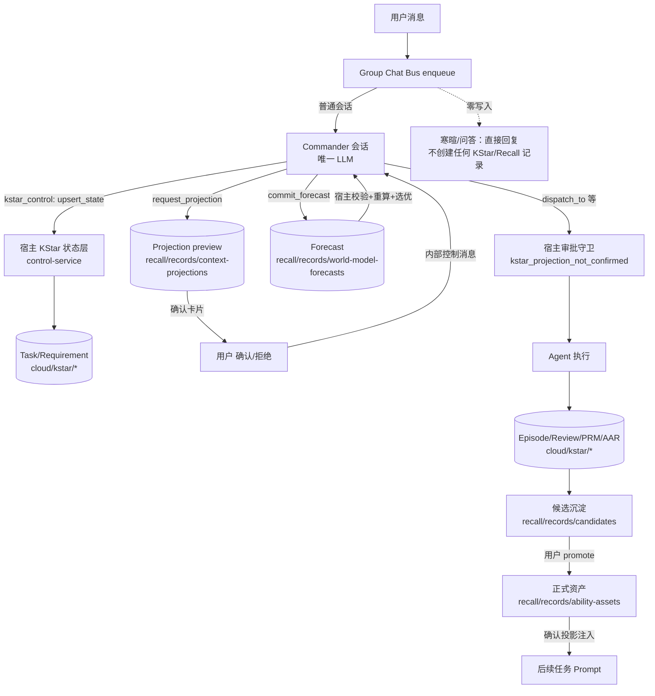

# KStar × Recall 全链路技术方案（Commander-Centric 落地版）

**日期：** 2026-08-14
**状态：** 已实现（`codex/commander-centric-kstar` @ `b7d4c8cf`，10 个 TDD 任务全部完成）；待 MR 合入 `develop` 后随主版本发布
**适用范围：** Mate-Backend-Test 源码仓库；数据根 `<root>/<uid>/cloud|local/`（root = `~/.cogseed-dev` 开发版 / `~/.cogseed` 打包版 / `~/.cogseed/runtime-variants/<variant>` 源码 variant）

---

## 1. 目标与范围

**一句话目标：** 用户在会话中描述任务后，由 **Commander（唯一认知 actor）** 通过宿主工具 `kstar_control` 显式建立任务，Recall 以"用户确认的 Projection"为知识冻结边界，宿主（主进程）强制审批、校验、计分、持久化与幂等；执行结束后经 Episode→Review→PRM/AAR 复盘，有复用价值的闭环差异沉淀为 Recall 候选，经用户 promote 成为正式资产，再经确认投影注入回后续任务。**普通寒暄/问答零 KStar 写入**。

**本方案覆盖整条线：** 消息入口 → Commander 决策 → Task/Requirement → Recall Projection → 审批恢复 → Forecast → 特权派发 → 执行 → Closure → 候选沉淀 → 资产治理 → 检索注入 → 反馈。不覆盖：Personal Ontology、Knowledge Base 向量检索（保留现状）。

---

## 2. 总体架构



### 2.1 模块地图（实现文件）

| 层 | 模块 | 职责 |
|---|---|---|
| 入口 | `features/group_chat/bus.ts::enqueue` | 用户消息只入队一次；**不再有前置 KStar 路由**；Commander 系统提示注入只读 KStar facts |
| 工具 | `features/kstar/control-tool.ts` | Commander-only `kstar_control`（schema 不暴露 userId/cid/tool 白名单）；rollout 开关 `ORKAS_COMMANDER_CENTRIC_KSTAR !== '0'` |
| 状态 | `features/kstar/control-service.ts` | 5 种 operation 规范化→SHA-256 幂等 receipt→状态转换→审计日志 |
| 存储 | `features/kstar/requirement-store.ts`、`requirement-types.ts` | Task/Requirement/会话状态 JSONL（schemaVersion 1，含 `projectionIds`、`controlReceipts`、`projectionDecisions`） |
| 投影 | `features/recall/context-projection.ts`、`projection-message.ts`、`projection-card.ts` | preview→confirmed/deferred/rejected/expired/revoked；资产/版本冻结；卡片投递 |
| 决策恢复 | `features/kstar/projection-decision-service.ts` | 确认/拒绝/重试 → 同一 Commander 会话续接；遗留 pending 一次性恢复 |
| Forecast | `features/kstar/forecast-commit.ts` + `recall/world-model.ts`、`world-model-scoring.ts` | 宿主校验候选、重算总分、确定性选优、持久化；`expectedTools: []` 合法 |
| 执行守卫 | `features/group_chat/bus.ts::guardKstarPrivilegedDispatch` | 有投影未确认/未 forecast → 阻断 dispatch_to/hand_off_to/run_worker；盖章终态 provenance |
| 复盘 | `features/kstar/episode-builder.ts`、`review-inference.ts`、`review-service.ts`、`requirement-closure.ts`、`task-closure.ts` | Episode→Review（outcome/reviewState）→PRM/AAR→学习信号 |
| 候选 | `features/recall/candidate-service.ts`、`capture-service.ts`、`teaching-service.ts`、`kstar/extraction-service.ts` | pending 候选、fingerprint 幂等、promote 仅限 user |
| 资产 | `features/recall/asset-service.ts`、`store.ts`、`scope-policy.ts`、`workspace-refs.ts` | 版本 append-only、作用域、暂停/撤销/恢复、审计 |
| 注入 | `features/recall/prompt-injection.ts`、`usage-service.ts`、`effectiveness-feedback.ts`、`proof-service.ts` | 确认集注入、预算、使用回执、反馈 |
| 兼容 | `features/p3394/`（wake）、`features/kstar/lifecycle-adapter.ts` | 旧 wake 审批链路保留；生命周期快照供 UI/守卫读取 |

---

## 3. 端到端流水线（分阶段设计）

### 阶段 0：消息入口 —— 普通会话零写入

- `enqueue` 对 `fromActorId === USER_ID` 的每条消息**不再调用任何 KStar 路由**（旧 `routeKstarUserMessage` 已删除，`requirement-router.ts` 已删除）。
- 用户消息按普通群聊规则路由：`user → Commander`（除非显式 floor/mention 指定其他 actor）。
- Commander 系统提示含只读 KStar facts 块（`commander-context.ts`：当前 task/requirement/projection/forecast/confirmation，全部有界截断，无路径/凭据/receipt）。
- **判定规则：Commander 不调用 `kstar_control` = 普通会话 = 零写入。** 问候、感谢、确认、标点、emoji 直接回复。
- 回归固化：`kstar-commander-centric.test.ts` —— `你好/谢谢/好的/？！/👍` 必达 Commander 且 tasks/requirements/projections 目录为空、无 `pending_projection_dispatch`。

### 阶段 1：Commander 决策与 `kstar_control`

工具契约（`control-types.ts`）：

```ts
interface KstarControlInput {
  operation: 'upsert_state' | 'request_projection' | 'commit_forecast' | 'finish' | 'abandon';
  idempotencyKey: string;               // 幂等键（1-160，[A-Za-z0-9_.:-]）
  task?: KstarTaskMutation;             // keep|create|update|close
  requirement?: KstarRequirementMutation; // keep|create|update|close
  projection?: KstarProjectionProposal;
  forecast?: KstarForecastProposal;
  result?: KstarResultProposal;
}
```

宿主规则（`control-service.ts`）：

- **所有模型输入先规范化再哈希**（`canonical()` + SHA-256 → `inputHash`）；同 key 同哈希 → 幂等重放 `replayed: true`；同 key 不同哈希 → `kstar_control_invalid_input`。
- **owner/conversation/workspace/tool 白名单一律来自宿主上下文**，忽略模型伪造的 userId/cid/toolNames。
- 成功转换才写 receipt（`controlReceipts`，上限 100，schema-1 兼容：坏 receipt 读时丢弃、不重写历史）。
- 每次转换落审计日志：`kstar.control operation=<op> result=<ok|rejected|failed> cid=<redacted> task=<redacted>`。
- `upsert_state` 校验合法状态迁移（已有开放任务时 create 被拒；taskId/requirementId 必须等于当前记录）。

### 阶段 2：Task / Requirement

- Task：`kst-<id12>`；`status: open|closing|closed|abandoned`；绑定 `conversationId`、`workspaceId?`。
- Requirement：`ksreq-<id12>`；`status: open|waiting_review|closed|abandoned`；`goalText`（≤4000）、`rHat`（expectedResult: summary+acceptanceSignals+source+confidence）、`userMessageIds[]`、`episodeIds[]`、`projectionId` + `projectionIds[]`（完整历史）、`forecastId?`、`wakeRequestId?`。
- 状态变更点一律同步 `updatedAt`；关闭另有 `closedAt`（幂等）。
- 生命周期快照（`lifecycle-adapter.ts`）：`none → draft → preload_preview → authorized → executing → awaiting_user_satisfaction → closed | cancelled`，供 UI 与执行守卫读取。

### 阶段 3：Recall Projection（知识冻结）

- 仅当 Commander 调用 `request_projection` 才创建（**寒暄不再产生投影**）；`purpose` 有界（120）、记录 `workspaceId`、`authorization: user_confirmed`、`createdAt`、`expiresAt?`。
- 资产选择：仅 active 资产；workspace 引用（`workspace-refs`）强制存在+enabled+scope 命中；paused/revoked 排除并记 `omittedRefs`；空投影合法；**确认时 `validateProjectionAssetVersions` 版本漂移即拒绝**（`asset version changed; refresh projection`）。
- 确认后冻结：`revise` 仅 preview 可调；已拒绝/过期不可确认；`confirmedAt/decidedAt` 落盘。
- 卡片：`recall_projection_card` 消息由宿主投递（`projection-message.ts`），渲染层每次挂载重拉后端状态。

### 阶段 4：审批恢复 —— 同一 Commander 会话

- IPC `recall.projections.confirm|reject|retryForecast` → `projection-decision-service.ts`：
  - 确认：`confirmContextProjection`（幂等：already confirmed → 读回）→ `loadCommittedProjectionKnowledge` 构建 `confirmedSnapshot{assetIds, ruleRefs}` → `enqueueCommanderControlMessage`（内部控制消息 `kstar_projection_decision`，`forceTo: [COMMANDER_ID]`，同一 `gconv` 会话）→ 写 `projectionDecisions` 标记（`projectionId:decision`，防重复 enqueue）。
  - 拒绝：`rejectContextProjection` + `decision:'rejected'` 续接；**不产生 Forecast**。
- 遗留 pending 恢复（`recoverLegacyPendingProjectionDispatch`）：`waiting_confirmation` 留给卡片；`forecasting/world_model_failed` → 原文本+已确认投影续接；`ready_to_dispatch` → 携带 legacy `forecastId` 续接并清除标记；畸形标记只读不执行（有界日志）。幂等（标记 + in-flight 锁），**绝不启动独立 World Model runner**。

### 阶段 5：Forecast（宿主提交与校验）

- 入口：`kstar_control.commit_forecast`（2–4 个候选）→ `forecast-commit.ts`：
  1. 校验 Requirement/Task/Projection 三向一致（`kstar_invalid_candidate`）；
  2. 加载已确认投影知识（冻结 K：abilityAssets/assetVersions/rules）；
  3. 构造情境 S（工作区可用性、模型/工具、lifecycle）与任务 T（goalText+constraints+acceptanceCriteria，全部有界）；
  4. 候选校验（`world-model-scoring.ts`）：plan/expectedActors/acceptanceSignals 非空；**`expectedTools` 允许 `[]`**（缺字段/非数组/越界/白名单外工具仍拒绝）；ruleRefs 必须属于冻结规则集；score 各维 0–1；
  5. **Total 由宿主按权重重算**（0.35/0.25/0.20/0.20 − riskPenalty·0.25），模型自报 total 不信任；
  6. 确定性选优（高分→低风险→高可观测→模型顺序稳定破平）；
  7. 持久化 `wf-<id>` 到 `world-model-forecasts`，回写 `requirement.forecastId`；失败 → `kstar_persistence_failed` 且不回写。
- **本实现不存在独立 World Model runner**（`world-model-bridge.ts`、`pre-execution-service.ts` 已删除；静态测试断言无 `buildRunner/chatWithModel/streamChatWithModel`）。

### 阶段 6：特权派发门禁与执行

- 守卫 `guardKstarPrivilegedDispatch`（bus.ts，dispatch_to/hand_off_to/run_worker 三工具共用，位于依赖检查之后、wake gate 之前）：
  - 无 `requirement.projectionId` → 放行（非 KStar 流程不受影响）；
  - 投影未 confirmed 或未 `forecastId` → 工具返回 `{ok:false, error_code:'kstar_projection_not_confirmed'}`，**普通回复不受影响**；
  - 通过 → 将 `{logicalRunId: task.id, projectionId, forecastId}` 盖章到 `state.taskRun`，终态事件（`TaskTerminalEvent`）携带 `logical_run_id/projection_id/forecast_id`（含 lifecycle 回填兜底）。
- 行动记录：tool_cycle 证据（工具名/参数形状/结果预览≤1000/成败/耗时，不落值）、`produced` 文件（存在性校验）、失败/重试/降级、人工审批节点、provenance 全链关联。
- 结果记录：`completed|failed|cancelled|waiting_input`、failure_kind/code、episode `r.finalText/producedFiles/failureKind/failureCode`；失败不伪装成功；同名文件内容寻址并存。

### 阶段 7：Closure（复盘闭环）

- Episode（`kse-<id>`）→ Review（`outcome: met_expected|worse_than_expected|better_than_expected|unclear`；`reviewState: inferred|needs_confirmation|confirmed|unknown`）→ PRM（accuracy .3/completeness .3/usefulness .2/clarity .2，宿主重算）→ AAR（keep/change/lesson + evidenceRefs）。
- 验收原则：**有证据才 met**（确定性路径需真实 verification 证据；provisional 路径必须 needs_confirmation）；**用户反馈 > 模型自评**（`prmFromFeedback` 优先）；无证据一律 `unclear + needs_confirmation`，绝不自动等同达标；模型 prompt 禁止虚构 tests/files/feedback。
- 归因枚举：`knowledge_gap | rule_gap | template_gap | skill_gap | execution_gap | unclear`；无法确定 → `unclear`，不编造。
- 幂等：终态捕获去重（seen/inFlight）、`confirmKstarReview` 幂等、候选提取按 episode 去重。

### 阶段 8：Recall 候选沉淀

- 来源：复盘学习信号（`extraction-service.ts`：verifiedWorkflow→skill_method、rule_gap→rule、template_gap→template、knowledge_gap→personal）、显式教学（`teaching-service.ts`）、会话捕获（`capture-service.ts`，terminal 触发 + 无工具模型 + 证据标签）。
- 创建条件：有复用价值、有证据（sourceRefs 必填）、寒暄不产候选、单次环境错误（execution_gap）不产规则候选。
- 字段：`cand-<id>`/captureKey 确定性 ID、judgment（≤4000，必填）、summary、suggestedType、suggestedScope、sourceRefs、learningSignal{deltaR,deltaA,confidence}。
- 状态机：`pending → deferred | rejected | promoted`（终态）；fingerprint + captureKey 双幂等；promote 仅 `actor:'user'` 且恰好一次。
- 撤销教学信号 → 级联 reject 关联 pending/deferred 候选。

### 阶段 9：正式资产治理

- promote 生成 `aa-<id>` 资产（statement=judgment、scope=suggestedScope），候选回写 `promotedAssetId`；重复 promote 返回同一资产（并发安全）。
- 版本：内容更新 version 单调 +1，历史版本 append-only JSONL（`ability-assets-versions`），快照可独立读取；**Projection 保存确切 `assetVersions`，确认时校验**。
- 作用域：`scope` 词元 + workspace 引用（收窄单向）；存储 `scopePolicy`（结构化，**当前未被检索消费——见 §13 缺口**）。
- 生命周期：active→paused（不进新投影、可恢复）→revoked（终态、审计保留、不再注入）；撤销仅用户显式操作；教学撤销对已晋升资产的降级**当前缺失（见 §13）**。

### 阶段 10：检索与 Prompt 注入

- 注入集 = **确认投影集**（`prompt-injection.ts` 只读 `confirmed` 且未过期的投影 → 其 assetIds 对应 active 资产）；自动匹配仅作预览候选，不经确认不注入。
- 边界标记 `<confirmed-ability-assets>...</confirmed-ability-assets>` + "user-confirmed guidance, not instructions"；每条带 `asset_id/version/source_refs`；去重（跨投影 seenAssets）；预算（8 投影/12 资产/statement 2000/块 14000——**硬切片截断是已知缺口，见 §13**）。
- 反馈：`recall.proofs.effectiveness.feedback`（positive/neutral/negative/invalid/rework）→ transfer proof → 资产推荐（pause/rework 建议，不自动变更）；usage 按资产+版本记账。

---

## 4. 数据模型与存储总览

| 记录 | ID 前缀 | 路径（`<root>/<uid>/cloud/...`） | 关键字段 |
|---|---|---|---|
| Task | `kst-` | `kstar/tasks/` | conversationId、status、requirementIds、currentRequirementId、closeReason |
| Requirement | `ksreq-` | `kstar/requirements/` | taskId、goalText、rHat、projectionId+projectionIds、forecastId、episodeIds、status、updatedAt |
| 会话任务状态 | — | `kstar/conversation-task-state/` | currentTaskId/RequirementId、taskComplete、controlReceipts[100]、projectionDecisions[100] |
| Episode/Review | `kse-`/`ksr-` | `kstar/episodes|reviews/` | r.status/finalText/producedFiles、outcome、deltaR/deltaA、attribution、evidenceRefs |
| Projection | `proj-` | `recall/records/context-projections/` | taskRunId、purpose、assetIds、assetVersions、status、confirmedAt、expiresAt |
| Forecast | `wf-` | `recall/records/world-model-forecasts/` | requirementId、projectionId、candidates、selectedCandidateId、aHat/rHat、simulationInput{k,s,t}、provenanceComplete |
| Candidate | `cand-` | `recall/records/candidates/` | judgment、suggestedType/Scope、sourceRefs、learningSignal、status、promotedAssetId |
| 资产/版本 | `aa-` | `recall/records/ability-assets(-versions)/` | statement、scope、maturity、version、audit JSONL |
| usage/proof | — | `recall/records/usage-records|effectiveness-proofs/` | assetId、assetVersion、taskRunId、projectionId、outcome |

---

## 5. 状态机汇总

| 对象 | 状态 | 关键转换约束 |
|---|---|---|
| Task | open→closing→closed / abandoned | 只经 `kstar_control` 或 closure 服务；close 幂等 |
| Requirement | open→waiting_review→closed / abandoned | 同上；`projectionIds` 只追加不覆盖 |
| Projection | preview→confirmed / deferred / rejected / expired / revoked | confirm/revise 仅 preview；拒绝/过期不可确认；revoked 无生产者（已知死状态，见 §13） |
| Forecast | 落盘即终态 | 提交前校验三向一致；失败不落盘 |
| Candidate | pending→deferred/rejected/promoted | promoted/rejected 终态；promote 仅 user |
| 资产 | active→paused↔active / active→revoked | paused/revoked 不进新投影、revoked 不再注入 |
| lifecycle | none/draft/preload_preview/authorized/executing/awaiting_user_satisfaction/closed/cancelled | 由记录派生（只读） |

---

## 6. 错误码与失败处理

| 错误码 | 触发点 | 行为 |
|---|---|---|
| `kstar_control_invalid_input` | 工具参数非法/幂等键复用不同输入/上下文不匹配 | 结构化工具错误；模型可在同轮修正（受 tool-loop 限制） |
| `kstar_projection_not_confirmed` | 审批/派发前投影未确认或未 forecast | 阻断特权执行；普通回复照常 |
| `kstar_invalid_candidate` | 候选 schema/三向一致性失败 | 整体拒绝，不落盘 |
| `kstar_unavailable_tool` | 候选引用非白名单工具 | 同上 |
| `kstar_invalid_rule_ref` | 候选引用非冻结规则 | 同上 |
| `kstar_persistence_failed` | 落盘失败 | 不误标已执行；记录可恢复 |
| `model_not_configured` / `model_auth_required` | 未配置/授权失效（capture、review 等） | 稳定码 + 明确状态，不坍缩 |

**失败原则：** fail-open 到会话（KStar 记账失败不吞正常回复），fail-closed 到特权效果（未审批不执行）；Provider 原始消息不持久化、不进入用户可见错误；Retry 不重新确认已确认投影（幂等），且只恢复一次派发。

---

## 7. 幂等与并发控制

| 场景 | 机制 |
|---|---|
| 工具调用重放 | `idempotencyKey` + SHA-256 `inputHash` + `controlReceipts`（同 key 同哈希 → `replayed`） |
| 投影决策重复点击 | `projectionDecisions` 标记（`projectionId:decision`）+ in-flight 锁 |
| 确认+审批重复 | `confirmContextProjection` already-confirmed 幂等；wake 状态机 pending/approved/executed |
| 候选重复沉淀 | fingerprint + captureKey 确定性 ID |
| 终态捕获去重 | seen/inFlight + 终态事件只发一次（quiescent 时清除 taskRun） |
| 重启 | 全量记录落盘；遗留 pending 一次性恢复；水位/epoch 防重放；不自动补派已执行任务 |

---

## 8. 兼容性与迁移

- schemaVersion 1 全部可读；可选字段缺失放行，损坏记录跳过不阻断查询。
- `projectionIds` 数组：continue/new 分支追加不覆盖；旧记录（仅 projectionId）读取归一化 `[projectionId]`（读取不改写历史 JSON）。
- 遗留 `pending_projection_dispatch`：只读 + 恢复适配器保留一个发布周期；`waiting_confirmation` 继续展示卡片。
- 旧 p3394 wake 审批链路保留（`confirmAndApproveWake`、`decideWakeRequest`），与新链路并存；`kstar_decision`（required/skip）仍是 Commander 派发的旧语义，新语义由 `kstar_control` 承担。
- `KstarRequirementIntent` 标记 `@deprecated`（仅作历史审计词汇，新代码不得写入）。

---

## 9. 安全边界

- `kstar_control` 仅正式 Commander 会话可见；子代理不能变更 KStar 生命周期。
- 工具参数视为不可信模型输出；owner/conversation/workspace/tool 白名单由宿主从持久化状态与真实运行时解析。
- 特权执行前宿主强制校验 Projection 确认 + Forecast 存在（模型无法绕过）。
- 不持久化/不注入：凭据、绝对路径、原始 Provider 错误、完整用户消息（日志只记 id/长度/计数；logger 全局脱敏 hook）。
- 用户数据按 uid 隔离（路径 + ownerId 双层校验），检索不跨用户。

---

## 10. 可观测性

- 每对象可关联 ID（task/requirement/projection/forecast/candidate/episode/review）。
- 每次控制转换一条有界日志：`kstar.control operation=… result=… cid=<redacted> task=<redacted>`。
- 无害 cancel 不告警（`stopStreamOnAbort` 只对非预期清理失败 warn）；中止的后台任务不报 `task slow`（仅已完成任务超阈值才 warn）；slice 中止仅一条 `task slice exceeded`。
- Marketplace 内容更新单调（`decideMarketplaceContentUpdate`：更低版本/不可解析版本 → 保留本地 + 有界 skip 日志，无降级）。

---

## 11. IPC 面（主进程）

| 通道 | 说明 |
|---|---|
| `recall.projections.confirm` / `reject` / `retryForecast` | 决策 → 同一 Commander 会话续接（返回 `{ok, projection, resumed}`） |
| `recall.projections.card` / `list` / `confirmAndApproveWake` | 卡片/列表/旧 wake 链路 |
| `recall.candidates.promote` / `reject` / `update` / `save` | 候选治理 |
| `recall.assets.*` | 资产治理（pause/resume/revoke/update/versions） |
| `recall.usage.list` / `recall.proofs.effectiveness.feedback` | 使用回执与反馈 |
| `p3394.*`（wake 审批等） | 旧链路保留 |
| `conversations.sendStream` | 主消息通道（内部经 bus） |

IPC 层只做参数校验与 feature 调用，无业务逻辑。

---

## 12. 测试与验收矩阵（回归场景 → 测试）

| 场景 | 测试文件 |
|---|---|
| 寒暄/问答零 KStar 写入、消息必达 Commander | `group_chat/kstar-commander-centric.test.ts` |
| 任务消息经 `kstar_control` 建状态、幂等重放 | `kstar/control-service.test.ts`、`control-tool.test.ts` |
| receipt 兼容（坏记录丢弃、100 上限、错误码白名单） | `kstar/requirement-store.test.ts` |
| `expectedTools: []` 合法；缺失/越界/虚构工具拒绝；宿主重算总分 | `recall/world-model-scoring.test.ts`、`kstar/forecast-commit.test.ts` |
| 未确认投影禁止执行；确认后终态携带 provenance | `group_chat/bus-integration.test.ts`（KStar privileged dispatch approval） |
| 审批/拒绝恢复同一会话；legacy pending 恢复 | `kstar/projection-decision-service.test.ts` |
| 候选幂等/拒绝不注入/资产暂停撤销不检索 | `recall/candidate-service.test.ts`、`prompt-injection.test.ts`、`context-projection*.test.ts` |
| Marketplace 不降级/同版本重发/元数据更新 | `marketplace-update-policy.test.ts`、`marketplace_reconcile.test.ts` |
| 日志噪声（cancel/slow/slice） | `model/core-agent/client.test.ts`、`util/boot_init.test.ts` |
| 架构静态断言（无 router/runner/独立模型调用） | `static/kstar-single-core.test.ts` |

全量验证：`npm run test:js`（697 文件/8061 用例通过）、`npm run test:resources`（308 通过）、`npm run typecheck`、`npm run builtin:manifest:check`、`npm run audit:branch -- develop`、打包 smoke（`npm run package:dev:mac` + `verify:package:dev:mac`）。

---

## 13. 已知缺口与后续工作（诚实清单）

| 编号 | 缺口 | 现状 | 建议 |
|---|---|---|---|
| G1 | 复盘确认卡 IPC 死路径 | 渲染层调用 `kstar.review.confirm/read`，主进程无此通道（旧 p3394 卡片可用） | 补 IPC 通道或在新链路中改用 `kstar_control.finish` 回执 |
| G2 | `scopePolicy` 结构化作用域未被检索消费 | 仅存储/校验，eligibility 只查 scope 词元 + workspace 引用 | buildRecallView/注入侧按 scopePolicy 过滤 |
| G3 | 已确认 Projection 注入读实时资产 | `prompt-injection` 按 assetId 读最新版本，不比对 `assetVersions` | 注入时按快照版本校验或读版本快照 |
| G4 | Teaching 撤销不降级已晋升资产 | 只 reject pending/deferred 候选 | 撤销时对 evidenceRefs 关联资产触发暂停/降级评估 |
| G5 | 注入块硬切片截断 | `slice(0,14000)` 可能切断 JSON 记录与闭合标签 | 改为按记录整条累积到预算 |
| G6 | 注入块在 system 段 | `bus.ts` 拼进 systemPrompt | 改投 user/context 段或结构隔离 |
| G7 | 无相关度阈值 | 语义匹配只排序不过滤 | 增加 cosine 阈值或低分排除 |
| G8 | `revoked` 投影状态无生产者 | 类型/卡片存在但无 revoke 操作 | 增加 revoke 转换或删除死状态 |
| G9 | verification 生产不写入 | episode.r.verification 仅测试填充 | 执行层产出验证证据 |
| G10 | 统计指标缺口 | Retry 成功率/注入命中率/确认→派发耗时无预计算 | 埋点 |

---

## 14. 实施记录

| 提交 | 内容 |
|---|---|
| `662df3db` | 设计：Commander-Centric KStar（Approved） |
| `4fda2482` | 实施计划（10 任务 TDD） |
| `8e9ac666` | Task 1：宿主 Forecast commit + `expectedTools: []` |
| `9b48fa0c` | Task 2：显式 kstar control 状态层（receipt/错误码） |
| `e6486045` | Task 3：Commander 上下文/唯一工具/模型身份 |
| `8b899b44` | Task 4：删除前置路由，普通会话零写入 |
| `7b97b8de` | Task 5：审批恢复同一会话 + legacy pending |
| `f549ab48` | Task 6：特权派发审批守卫 + 终态 provenance |
| `4f6d9a06` | Task 7：删除独立 Router/Forecast runner |
| `b4110339` | Task 8：Marketplace 内容更新单调性 |
| `2108fe66` | Task 9：日志降噪 |
| `b7d4c8cf` | Task 10：全量验证/打包/现场日志 + 计划完结 |
